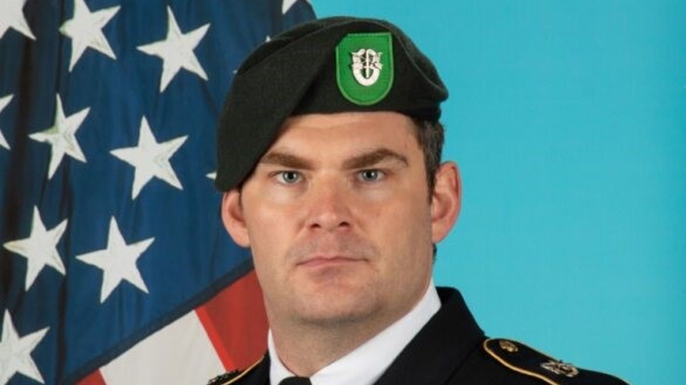

# Matthew Livelsberger
Highly decorated U.S. Army Green Beret who died on January 1, 2025 in a Cybertruck explosion at the Trump International Hotel in Las Vegas. Cause of death was a self-inflicted gunshot wound to the head before the detonation. Some X/social media theorists alleged he was a UAP/drone whistleblower who was silenced; the FBI investigation concluded it was a PTSD-related suicide with political protest intent. Livelsberger left notes describing the act as a "wakeup call."

| Field | Details |
|-------|---------|
| **Full Name** | Matthew Alan Livelsberger |
| **Born** | c. 1987 (Colorado Springs, Colorado) |
| **Died** | January 1, 2025 |
| **Age at Death** | 37 |
| **Location of Death** | Trump International Hotel, Las Vegas, Nevada, USA |
| **Cause of Death** | Self-inflicted gunshot wound to the head |
| **Official Ruling** | Suicide |
| **Category** | Military Officer / Green Beret |

## Assessment: UNCERTAIN (UAP Link)

Matthew Livelsberger's death was extensively investigated by the FBI and Las Vegas Metropolitan Police Department. The investigation concluded that he died by self-inflicted gunshot wound, with the Cybertruck explosion being a planned "spectacle" intended as a political statement. He left multiple notes explaining his actions, describing them as a "wakeup call" for America and expressing his struggles with PTSD and the psychological burden of combat. Some X/social media theorists alleged that Livelsberger was silenced because of knowledge about UAP-related drone technology from his military assignments. **There is no evidence supporting a UAP connection.** His notes make clear this was a deliberate, personally motivated act.

## Circumstances of Death

On January 1, 2025, Matthew Livelsberger drove a rented Tesla Cybertruck loaded with fireworks and camping fuel canisters to the entrance of the Trump International Hotel in Las Vegas. He shot himself in the head with a firearm, and shortly after, the vehicle exploded.

The explosion caused minor injuries to seven bystanders but virtually no damage to the hotel building. The Cybertruck's steel body largely contained the blast.

Livelsberger had rented the Cybertruck in Colorado and driven it to Las Vegas. He used AI tools (reportedly ChatGPT) to help plan aspects of the explosion.

### The Notes

Livelsberger left multiple written messages explaining his actions:

- He wrote: "This was not a terrorist attack, it was a wakeup call. Americans only pay attention to spectacles and violence. What better way to get my point across than a stunt with fireworks and explosives."
- He stated he needed to "cleanse my mind" of the lives lost of people he knew and "the burden of the lives I took."
- FBI Special Agent in Charge Spencer Evans concluded: "It ultimately appears to be a tragic case of suicide involving a heavily decorated combat veteran who was struggling with PTSD and other issues."

## Background

Matthew Alan Livelsberger was a 37-year-old active-duty U.S. Army Green Beret based at Fort Liberty (formerly Fort Bragg), North Carolina, assigned to 10th Special Forces Group. He had served in the Army since 2006 and had an extraordinarily decorated career:

- **Five Bronze Stars**, including one with a valor device for courage under fire
- **Combat Infantry Badge**
- **Army Commendation Medal with valor**
- Multiple deployments to Afghanistan
- Service in Ukraine, Tajikistan, Georgia, and the Democratic Republic of Congo

At the time of his death, he was on approved leave.

### UAP/Drone Speculation

Following the incident, some X/social media accounts alleged that Livelsberger had knowledge of UAP-related drone technology through his military assignments and was killed (or driven to suicide) to prevent disclosure. The specific claims included:

- That his Special Forces work involved encountering or investigating anomalous drone activity
- That the Cybertruck explosion was staged to look like a suicide but was actually an assassination
- That his death coincided with a wave of mysterious drone sightings across the northeastern United States in late 2024

However, these claims are contradicted by:
- Livelsberger's own detailed notes explaining his motivations
- The FBI's thorough investigation concluding suicide
- The self-inflicted gunshot wound as the actual cause of death (the explosion was secondary)
- His explicit statements about PTSD and political frustration
- No evidence from the investigation linking him to any UAP or drone disclosure activity

## Why This Death Possibly Raises Questions (UAP Context)

- Was a highly decorated Special Forces operator with potential access to sensitive information
- His death coincided temporally with widespread reports of mysterious drone sightings in the U.S.
- Some social media posts alleged drone/UAP whistleblower connections
- However, he left detailed notes explaining his motives as PTSD-related and political
- The FBI investigation found no UAP connection
- The cause of death (self-inflicted gunshot) is conclusively established
- His own words describe the act as a protest, not a silencing

## See Also

- [Philip Haney](Philip_Haney.mdx) — Government whistleblower found dead from gunshot wound, ruled suicide

## Other Shocking Stories

- [Rory Johnson](Rory_Johnson.mdx): Inventor of the Magnatron cold-fusion laser-activated magnetic motor who died unexpectedly around 1979 after the U.S. Department of...
- [Ivan T. Sanderson](Ivan_Sanderson.mdx): British-born biologist and founder of the Society for the Investigation of the Unexplained (SITU), died of fast-acting brain...
- [James V. Forrestal](James_Forrestal.mdx): First United States Secretary of Defense, fell from the sixteenth floor of Bethesda Naval Hospital under disputed circumstances...
- [Tim Burchett](Tim_Burchett.mdx): U.S. Congressman from Tennessee who leads Congressional UAP hearings and has publicly stated he was warned by Army...

## Sources

- [NPR: The soldier who died in Cybertruck explosion wrote it was intended as a 'wakeup call'](https://www.npr.org/2025/01/03/nx-s1-5247805/las-vegas-cybertruck-explosion-note)
- [CNN: Driver who exploded Tesla Cybertruck at Trump hotel was an active-duty Army Green Beret](https://www.cnn.com/2025/01/02/us/tesla-cybertruck-trump-hotel-wwk-hnk/index.html)
- [PBS: Soldier who died in Cybertruck explosion left note saying it was a 'wakeup call'](https://www.pbs.org/newshour/nation/soldier-who-died-in-cybertruck-explosion-left-note-saying-it-was-a-wakeup-call-for-countrys-ills)
- [NBC News: Officials ID Matthew Alan Livelsberger as person who rented Cybertruck](https://www.nbcnews.com/news/us-news/officials-id-person-rented-cybertruck-used-explosion-las-vegas-trump-h-rcna185986)
- [Fortune: Matthew Livelsberger was a highly decorated Green Beret](https://fortune.com/2025/01/02/matthew-livelsberger-tesla-cybertruck-explosion-trump-hotel-las-vegas-us-army-green-beret/)
- [Wikipedia: 2025 Las Vegas Cybertruck explosion](https://en.wikipedia.org/wiki/2025_Las_Vegas_Cybertruck_explosion)
- [Fox News: Questions grow about soldier's Tesla Cybertruck attack](https://www.foxnews.com/us/questions-grow-about-soldiers-tesla-cybertruck-attack-trump-las-vegas-hotel)

*This information was built by Grok and Claude AI research.*

**Status:** Deceased (2025)
