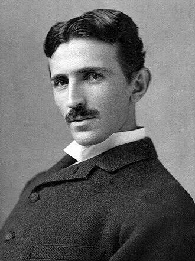

# Nikola Tesla
Legendary inventor of AC electricity and wireless power transmission who died alone in a New York hotel room in 1943; the FBI and Office of Alien Property immediately seized approximately 80 trunks of his papers, many of which remain unaccounted for.

| Field | Details |
|-------|---------|
| **Full Name** | Nikola Tesla |
| **Born** | July 10, 1856 (Smiljan, Austrian Empire, present-day Croatia) |
| **Died** | January 7, 1943 |
| **Age at Death** | 86 |
| **Location of Death** | Hotel New Yorker, Room 3327, New York City, USA |
| **Cause of Death** | Coronary thrombosis |
| **Official Ruling** | Natural causes |
| **Category** | Suppressed Technology Researcher |

## Video Evidence

<video controls style={{width: '100%', maxWidth: '720px', height: 'auto', display: 'block'}}>
  <source src="http://127.0.0.1:8080/ipfs/QmdEY5U4HjXFNriDoEboezC8ZiXQoi1yN9wXoKoNMSc3Ta" type="video/mp4" />
  <source src="https://ipfs.io/ipfs/QmdEY5U4HjXFNriDoEboezC8ZiXQoi1yN9wXoKoNMSc3Ta" type="video/mp4" />
  <source src="https://dweb.link/ipfs/QmdEY5U4HjXFNriDoEboezC8ZiXQoi1yN9wXoKoNMSc3Ta" type="video/mp4" />
  Your browser does not support the video tag.
</video>

*Amy Eskridge — murdered antigravity researcher (2022) — named Nikola Tesla as one of the people who independently discovered antigravity, with the government suppressing it each time. Source: [@UAPLuigi on X](https://x.com/UAPLuigi/status/2049485639142543816), April 29, 2026.*

## Assessment: SUSPICIOUS

While Tesla's death at age 86 is not inherently suspicious, the extraordinary government response that followed raises significant questions. Within hours, the Office of Alien Property -- a wartime agency with no obvious jurisdiction over a naturalized U.S. citizen -- seized approximately 80 trunks of his papers, personal effects, and research materials. Only about 60 trunks were later returned to his family, and the contents of the missing materials have never been publicly disclosed. The seized papers reportedly included work on wireless energy transmission and a directed-energy weapon Tesla called the "death beam."

## Circumstances of Death

Nikola Tesla was found dead in his bed in Room 3327 of the Hotel New Yorker on January 8, 1943, by hotel maid Alice Monaghan. He had died the previous evening, approximately 10:45 PM on January 7. The New York City medical examiner determined the cause of death was coronary thrombosis and ruled it natural causes. Tesla had been living in near-total seclusion for years, subsisting largely on a diet of milk and crackers, and had become increasingly frail.

Within hours of his body being discovered, representatives of the Office of Alien Property (OAP) arrived at the hotel and seized all of Tesla's belongings -- documents, notebooks, research papers, and personal effects totaling approximately 80 trunks of material. The OAP's involvement was unusual given that Tesla had been a naturalized American citizen since 1891. The FBI was also involved, with Director J. Edgar Hoover personally ordering the seizure be classified as "top secret."

## Background

Nikola Tesla was a Serbian-American inventor, electrical engineer, and futurist who obtained around 300 patents worldwide. He is best known for designing the modern alternating current (AC) electricity supply system, which powers the world today. Tesla also made pioneering contributions to radio, X-ray technology, rotating magnetic fields, and wireless communication.

In his later years, Tesla worked on several technologies that attracted intense government interest. His "Teleforce" weapon -- popularly known as the "death beam" or "death ray" -- was a directed-energy concept he claimed could bring down enemy aircraft at a distance of 250 miles. He also pursued wireless energy transmission, envisioning a system to broadcast electrical power without wires, which would have eliminated the need for conventional power grids and the industries built around them.

Tesla made direct appeals to multiple governments, including the United States, Soviet Union, United Kingdom, and Yugoslavia, offering his weapon designs. During World War II, these claims attracted particular attention from U.S. military and intelligence officials concerned that rival powers might acquire Tesla's technology.

## Why This Death Possibly Raises Questions

- The Office of Alien Property seized his papers despite Tesla being a U.S. citizen since 1891, raising questions about the legal basis for the seizure
- Approximately 80 trunks of materials were seized; only about 60 were eventually returned to his family in Belgrade, leaving the contents of roughly 20 trunks unaccounted for
- FBI Director J. Edgar Hoover ordered the matter classified as "top secret"
- Dr. John G. Trump (MIT physicist and uncle of Donald Trump) was brought in by the FBI to evaluate the papers; he concluded they contained "nothing of significant value" -- a claim many researchers dispute given Tesla's documented work
- Vice President Henry Wallace personally discussed "the effects of TESLA, particularly those dealing with the wireless transmission of electrical energy and the 'death ray'" with his advisors, suggesting high-level government interest
- Declassified FBI documents released in 2016 reveal the government maintained an extensive file on Tesla and tracked his activities for years before his death
- Tesla had been in communication with multiple foreign governments about his weapon designs, making him a target for intelligence services
- His wireless energy transmission technology, if viable, would have disrupted the entire electrical utility industry
- Tesla spent his final years impoverished and isolated, despite holding patents worth billions in modern terms -- raising questions about whether his marginalization was engineered
- Some military personnel dismissed his inventions while "another group said there was really something to it," suggesting internal disagreement about the significance of his work

## See Also

- [Nikola Tesla (Zero Point Energy)](/energy/Details/Nikola_Tesla) — This case also appears in the Zero Point Energy project
- [Thomas Townsend Brown](Thomas_Townsend_Brown.mdx) — Electrogravitics researcher whose work was allegedly classified
- [Floyd Sweet](Floyd_Sweet.mdx) — Free energy inventor whose research materials were confiscated after death
- [Bruce DePalma](Bruce_DePalma.mdx) — N-Machine inventor who died before scheduled testing

## Other Shocking Stories

- [John F. Kennedy](John_F_Kennedy.mdx): 35th President of the United States, assassinated in Dallas on November 22, 1963. Some fringe theorists, including Steven...
- [Walter Kasza (Area 51 Worker)](Walter_Kasza_Area51.mdx): Civilian contractor at Groom Lake (Area 51) who died at age 73 from kidney cancer after years of...
- [Dorothy Kilgallen](Dorothy_Kilgallen.mdx): Journalist who broke the British military UFO investigation story and was investigating the JFK assassination, found dead under...
- [John Brittan](John_Brittan.mdx): Royal College of Military Science IT specialist found dead from carbon monoxide poisoning in his garage — had...

## Sources

- [The Mystery of Nikola Tesla's Missing Files - HISTORY](https://www.history.com/articles/nikola-tesla-files-declassified-fbi)
- [The Mysterious Disappearance of Nikola Tesla's Files After His Death - Interesting Engineering](https://interestingengineering.com/culture/the-mysterious-disappearance-of-nikola-teslas-files-after-his-death)
- [PBS: Tesla - Master of Lightning: The Missing Papers](https://www.pbs.org/tesla/ll/ll_mispapers.html)
- [FBI releases catalog of Nikola Tesla's writings seized after his death - MuckRock](https://www.muckrock.com/news/archives/2018/mar/19/fbi-tesla-ii/)
- [Nikola Tesla - Wikipedia](https://en.wikipedia.org/wiki/Nikola_Tesla)
- [Nikola Tesla - Inventions, Facts & Death - HISTORY](https://www.history.com/articles/nikola-tesla)

*This information was built by Grok and Claude AI research.*

**Status:** Deceased (1943)
