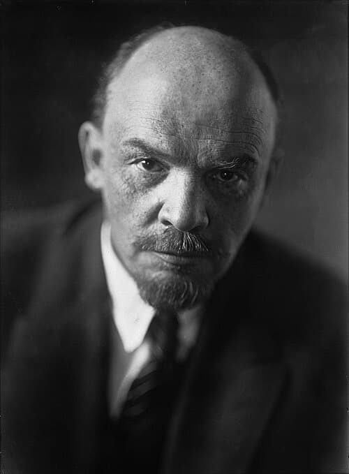

# Ning Li
Chinese-American physicist who published groundbreaking antigravity research, received a $448,970 DOD grant through her company AC Gravity, published no results, was struck by a vehicle in 2014 causing permanent brain damage, and died in 2021 after years of decline from Alzheimer's disease.

| Field | Details |
|-------|---------|
| **Full Name** | Ning Li |
| **Born** | January 14, 1943 (China) |
| **Died** | July 27, 2021 |
| **Age at Death** | 78 |
| **Location of Death** | Madison, Alabama, USA |
| **Cause of Death** | Alzheimer's disease complications |
| **Official Ruling** | Natural causes |
| **Category** | Suppressed Technology Researcher |

## Video Evidence

<video controls style={{maxWidth: '50vw', maxHeight: '50vh', display: 'block', margin: '1rem auto'}}>
  <source src="http://127.0.0.1:8080/ipfs/QmdEY5U4HjXFNriDoEboezC8ZiXQoi1yN9wXoKoNMSc3Ta" type="video/mp4" />
  <source src="https://ipfs.io/ipfs/QmdEY5U4HjXFNriDoEboezC8ZiXQoi1yN9wXoKoNMSc3Ta" type="video/mp4" />
  <source src="https://dweb.link/ipfs/QmdEY5U4HjXFNriDoEboezC8ZiXQoi1yN9wXoKoNMSc3Ta" type="video/mp4" />
  Your browser does not support the video tag.
</video>

*Amy Eskridge — murdered antigravity researcher (2022) who worked in the same city (Huntsville, Alabama) as Ning Li — described the systematic suppression of antigravity research and the threats and break-ins she experienced before being killed. Source: [@UAPLuigi on X](https://x.com/UAPLuigi/status/2049485639142543816), April 29, 2026.*

## Assessment: SUSPICIOUS

Ning Li's case presents a disturbing trajectory rather than a single suspicious event. After publishing peer-reviewed antigravity research that attracted mainstream scientific attention, she left academia to found AC Gravity LLC and received a $448,970 Department of Defense grant -- after which she effectively disappeared from public life with no results ever published. In 2014, she was struck by a vehicle while crossing the street on the University of Alabama in Huntsville campus, an accident that caused permanent brain damage. Her husband, who witnessed the accident, suffered a heart attack and died the following year. Li spent her final six years with Alzheimer's disease before dying in 2021. The complete suppression of her DOD-funded research results, combined with the vehicle accident that ended her cognitive capacity, raises significant questions.

## Circumstances of Death

Ning Li died on July 27, 2021, in Madison, Alabama, at the age of 78. Her death followed years of decline from Alzheimer's disease, which had been dramatically accelerated by a 2014 incident in which she was struck by a vehicle while crossing the street on the University of Alabama in Huntsville (UAH) campus. The accident caused permanent brain damage.

Her husband, who witnessed the accident, suffered a heart attack. He died in 2015, approximately one year after the incident. Following the loss of both her cognitive abilities and her husband, Li's son cared for her during the remaining six years of her life.

## Background

Ning Li was a Chinese-American physicist who conducted research at the University of Alabama in Huntsville (UAH) that attracted significant attention for its potential implications in antigravity technology. Her theoretical work proposed a method for generating a gravitational field using a rotating superconductor -- specifically, she theorized that ions in a spinning superconducting lattice could generate a detectable gravitational field, a phenomenon she termed "AC Gravity."

Li's research was published in peer-reviewed journals and was considered credible enough to attract mainstream scientific coverage. Her work suggested the possibility of gravity shielding or gravity modification -- technologies with obvious implications for aerospace, defense, and transportation.

In 1999, Li left the University of Alabama to found AC Gravity LLC, a private company dedicated to continuing her antigravity research. In 2001, AC Gravity was awarded a United States Department of Defense grant totaling $448,970 to continue the research. The grant period ended in 2002.

No results from this DOD-funded research were ever made public. Li effectively vanished from the scientific community. No papers were published, no presentations were given, and no progress reports were released. Researchers and journalists who attempted to contact her or learn about the status of her work were unsuccessful. Her disappearance from public life became a subject of significant speculation -- some believed her work had been classified by the DOD, others theorized she had been pressured to stop, and some wondered if the research had simply failed.

The mystery deepened when Li was struck by a vehicle in 2014 on the UAH campus, an accident that destroyed her ability to continue any research or provide answers about what had happened to her work.

## Why This Death Possibly Raises Questions

- Published legitimate, peer-reviewed antigravity research that attracted mainstream scientific attention
- Received a $448,970 DOD grant but published zero results, suggesting either failure, classification, or suppression
- Completely disappeared from public scientific life after receiving the DOD grant
- Was struck by a vehicle on the UAH campus in 2014, causing permanent brain damage that ended any possibility of her continuing or discussing her work
- Her husband witnessed the accident, suffered a heart attack, and died the following year
- The vehicle accident effectively silenced the only person who knew the full status of the AC Gravity research
- No public accounting of what happened to the research, equipment, or data from the DOD-funded project has ever been provided
- Her antigravity technology, if successful, would have had profound military and commercial implications
- The DOD's involvement raises questions about whether the research was classified rather than abandoned
- Her case has been cited by UAP researchers as potentially connected to broader suppression of antigravity and advanced propulsion technologies
- Fits a pattern of researchers working on gravity modification who experience career destruction, disappearance, or death

## See Also

- [Ning Li (Zero Point Energy)](https://uapmurders.com/uaps/Details/Ning_Li/) — This case also appears in the Zero Point Energy project
- [Amy Eskridge](Amy_Eskridge.mdx) — Another antigravity researcher based in Huntsville, Alabama, found dead from a gunshot wound
- [Bruce DePalma](Bruce_DePalma.mdx) — N-Machine inventor who died weeks before scheduled testing
- [Thomas Townsend Brown](Thomas_Townsend_Brown.mdx) — Electrogravitics researcher whose work was allegedly classified
- [Arie DeGeus](Arie_DeGeus.mdx) — Free energy inventor found dead at airport en route to secure funding

## Other Shocking Stories

- [Edward J. Ruppelt](Edward_Ruppelt.mdx): First director of Project Blue Book and the man who coined the term "unidentified flying object," dead of...
- [John Brittan](John_Brittan.mdx): Royal College of Military Science IT specialist found dead from carbon monoxide poisoning in his garage — had...
- [John E. Mack](John_Mack.mdx): Pulitzer Prize-winning Harvard psychiatrist and alien abduction researcher, killed by a drunk driver while walking in London in...
- [Luis "Lue" Elizondo](Lue_Elizondo.mdx): Former head of the Pentagon's Advanced Aerospace Threat Identification Program (AATIP), UAP whistleblower, author of *Imminent*, and the...

## Sources

- [Ning Li (physicist) - Wikipedia](https://en.wikipedia.org/wiki/Ning_Li_(physicist))
- [Obituary: Ning Li of Madison, Alabama - Berryhill Funeral Home](https://www.berryhillfh.com/obituary/ning-li)
- [Ning Li: This Scientist Got $450k From The DoD, Then She Disappeared - TILLN](https://tilln.com/season-4/ning-li-this-scientist-got-450k-from-the-dod-then-she-disappeared/)
- [Uncovering The Mystery Of Huntsville's Brilliant Anti-gravity Scientist - Huntsville Business Journal](https://huntsvillebusinessjournal.com/news/2023/07/30/solving-the-mystery-of-huntsvilles-brilliant-scientist-disappearing/)
- [The Mystery of Ning Li - Vulkan's Musings](https://agreenfield7.substack.com/p/the-mystery-of-ning-li)

*This information was built by Grok and Claude AI research.*

**Status:** Deceased (2021)

---

## Additional context from the UAP Energy Systems Murders investigation

Chinese-American physicist who published groundbreaking anti-gravity research, received DOD funding, obtained top secret clearance, then vanished from public life for 17 years before dying of Alzheimer's disease.

| Field | Details |
|-------|---------|
| **Full Name** | Ning Li |
| **Born** | January 14, 1943, Shandong Province, China |
| **Died** | July 27, 2021 |
| **Age at Death** | 78 |
| **Location of Death** | Huntsville/Madison, Alabama |
| **Cause of Death** | Alzheimer's disease (following brain damage from 2014 traffic accident) |
| **Official Ruling** | Natural causes |
| **Category** | Physicist / Defense Researcher |

## Video Evidence

<video controls style={{maxWidth: '50vw', maxHeight: '50vh', display: 'block', margin: '1rem auto'}}>
  <source src="http://127.0.0.1:8080/ipfs/QmdEY5U4HjXFNriDoEboezC8ZiXQoi1yN9wXoKoNMSc3Ta" type="video/mp4" />
  <source src="https://ipfs.io/ipfs/QmdEY5U4HjXFNriDoEboezC8ZiXQoi1yN9wXoKoNMSc3Ta" type="video/mp4" />
  <source src="https://dweb.link/ipfs/QmdEY5U4HjXFNriDoEboezC8ZiXQoi1yN9wXoKoNMSc3Ta" type="video/mp4" />
  Your browser does not support the video tag.
</video>

*Amy Eskridge — murdered antigravity researcher (2022) who conducted research in the same city (Huntsville, Alabama) as Ning Li — described the systematic suppression of antigravity research and the threats she faced before being killed. Source: [@UAPLuigi on X](https://x.com/UAPLuigi/status/2049485639142543816), April 29, 2026.*

## Assessment: RESEARCH CLASSIFIED / SUPPRESSED

Ning Li was not murdered — she died of Alzheimer's disease at age 78. However, her case is central to the pattern of anti-gravity and zero-point energy research suppression because of what happened to her work: after publishing peer-reviewed papers on gravitomagnetic effects in superconductors, receiving a $448,970 DOD grant, and obtaining top secret security clearance, she sent colleagues an email in 2003 claiming "successful new experiments" — and then went completely silent. For nearly two decades, the physics community believed she had "disappeared." Her son later clarified that she had continued working for the DOD under classified conditions, was struck by a vehicle in 2014 causing permanent brain damage, and spent her final years with Alzheimer's. The nature and results of her classified DOD work remain unknown.

## Circumstances of Death

Ning Li died on July 27, 2021, in Huntsville/Madison, Alabama. She had been suffering from Alzheimer's disease, which was precipitated by permanent brain damage sustained in a 2014 traffic accident. While crossing the street on the University of Alabama in Huntsville campus, she was struck by a vehicle. The injury caused irreversible cognitive decline.

Her husband witnessed the accident and suffered a heart attack. He died in 2015. Their son, Dr. George Men, cared for Ning Li through her final years.

Her death was not publicly reported at the time. It was not until 2023 that the Huntsville Business Journal published an investigative piece that solved the mystery of her "disappearance," based on her obituary and interviews with her son.

## Background

### Education and Early Career

Ning Li was born in Shandong Province, China, on January 14, 1943. She graduated from the Department of Physics at Peking University and earned her Ph.D. in Physics from the University of California, Santa Barbara. She emigrated from China to the United States in 1983.

She joined the University of Alabama in Huntsville (UAH), working in the Center for Space Plasma and Aeronomic Research (CSPAR), where she collaborated with fellow physicist Douglas Torr.

### Published Anti-Gravity Research

Li and Torr published three key papers between 1991 and 1993:

1. **"Effects of a gravitomagnetic field on pure superconductors"** — *Physical Review D*, Vol. 43(2), pp. 457–459 (January 1991)
2. **"Gravitational effects on the magnetic attenuation of superconductors"** — *Physical Review B*, Vol. 46(9), pp. 5489–5495 (September 1992)
3. **"Gravito-electric coupling via superconductivity"** — *Foundations of Physics Letters*, Vol. 6(4), pp. 371–383 (August 1993)

Li theorized that rotating ions in a high-temperature superconductor could create a gravitomagnetic field perpendicular to their spin axis. If a large number of ions could be aligned in a Bose-Einstein condensate, the resulting gravitomagnetic field would be strong enough to produce a measurable repulsive gravitational force — effectively, anti-gravity.

This was a theoretical framework for practical anti-gravity using superconductors, related to but distinct from zero-point energy concepts. The approach was grounded in general relativity's prediction of gravitomagnetic effects, not speculative physics.

### AC Gravity LLC and the DOD Grant

In 1999, Li left academia to found **AC Gravity LLC**, a private company dedicated to developing anti-gravity technology. She convinced several colleagues, including her department chair at UAH, to join the company.

In 2001, AC Gravity received a **$448,970 Department of Defense grant** for anti-gravity research. The grant period ended in 2002. No results were ever made public.

In 2003, Li gave her last known public presentation at a science conference. A few months later, she sent colleagues an email claiming **"successful new experiments"** — then went completely silent.

### Top Secret Clearance and Classified Work

According to her son, Dr. George Men, Ning Li obtained a top secret security clearance and continued working for the DOD. This explains why she stopped publishing and attending conferences — she was legally prohibited from discussing her work.

In 2004, physicist Eugene Podkletnov confirmed to journalist Tim Ventura that Li was alive and working with the DOD but could not discuss her research.

### The "Disappearance" Mystery

From approximately 2004 to 2021, the physics and UAP communities widely believed Ning Li had been "disappeared" by government interests seeking to suppress anti-gravity technology. Her case became a fixture in conspiracy literature about silenced scientists. The reality — classified DOD work followed by a devastating traffic accident and Alzheimer's — was not publicly known until 2023.

## Why This Case Raises Questions

- **Classified results:** The DOD funded Li's anti-gravity research with nearly half a million dollars, then classified the results. The public has no idea what she found
- **"Successful new experiments":** Li's final communication to colleagues claimed successful results — and then she went permanently silent. If her experiments worked, the implications for energy and propulsion would be world-changing
- **Top secret clearance:** The fact that a physicist working on anti-gravity was given top secret clearance suggests the DOD took her work seriously and considered the results sensitive
- **Career destruction pattern:** Like [B. Stanley Pons](https://intelligencemurders.com/epstein-murders/Details/B_Stanley_Pons) and Martin Fleischmann, Li's departure from academia effectively removed her voice from the public scientific debate
- **2014 accident:** While the traffic accident that caused her brain damage appears to have been a genuine accident, it permanently eliminated any possibility of her discussing her classified work
- **No public accounting:** The DOD has never released any information about the results of the AC Gravity grant or Li's subsequent classified work

## The Counterargument

- Li died of Alzheimer's disease at age 78 — a natural cause consistent with her age and the brain damage from her 2014 accident
- The traffic accident appears to have been a genuine accident, not an assassination
- Her son has publicly explained the circumstances and does not allege foul play
- The DOD classifies many research projects, and classification does not necessarily indicate suppression
- Li's anti-gravity theories, while published in peer-reviewed journals, have not been independently replicated
- Her "disappearance" was not a disappearance at all — she was working under classified conditions by choice

## Key Unanswered Questions

- What results did AC Gravity produce with the $448,970 DOD grant?
- What were the "successful new experiments" she mentioned in her final 2003 email?
- What was the nature and outcome of her classified DOD work from 2003–2014?
- Were her findings incorporated into any DOD or intelligence community programs?
- Has any other researcher been able to replicate her gravitomagnetic superconductor approach?

## See Also

- [Amy Eskridge](Amy_Eskridge.mdx) — Anti-gravity researcher who died in 2022 in Huntsville, Alabama
- [Thomas Townsend Brown](Thomas_Townsend_Brown.mdx) — Electrogravitics researcher whose work was allegedly classified
- [Eric Wang](Eric_Wang.mdx) — Defense scientist at Wright-Patterson, alleged UFO reverse-engineering
- [William Neil McCasland](William_Neil_McCasland.mdx) — AFRL commander linked to UAP programs, missing since 2026
- [Otis T. Carr](Otis_T_Carr.mdx) — Tesla protege who claimed antigravity breakthrough. Arrested before demonstration. Equipment seized, died penniless
- [John Rossi](John_Rossi.mdx) — Two-star general found hanged at Redstone Arsenal two days before his three-star promotion; commanded the same U.S. Army Space and Missile Defense operations at the Huntsville installation where Ning Li conducted her DOD-funded anti-gravity research
- [Ning Li (UAP Deaths project)](/uaps/Details/Ning_Li) — Parallel profile in UAP Deaths project

## Other Shocking Stories

- [Eugene Mallove](Eugene_Mallove.mdx): MIT cold fusion whistleblower beaten to death days before announcing a major energy breakthrough.
- [Paul Pantone](Paul_Pantone.mdx): GEET plasma reactor inventor committed to a state mental hospital. Died after years of institutionalization.
- [Richard Pugh](Richard_Pugh.mdx): MOD consultant found dead — feet bound, plastic bag on head, thick rope around his body.
- [Stefan Marinov](Stefan_Marinov.mdx): Bulgarian physicist fell from a university staircase after decades fighting to publish electromagnetic research.

## Sources

- [Ning Li (physicist) — Wikipedia](https://en.wikipedia.org/wiki/Ning_Li_(physicist))
- [Uncovering the Mystery of Huntsville's Brilliant Anti-Gravity Scientist — Huntsville Business Journal (2023)](https://huntsvillebusinessjournal.com/news/2023/07/30/solving-the-mystery-of-huntsvilles-brilliant-scientist-disappearing/)
- [Obituary — Ning Li of Madison, Alabama — Berryhill Funeral Home](https://www.berryhillfh.com/obituary/ning-li?lud=4CF765EE88E7526FCBA619C30101F7E6)
- [Ning Li — Find a Grave Memorial](https://www.findagrave.com/memorial/230028901/ning-li)
- [DOD Grant for AC Gravity LLC — MuckRock FOIA Request](https://www.muckrock.com/foi/united-states-of-america-10/department-of-defense-grant-for-ac-gravity-llc-2001-department-of-defense-freedom-of-information-policy-office-135081/)
- [Superconductors & Gravity Control Timeline — Tim Ventura / Medium](https://medium.com/@timventura/superconductors-gravity-control-research-timeline-resources-e728fb954bd1)
- [The Role of Superconductors in Gravity Research — DIA FOIA Reading Room](https://www.dia.mil/FOIA/FOIA-Electronic-Reading-Room/FileId/170046/)

*This information was built by Grok and Claude AI research.*

**Status:** Deceased (2021)

---

## Additional context from the UAP Physics Murders investigation

Chinese-American physicist who published peer-reviewed theoretical work on generating gravitational fields using rotating superconductors, received a $448,970 DoD grant, then vanished from public science — her research apparently classified and her cognitive capacity destroyed by a 2014 vehicle accident.

| Field | Details |
|-------|---------|
| **Full Name** | Ning Li |
| **Born** | January 14, 1943 (China) |
| **Died** | July 27, 2021 (Madison, Alabama) |
| **Role** | Physicist / Antigravity Researcher |
| **Platform** | Peer-reviewed journals, University of Alabama in Huntsville (CSPAR), AC Gravity LLC |
| **Notable Works** | "Effects of a Gravitomagnetic Field on Pure Superconductors" (with Douglas Torr, *Physical Review D*, 1991); "Gravitational Effects on the Magnetic Attenuation of Superconductors" (with Torr, *Physical Review B*, 1992); series of papers on gravitomagnetic effects in superconductors (1991-1997) |
| **Evidence Rating** | **STRONG EVIDENCE** |

## Video Evidence

<video controls style={{maxWidth: '50vw', maxHeight: '50vh', display: 'block', margin: '1rem auto'}}>
  <source src="http://127.0.0.1:8080/ipfs/QmdEY5U4HjXFNriDoEboezC8ZiXQoi1yN9wXoKoNMSc3Ta" type="video/mp4" />
  <source src="https://ipfs.io/ipfs/QmdEY5U4HjXFNriDoEboezC8ZiXQoi1yN9wXoKoNMSc3Ta" type="video/mp4" />
  <source src="https://dweb.link/ipfs/QmdEY5U4HjXFNriDoEboezC8ZiXQoi1yN9wXoKoNMSc3Ta" type="video/mp4" />
  Your browser does not support the video tag.
</video>

*Amy Eskridge — murdered antigravity researcher (2022) who worked in the same city (Huntsville, Alabama) as Ning Li — described the systematic suppression of antigravity research and the threats she received before being killed. Source: [@UAPLuigi on X](https://x.com/UAPLuigi/status/2049485639142543816), April 29, 2026.*

## Their Claims

Ning Li's central contribution to UAP physics was a theoretical framework proposing that rotating ions in a superconducting lattice could generate a measurable gravitomagnetic field perpendicular to their spin axis. If a large number of ions could be aligned — as occurs in a Bose-Einstein condensate or a superconducting lattice — the resulting gravitomagnetic field would be enormously amplified compared to what general relativity predicts for ordinary spinning matter.

Li and her collaborator Douglas Torr published this work in a series of peer-reviewed papers between 1991 and 1993 in prestigious physics journals including *Physical Review D* and *Physical Review B*. The papers proposed that in a type-II superconductor, the angular momentum of Cooper pairs (paired electrons responsible for superconductivity) could be converted into a detectable gravitomagnetic field through the lattice ions. The key insight was that if the lattice ions could be made to spin in alignment (rather than randomly), the individual gravitomagnetic contributions would add coherently rather than canceling out — producing a macroscopic gravitational effect from a laboratory-scale device.

The implications were profound: if correct, Li's theory described a practical method for gravity shielding or gravity modification using existing superconductor technology. This would represent a bridge between conventional physics and the gravitational manipulation described by UAP witnesses and whistleblowers.

Li's theoretical work attracted serious attention. In 1997, she and colleagues at the University of Alabama in Huntsville published a paper examining Eugene Podkletnov's claims of anomalous weight changes (0.05-2.1%) above a rotating superconductor. Their own experiments with a non-rotating superconductor failed to produce the gravitational effect, but the theoretical framework remained intact — the rotation component appeared to be essential.

In 1999, Li left the University of Alabama to found AC Gravity LLC, a private company dedicated to continuing her antigravity research. In 2001, AC Gravity was awarded a United States Department of Defense grant totaling $448,970. The grant period ended in 2002. No results from this DoD-funded research were ever made public. Li effectively vanished from the scientific community.

According to Li's son, she continued antigravity research for the Department of Defense but stopped publishing or discussing her research findings upon attaining a top secret security clearance. This statement, if accurate, confirms that Li's work was classified — not abandoned.

## Key Quotes

> "If the ions in a lattice can be made to have aligned spins, the coupling between the gravitomagnetic field and the lattice ions would be multiplied by the number of ions, producing a measurable gravitomagnetic field."
> — **Ning Li**, summarizing her theoretical framework in published papers

> "Li continued anti-gravity research for the Department of Defense but she stopped publishing or discussing her research findings upon attaining a top secret security clearance."
> — **Li's son**, as reported by the Huntsville Business Journal (2023)

## Key Arguments & Evidence They Cite

- **Peer-reviewed theoretical framework**: Published in *Physical Review D* and *Physical Review B* (1991-1993), among the most prestigious physics journals in the world — this was not fringe science but mainstream academic publishing
- **Gravitomagnetic amplification through lattice alignment**: Proposed that coherent alignment of lattice ion spins in a superconductor could amplify the gravitomagnetic field by a factor proportional to the number of aligned ions — potentially billions of times stronger than natural gravitomagnetic effects
- **Connection to Podkletnov's experiments**: Li's theoretical framework provided a potential explanation for Eugene Podkletnov's reported anomalous weight changes above rotating superconductors (1992), even though her own team's non-rotating experiments did not replicate the effect
- **DoD funding**: A $448,970 Department of Defense grant indicates the US military considered her research credible enough to fund — this was not speculative theory, it was research the military wanted to pursue
- **Classification of results**: Her son's statement that she obtained top secret clearance and stopped publishing suggests the research produced results worth classifying, not that it failed
- **Convergence with other researchers**: Li's superconductor-based approach to gravity modification parallels work by Podkletnov, and exists within the same theoretical space as [Hal Puthoff](Hal_Puthoff.mdx)'s vacuum engineering and [Salvatore Pais](Salvatore_Pais.mdx)'s Navy patents

## The Physics

### Gravitomagnetism in General Relativity

General relativity predicts that a spinning massive object generates a "gravitomagnetic" field — analogous to how a spinning electric charge generates a magnetic field. This effect (also called frame-dragging or the Lense-Thirring effect) was confirmed experimentally by NASA's Gravity Probe B mission in 2011. However, for ordinary matter, the gravitomagnetic field is extraordinarily weak — essentially undetectable at laboratory scales.

### Li's Amplification Mechanism

Li proposed that in a type-II superconductor, the situation is fundamentally different. In a superconductor:

1. **Cooper pairs** (paired electrons) carry the supercurrent and have angular momentum
2. The **lattice ions** are coupled to the Cooper pairs through the electron-phonon interaction
3. If the lattice ions can be made to spin coherently (all aligned in the same rotational direction), their individual gravitomagnetic contributions add constructively
4. The resulting gravitomagnetic field scales with the number of aligned ions — potentially producing a macroscopic gravitational effect from a device that could fit on a laboratory bench

This is analogous to how a ferromagnet works: individual atomic magnetic moments, too weak to detect individually, align coherently to produce a powerful macroscopic magnetic field. Li proposed the same principle could apply to gravitomagnetic fields through the mechanism of a superconducting lattice.

### Experimental Requirements

Li's framework required:
- A high-temperature superconductor (to allow operation at achievable temperatures)
- A method to induce coherent rotation of lattice ions (the most technically challenging aspect)
- Precise measurement equipment to detect the resulting gravitational field changes

### Connection to UAP Propulsion

If Li's mechanism could be scaled up, it would provide a laboratory-achievable path to gravity manipulation — exactly the kind of technology that would explain UAP flight characteristics. A craft equipped with a system that could generate and direct gravitational fields would exhibit anti-gravity, instantaneous acceleration without inertial stress, and transmedium capability — precisely the "Five Observables" described by [Luis Elizondo](Luis_Elizondo.mdx).

## Where They've Said It

- "Effects of a Gravitomagnetic Field on Pure Superconductors" — *Physical Review D*, Vol. 43, No. 2, 1991 (with Douglas Torr)
- "Gravitational Effects on the Magnetic Attenuation of Superconductors" — *Physical Review B*, Vol. 46, No. 9, 1992 (with Douglas Torr)
- Additional papers on gravitomagnetic effects in superconductors, 1991-1997
- 1997 paper examining Podkletnov's claims and reporting negative results from non-rotating superconductor experiments
- AC Gravity LLC, DoD grant application and research (2001-2002, results classified)

## The Counterargument

- Li and Torr's theoretical papers were criticized by some physicists who argued that the proposed gravitomagnetic amplification mechanism overstated the coupling strength between Cooper pairs and lattice ions by many orders of magnitude
- Li's own team failed to replicate Podkletnov's anomalous weight change results using a non-rotating superconductor, though the theoretical framework specifically required rotation
- No independent laboratory has publicly demonstrated measurable gravitational effects from superconductors using Li's proposed mechanism
- The absence of published results from the DoD grant could indicate failure rather than classification — many military research grants produce negative results that are simply not published
- Eugene Podkletnov's original experiments, which Li's theory was partly designed to explain, have never been independently replicated and remain highly controversial
- Some physicists have argued that the gravitomagnetic field of any laboratory-scale object, even with coherent alignment, would remain many orders of magnitude below detectability

## Related Perspectives

- [Gravity Manipulation](Gravity_Manipulation.mdx) — The broader thesis profile on antigravity propulsion, where Li is a key figure
- [Hal Puthoff](Hal_Puthoff.mdx) — Vacuum engineering approach to gravity manipulation, complementary to Li's superconductor approach
- [Salvatore Pais](Salvatore_Pais.mdx) — Navy patents describing gravity manipulation devices that exist in the same theoretical space as Li's work
- [Bob Lazar](Bob_Lazar.mdx) — Describes gravity amplification via Element 115, a different mechanism targeting the same capability
- [Thomas Townsend Brown](Thomas_Townsend_Brown.mdx) — Electrogravitics pioneer, earlier approach to electromagnetic-gravitational coupling
- [Zero Point Energy](Zero_Point_Energy.mdx) — Some overlap between vacuum energy physics and Li's superconductor-based approach
- [David Grusch](David_Grusch.mdx) — Testified about classified programs involving recovered craft; Li's work may have been absorbed into such programs

## See Also

- [Ning Li (UAP Deaths)](/uaps/Details/Ning_Li) — Profile emphasizing the suspicious circumstances of her vehicle accident and death
- [Ning Li (Zero Point Energy)](https://uapmurders.com/uaps/Details/Ning_Li/) — Profile in the suppressed energy technology project
- [The Role of Superconductors in Gravity Research — DIA FOIA release](https://www.dia.mil/FOIA/FOIA-Electronic-Reading-Room/FileId/170046/) — Defense Intelligence Agency report on superconductor gravity research

## Sources

- [Ning Li (physicist) - Wikipedia](https://en.wikipedia.org/wiki/Ning_Li_(physicist))
- [Uncovering The Mystery Of Huntsville's Brilliant Anti-gravity Scientist — Huntsville Business Journal (2023)](https://huntsvillebusinessjournal.com/news/2023/07/30/solving-the-mystery-of-huntsvilles-brilliant-scientist-disappearing/)
- [The Role of Superconductors in Gravity Research — DIA FOIA Electronic Reading Room](https://www.dia.mil/FOIA/FOIA-Electronic-Reading-Room/FileId/170046/)
- [Ning Li, Podkletnov, Superconductors & Gravity Control — APEC](https://www.altpropulsion.com/ning-li-podkletnov-superconductors-gravity-control/)
- [The Mystery of Ning Li — Vulkan's Musings (Substack)](https://agreenfield7.substack.com/p/the-mystery-of-ning-li)
- [Ning Li: This Scientist Got $450k From The DoD, Then She Disappeared — TILLN](https://tilln.com/season-4/ning-li-this-scientist-got-450k-from-the-dod-then-she-disappeared/)
- Li, N. & Torr, D.G., "Effects of a Gravitomagnetic Field on Pure Superconductors," *Physical Review D*, Vol. 43, No. 2 (1991)
- Li, N. & Torr, D.G., "Gravitational Effects on the Magnetic Attenuation of Superconductors," *Physical Review B*, Vol. 46, No. 9 (1992)

*This information was compiled by Claude AI research.*

**Status:** Deceased (2021)

---

**Investigations:** UAPs Murders (General), UAP Energy Systems Murders, UAP Physics Murders
