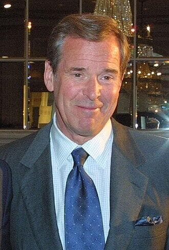

import Head from '@docusaurus/Head';

<Head>
  
</Head>

ABC World News Tonight anchor who produced and hosted a major primetime UFO special featuring extensive whistleblower interviews, then was diagnosed with aggressive lung cancer and died within months of its airing.

| Field | Details |
|-------|---------|
| **Full Name** | Peter Charles Jennings |
| **Born** | July 29, 1938 |
| **Died** | August 7, 2005 |
| **Age at Death** | 67 |
| **Location of Death** | New York City, New York |
| **Cause of Death** | Lung cancer |
| **Official Ruling** | Natural causes |
| **Category** | Journalist / News Anchor |

## Assessment: MODERATE SUSPICION

Jennings anchored *Peter Jennings Reporting: UFOs -- Seeing Is Believing*, a two-hour ABC primetime special that aired February 24, 2005. He announced his lung cancer diagnosis on April 5, 2005 -- approximately six weeks later -- and died on August 7, 2005. The speed of the cancer's progression was remarkable: from diagnosis to death in four months. While Jennings was a former smoker, the timing -- producing a major UFO special with extensive whistleblower footage, much of which was reportedly cut before broadcast, followed by a rapid cancer death -- has drawn attention from UAP researchers who note the pattern of fast-acting cancers among those who investigate or publicize UFO-related information.

## Circumstances of Death

Peter Jennings died on August 7, 2005, at his apartment in New York City from lung cancer. He had announced his diagnosis on April 5, 2005, during an on-air broadcast. The cancer was aggressive and advanced rapidly; he died approximately four months after diagnosis.

Jennings had been the sole anchor of ABC's *World News Tonight* since 1983 and was one of the three most prominent news anchors in America alongside Tom Brokaw and Dan Rather.

In the months before his diagnosis, Jennings had produced and hosted *Peter Jennings Reporting: UFOs -- Seeing Is Believing*, a two-hour primetime special that aired on ABC on February 24, 2005. The special examined the UFO phenomenon and featured interviews with multiple witnesses and researchers.

## Background

Peter Jennings was one of the most trusted and recognized news anchors in American television history. He anchored *ABC World News Tonight* for over two decades (1983-2005) and was known for his thorough, credible journalism.

### The UFO Special

In February 2005, Jennings produced and hosted a major two-hour primetime ABC special on UFOs. According to accounts from UAP researchers and witnesses who participated:

- Jennings reportedly recorded **days of footage** with prominent UFO whistleblowers and witnesses
- The original concept was allegedly a **multi-part program** that would air over multiple weeks
- What actually aired on February 24, 2005, reportedly **excluded approximately 90% of the recorded material**
- The broadcast version was significantly more skeptical and restrained than the full body of interviews suggested

The special that aired was titled *Peter Jennings Reporting: UFOs -- Seeing Is Believing* and drew significant viewership. Despite being edited down, it represented one of the most mainstream treatments of the UFO topic by a major network news anchor.

### Timeline

- **February 24, 2005**: UFO special airs on ABC primetime
- **April 5, 2005**: Jennings announces lung cancer diagnosis on air (~6 weeks after special)
- **April 2005**: Jennings begins chemotherapy
- **August 7, 2005**: Jennings dies (~4 months after diagnosis, ~5.5 months after special aired)

## Why This Death Possibly Raises Questions

- The speed of his cancer -- from diagnosis to death in approximately four months -- was remarkable
- The timing: diagnosed weeks after airing a major UFO special that allegedly contained far more explosive material than what was broadcast
- According to UAP researchers, the recorded material included extensive whistleblower testimony that was cut from the final broadcast -- raising questions about who made the editorial decision to remove 90% of the content
- Jennings' UFO special represented a potential "Walter Cronkite moment" -- a trusted mainstream anchor lending credibility to the UFO topic on primetime television
- The pattern of fast-acting cancers among UFO researchers and journalists is documented: [Karla Turner](Karla_Turner.mdx) (breast cancer, age 48), [Ann Livingston](Ann_Livingston.mdx) (ovarian cancer), [Olavo Fontes](Olavo_Fontes.mdx) (cancer at 32), [Ivan Sanderson](Ivan_Sanderson.mdx) (fast-spreading cancer), [Tony Dodd](Tony_Dodd.mdx) (brain tumor, believed "engineered")
- The CIA has been documented as possessing technology capable of inducing cancer-like symptoms. The Church Committee hearings revealed the CIA's "heart attack gun" and other assassination tools
- Jennings was a former smoker who had reportedly quit years earlier

## The Counterargument

- Jennings was a former smoker. Lung cancer is the leading cause of cancer death, and former smokers remain at elevated risk for years after quitting
- Lung cancer is frequently diagnosed at advanced stages because early symptoms are often absent or mild, which can explain the rapid progression from diagnosis to death
- Four months from diagnosis to death, while fast, is not unusual for late-stage lung cancer
- There is no direct evidence that anyone targeted Jennings
- The editorial decision to cut material from the UFO special could reflect standard television production decisions -- hours of footage are routinely reduced for broadcast
- ABC network executives and producers would have had editorial control over the final cut, which is normal practice
- Correlation between the special and the diagnosis does not establish causation

## Key Quotes from Media Coverage

> "Jennings reportedly recorded days and days worth of footage with all kinds of prominent whistleblowers. And it was supposed to air on primetime television... but what they aired excluded 90% of the material."
> -- UAP researcher account, 2024 (from video transcript discussing UAP-related deaths)

> "He records this thing, gets cancer, drops dead really, like within a year of this program airing."
> -- UAP researcher, 2024 (from video transcript)

## See Also

- [Karla Turner](Karla_Turner.mdx) -- Abduction researcher who died of fast-acting breast cancer at 48 with no family history; believed her cancer was retaliation
- [Dorothy Kilgallen](Dorothy_Kilgallen.mdx) -- Journalist who died after investigating UFOs and the JFK assassination; notes and files disappeared
- [Ann Livingston](Ann_Livingston.mdx) -- MUFON investigator who died of fast-acting ovarian cancer in 1994
- [Tony Dodd](Tony_Dodd.mdx) -- British UFO investigator who believed his brain tumor was "engineered in retaliation"
- [Karl Wolfe](Karl_Wolfe.mdx) -- Disclosure Project witness killed by tractor trailer while cycling
- [Robert Monroe](Robert_Monroe.mdx) -- Monroe Institute founder whose "loosh farm" framework describes fast-acting cancer as one tool non-human entities use to kill prominent people; the CIA used his institute for classified remote viewing

## Other Shocking Stories

- [Mark McCandlish](Mark_McCandlish.mdx): Aerospace illustrator found dead by shotgun blast days before scheduled Senate testimony on alien reproduction vehicles.
- [Ron Johnson](Ron_Johnson.mdx): MUFON deputy director collapsed with purple face and bleeding nose after sipping from a soda can at a conference.
- [Phil Schneider](Phil_Schneider.mdx): Ex-government geologist found strangled with his own catheter after two years of public lectures about underground alien bases.
- [Todd Sees](Todd_Sees.mdx): Pennsylvania hunter vanished on morning witnesses reported UFO on same ridge; body found with "cocaine toxicity" ruling.

## Sources

- [Peter Jennings -- Wikipedia](https://en.wikipedia.org/wiki/Peter_Jennings)
- [Peter Jennings Reporting: UFOs -- Seeing Is Believing -- Wikipedia](https://en.wikipedia.org/wiki/Peter_Jennings_Reporting:_UFOs_%E2%80%93_Seeing_Is_Believing)
- [Peter Jennings, Urbane News Anchor, Dies at 67 -- New York Times](https://www.nytimes.com/2005/08/08/business/media/peter-jennings-urbane-news-anchor-dies-at-67.html)
- [ABC News anchor Peter Jennings dead at 67 -- CNN](https://www.cnn.com/2005/US/08/07/jennings/)
- Nick Redfern, *Close Encounters of the Fatal Kind* (2014)
- Video: [@D4rk_n3ws on X, April 8, 2026](https://x.com/D4rk_n3ws/status/2041749170772451823) — UAP researcher discusses Jennings' UFO special, the 90% cut, and the pattern of fast-acting cancers among UAP journalists

*This information was built by Grok and Claude AI research.*

**Status:** Deceased (2005)
