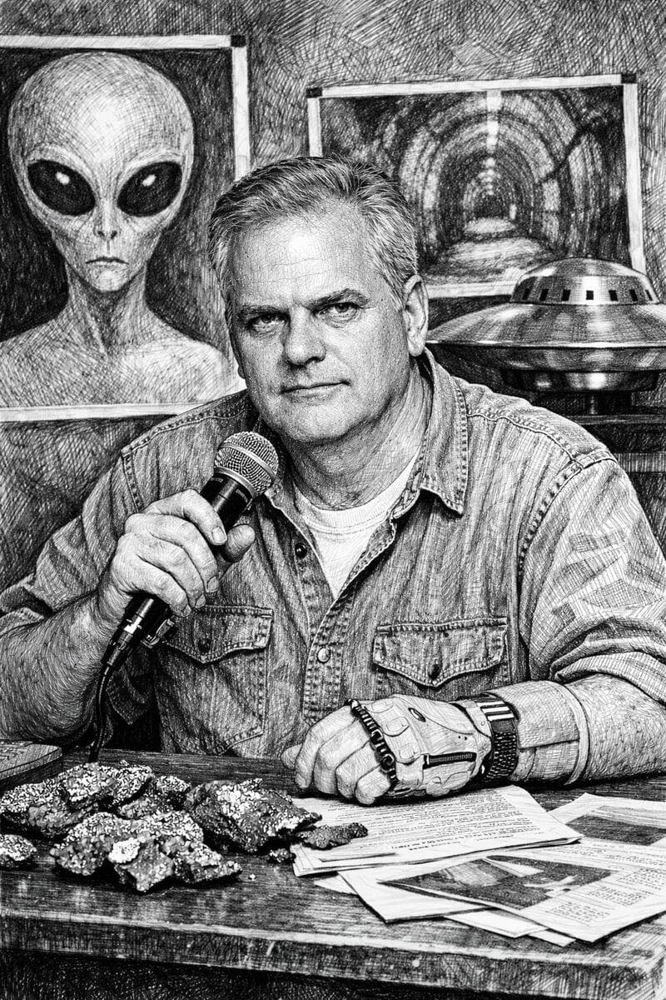

# Phil Schneider
Ex-government geologist and structural engineer who claimed involvement in building deep underground military bases (DUMBs) and an alleged firefight with aliens at Dulce, New Mexico. Found dead in his apartment with a catheter tube wrapped around his neck.

| Field | Details |
|-------|---------|
| **Full Name** | Philip Schneider |
| **Born** | April 23, 1947 |
| **Died** | January 11, 1996 (found January 17, 1996) |
| **Age at Death** | 48 |
| **Location of Death** | Wilsonville, Oregon |
| **Cause of Death** | Asphyxiation — rubber catheter tube wrapped three times around neck |
| **Official Ruling** | Suicide |
| **Category** | Government Contractor / Whistleblower |

## Assessment: HIGHLY SUSPICIOUS

Schneider's death presents significant physical anomalies that are difficult to reconcile with suicide. He was found with a rubber catheter tube wrapped three times around his neck. His ex-wife documented that his fingerprints were not found on the catheter — despite limited dexterity from a prior arm injury that would have made self-strangulation with a rubber tube extremely difficult. He had been giving public lectures for approximately two years exposing what he claimed were classified underground base programs. He had told audiences repeatedly that if he were found dead, it would not be suicide. His close friend [Ron Rummel](Ron_Rummel.md) had been found dead under similarly suspicious circumstances less than three years earlier.

## Circumstances of Death

Phil Schneider was found dead in his apartment in Wilsonville, Oregon, on January 17, 1996. He had been dead for several days, with the estimated date of death being January 11, 1996. A rubber catheter hose was wrapped three times around his neck.

The death was ruled a suicide by the medical examiner. However, Schneider's former wife, Cynthia Drayer, wrote letters to authorities (dated February 23 and November 23, 1996) alleging significant inconsistencies:

- **No fingerprints on the catheter** — Schneider's fingerprints were not found on the catheter tube used in his death, despite the fact that self-strangulation would require gripping and wrapping the tube
- **Physical limitations** — Schneider had limited dexterity in his hands due to injuries he claimed were sustained in the 1979 Dulce incident. He was missing fingers on one hand. Self-strangulation with a rubber tube would have been extremely difficult given these physical impairments
- **Scene inconsistencies** — Drayer stated the arrangement of the scene did not align with self-strangulation given his physical impairments

Despite these objections, the medical examiner declined to reclassify the death as homicide, and no formal police murder investigation was conducted.

## Background

Philip Schneider was an American geologist and structural engineer who claimed to have worked on underground tunneling projects for government contractors with high-level security clearance.

### Claims About Underground Bases

Beginning in approximately 1994, Schneider began giving public lectures in which he made extraordinary claims:

- He stated he had participated in constructing deep underground military bases (DUMBs) at multiple locations across the United States
- He claimed that in 1979, while working on a military project to expand an underground facility near Dulce, New Mexico, workers accidentally broke into a cavern system occupied by extraterrestrial beings
- He alleged a firefight broke out between the aliens and U.S. military forces, resulting in approximately 60 human deaths
- He displayed visible injuries during his lectures — missing fingers and chest scars — which he claimed were the result of being struck by an alien weapon during the Dulce confrontation
- He claimed the U.S. government maintained treaties with extraterrestrial species and that massive black-budget spending funded these programs

### Lecture Circuit and Warnings

From approximately 1994 until his death, Schneider gave dozens of public lectures, several of which were filmed and remain available. In these lectures, he repeatedly stated that he expected to be killed for speaking out and told audiences that if he were found dead, it would not be suicide.

He claimed that multiple attempts had been made on his life before his death, including having his car run off the road.

### Verification Issues

Schneider's claims about Dulce and underground bases have never been independently verified. No public military records document the casualties or operations he described. Records from Dammasch State Hospital indicate Schneider had documented mental health issues, including schizophrenia, self-inflicted injuries, and delusional episodes that predated his public lectures. He also suffered from mycosis fungoides cancer and multiple sclerosis.

His father, Oscar Schneider, was reportedly a U.S. Navy captain, which some researchers cite as lending partial credibility to Phil's claims of government connections.

## Why This Death Possibly Raises Questions

- A rubber catheter wrapped three times around the neck is an extremely unusual method of suicide — and particularly difficult for someone with missing fingers and limited hand dexterity
- No fingerprints were found on the catheter tube
- His ex-wife documented scene inconsistencies and formally requested reclassification as homicide
- The medical examiner declined to reclassify despite the anomalies, and no murder investigation was conducted
- Schneider had publicly predicted his own death and repeatedly stated it would not be suicide
- He claimed multiple prior assassination attempts
- His close friend and collaborator [Ron Rummel](Ron_Rummel.md) had been found dead under similarly suspicious circumstances (staged suicide with forensic anomalies) less than three years earlier
- His death occurred in January 1996, the same month [Karla Turner](Karla_Turner.md) died of fast-acting cancer
- He was in the midst of an active public lecture tour exposing what he claimed were classified programs
- However, documented mental health issues (schizophrenia, institutionalization) complicate the assessment of both his claims and his death
- The extraordinary nature of his claims (alien firefights, underground bases) makes objective evaluation difficult

## The Counterargument

- Schneider had documented serious health problems, including mycosis fungoides cancer and multiple sclerosis, which may have contributed to mental deterioration and potentially to suicidal ideation
- Hospital records from Dammasch State Hospital indicate a prior history of schizophrenia, self-inflicted injuries, and delusional episodes — predating his public lecture career
- His ex-wife Cynthia Drayer, the primary source of the murder allegations, later recanted some of her more dramatic claims; her account has been inconsistent over time
- None of Schneider's core claims — the 1979 Dulce firefight, the underground base network, the alien treaty program — have been independently verified; no geological surveys, construction records, or military personnel have corroborated the Dulce incident
- A rubber catheter tube wrapped around the neck is unusual, but given his physical and mental health deterioration, self-harm cannot be ruled out; the absence of fingerprints does not conclusively indicate someone else's involvement
- Some acquaintances noted significant mental health deterioration in his final months, which complicates reliance on his own predictions that his death would not be a suicide
- The extraordinary nature of his public claims (alien firefights, black-budget treaties, reptilian beings) makes objective assessment of his credibility difficult, and at least some claims appear to have no basis in verifiable fact

## Key Quotes from Media Coverage

> "If I ever 'commit suicide,' I'll have been murdered." — Phil Schneider, speaking at multiple public lectures in 1995

> "He was not suicidal. He was murdered. I know it. He told me he'd never commit suicide." — Cynthia Drayer, Phil Schneider's ex-wife

## See Also

- [Ron Rummel](Ron_Rummel.md) — Close friend and collaborator, found dead in 1993 with similar forensic anomalies
- [Karla Turner](Karla_Turner.md) — Died the same month (January 1996) of fast-acting cancer
- [William Cooper](William_Cooper.md) — Another government insider making extraordinary claims who died violently

## Other Shocking Stories

- [Mark Wisner](Mark_Wisner.md): MOD software engineer found dead from asphyxiation with a plastic sack and cling film over his face —...
- [Eugene Mallove](Eugene_Mallove.md): Cold fusion advocate, science writer, and editor of Infinite Energy magazine who was beaten to death in 2004...
- [Stanley Meyer](Stanley_Meyer.md): Inventor who claimed to have developed a water fuel cell capable of powering an automobile; died suddenly at...
- [Wilbert B. Smith](Wilbert_Smith.md): Canadian government engineer who ran Project Magnet, Canada's official UFO study, and concluded UFOs were extraterrestrial in origin

## Sources

- [Phil Schneider — Find a Grave](https://www.findagrave.com/memorial/146890828/phil-schneider)
- [Philip Schneider — Grokipedia](https://grokipedia.com/page/Philip_Schneider)
- [Phil Schneider A-Z](https://sites.google.com/site/philschneideraz/)
- [The Mysterious Life and Death of Phil Schneider — UFO Review](https://uforeview.tripod.com/philschneider.html)
- [Phil Schneider — Eastern Sierra Now](https://www.easternsierranow.com/beyond-the-beyond-who-was-phil-schneider/)
- [Phil Schneider — Documentary Tube](https://www.documentarytube.com/articles/phil-schneider--the-man-behind-the-alien-agenda/)

*This information was built by Grok and Claude AI research.*
