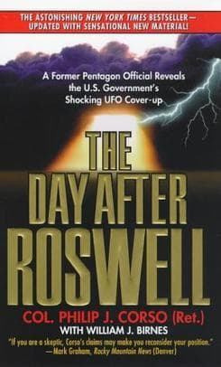

# Philip J. Corso
Lt. Colonel, U.S. Army, who served on Eisenhower's National Security Council and headed Foreign Technology at Army R&D, author of *The Day After Roswell* (1997), in which he claimed he oversaw the seeding of recovered alien technology to American defense contractors.

| Field | Details |
|-------|---------|
| **Full Name** | Philip James Corso |
| **Born** | May 22, 1915 |
| **Died** | July 16, 1998 |
| **Age at Death** | 83 |
| **Location of Death** | United States |
| **Cause of Death** | Heart attack |
| **Official Ruling** | Natural causes |
| **Category** | Military Insider / Whistleblower |

## Assessment: MODERATE SUSPICION

Corso died of a heart attack at age 83, approximately one year after publishing *The Day After Roswell*. While a heart attack at 83 is not inherently suspicious, the timing -- after going public with extraordinary claims about Roswell and reverse-engineering -- fits a pattern seen in other UAP disclosure cases. Heart attacks are also among the methods reportedly used by intelligence services to eliminate targets (see CIA "heart attack gun" disclosed in the 1975 Church Committee hearings). However, his advanced age makes a natural death the most likely explanation.

## Circumstances of Death

Philip Corso died of a heart attack on July 16, 1998, approximately one year after the publication of his book *The Day After Roswell* and less than a year after his high-profile appearance on Art Bell's *Coast to Coast AM* radio show on July 23, 1997, where he discussed his Roswell claims to a national audience.

## Background

Philip James Corso had a distinguished military career spanning from 1942 to 1963, rising to the rank of Lieutenant Colonel. His verified positions included:

- Intelligence officer on General Douglas MacArthur's staff during the Korean War
- Member of President Eisenhower's National Security Council
- Head of Foreign Technology in Army Research and Development at the Pentagon in the early 1960s, where he was reportedly in charge of the "Roswell Files"

In his 1997 book *The Day After Roswell* (co-authored with William J. Birnes), Corso claimed that in the early 1960s he was tasked with distributing recovered extraterrestrial artifacts from the 1947 Roswell crash to American defense contractors. According to Corso, the reverse-engineering of these artifacts allegedly led to the development of:

- Accelerated particle beam devices
- Fiber optics
- Lasers
- Integrated circuit chips
- Kevlar material

Corso stated that these technologies were seeded into the private sector through Army R&D contracts in a way that obscured their true origin. The book became a bestseller and remains one of the most widely cited texts in UAP disclosure literature.

## Why This Death Possibly Raises Questions

- Died approximately one year after publishing explosive claims about Roswell and reverse-engineering programs
- His verified military credentials (NSC member, Army R&D Foreign Technology chief) made his claims difficult to dismiss
- Heart attacks are a known method of covert assassination (CIA "heart attack gun" disclosed 1975)
- However, death at 83 from a heart attack is common and does not require an alternative explanation
- His claims about seeding alien technology into defense contractors align with later testimony by [David Grusch](David_Grusch.mdx) about reverse-engineering programs
- The specific technologies he named (fiber optics, integrated circuits, Kevlar) had well-documented development histories that do not require alien origins

## See Also

- [David Grusch](David_Grusch.mdx) -- Testified before Congress about UAP retrieval and reverse-engineering programs
- [Boyd Bushman](Boyd_Bushman.mdx) -- Lockheed Martin engineer who made similar reverse-engineering claims on deathbed
- [Bob Lazar](Bob_Lazar.mdx) -- Claimed to have worked on reverse-engineering alien craft at S-4 near Area 51
- [Stanton Friedman](Stanton_Friedman.mdx) -- Nuclear physicist and prominent Roswell researcher

## Other Shocking Stories

- [Fred Bell](Fred_Bell.mdx): Nuclear physicist, claimed MKULTRA participant, and inventor who died on September 25, 2011 — reportedly within 48 hours...
- [Thomas Townsend Brown](Thomas_Townsend_Brown.mdx): American inventor and physicist who pioneered electrogravitics research and the Biefeld-Brown effect; died of natural causes in 1985...
- [Bob Lazar](Bob_Lazar.mdx): Physicist who claims he reverse-engineered alien spacecraft at the S-4 facility near Area 51, and has faced ongoing...
- [Eugene Mallove](Eugene_Mallove.mdx): Cold fusion advocate, science writer, and editor of Infinite Energy magazine who was beaten to death in 2004...

## Sources

- [Philip J. Corso - The Black Vault](https://www.theblackvault.com/casefiles/philip-j-corso/)
- [LTC Philip James Corso - Find a Grave](https://www.findagrave.com/memorial/525546/philip_james-corso)
- [Philip J. Corso - Wikipedia](https://en.wikipedia.org/wiki/Philip_J._Corso)
- [Philip J. Corso - Military Wiki](https://military-history.fandom.com/wiki/Philip_J._Corso)
- [Biography: Philip J. Corso - HandWiki](https://handwiki.org/wiki/Biography:Philip_J._Corso)

*This information was built by Grok and Claude AI research.*

**Status:** Deceased (1998)

---

## Additional context from the UAP Physics Murders investigation

Lt. Colonel who served on Eisenhower's National Security Council and headed Army R&D Foreign Technology, claiming he oversaw the distribution of recovered Roswell artifacts to defense contractors, allegedly seeding breakthroughs in integrated circuits, fiber optics, lasers, and Kevlar.

| Field | Details |
|-------|---------|
| **Full Name** | Philip James Corso |
| **Role** | Military Insider / Whistleblower |
| **Platform** | Book (*The Day After Roswell*), Art Bell's *Coast to Coast AM*, media interviews |
| **Notable Works** | *The Day After Roswell* (1997, co-authored with William J. Birnes) |

## Their Claims

Philip Corso's contribution to UAP physics understanding centers not on theoretical frameworks but on a specific mechanism: the claim that classified reverse-engineering of recovered extraterrestrial technology produced major advances in materials science, electronics, and photonics that were then seeded into the American industrial base.

Corso served as head of the Foreign Technology Division at Army Research and Development in the Pentagon during the early 1960s. In this role, he claimed he was given custody of what he called "the Roswell Files" -- artifacts recovered from the 1947 Roswell crash. According to Corso, he was tasked with distributing these artifacts to defense contractors in ways that obscured their extraterrestrial origin, presenting them as foreign technology for reverse-engineering.

The specific technologies Corso claimed resulted from this reverse-engineering program include:

- **Integrated circuit chips** -- Allegedly derived from wafer-thin components found in the wreckage, seeded to companies including IBM and Bell Labs
- **Fiber optics** -- Claimed to be reverse-engineered from light-conducting filaments recovered from the craft
- **Lasers** -- Attributed to energy-focusing components found in the debris
- **Kevlar and super-tenacity fibers** -- Said to originate from the extraordinarily strong, flexible material of the craft's structure
- **Accelerated particle beam devices** -- Claimed to be derived from weapon or propulsion components

Corso stated that the seeding was done through Army R&D contracts, with contractors like Hughes Aircraft, IBM, Bell Labs, and Dow Corning receiving materials without being told of their true origin. The contractors believed they were working with captured foreign (terrestrial) technology.

## Key Quotes

> "The most significant achievement of my tenure at Foreign Technology was the reverse-engineering of the alien technology and the seeding of that technology into American industry."
> -- **Philip Corso**, *The Day After Roswell* (1997)

> "I was given direct access to the Roswell files and the artifacts. My job was to get this technology into the hands of defense contractors who could use it."
> -- **Philip Corso**, interview on *Coast to Coast AM*, July 23, 1997

## Key Arguments & Evidence They Cite

- **Verified military credentials**: Corso's positions -- intelligence officer on MacArthur's staff, member of Eisenhower's NSC, head of Army R&D Foreign Technology Division -- are confirmed by military records
- **Technology timeline alignment**: Corso argued that the rapid pace of advancement in integrated circuits, fiber optics, and lasers in the late 1950s and 1960s was suspiciously fast and coincided with when he claims the seeding program was active
- **Army R&D contracting mechanism**: Described a specific, plausible institutional mechanism (Army R&D contracts for "foreign technology" analysis) through which alien artifacts could have been distributed without revealing their origin
- **Senator Strom Thurmond's endorsement**: Thurmond initially wrote the foreword to the book, lending political credibility, though he later distanced himself from it
- **Alignment with later testimony**: Corso's claims about reverse-engineering programs preceded and align with testimony by [David Grusch](David_Grusch.mdx) about UAP retrieval and reverse-engineering programs described to Congress in 2023

## Where They've Said It

- *The Day After Roswell* (Simon & Schuster, 1997)
- Interview on Art Bell's *Coast to Coast AM*, July 23, 1997
- Multiple media appearances in 1997-1998
- Sworn affidavit filed before his death affirming his claims

## The Counterargument

- **Documented development histories**: Each technology Corso attributed to alien reverse-engineering (integrated circuits, fiber optics, lasers, Kevlar) has well-documented, incremental development histories involving identifiable human inventors and research programs
- **Integrated circuits** were developed independently by Jack Kilby at Texas Instruments and Robert Noyce at Fairchild Semiconductor, with extensive paper trails of their work
- **Fiber optics** trace back to research by Narinder Singh Kapany and others through decades of published optical research
- **Lasers** were theorized by Einstein (stimulated emission, 1917) and built by Theodore Maiman in 1960, with extensive published research preceding the invention
- **The Guardian** included *The Day After Roswell* in its "Top 10 literary hoaxes" list
- Senator Thurmond later stated he had been deceived about the book's contents when he wrote the foreword
- Military records do not specifically confirm Corso's access to Roswell-related materials
- Critics note that Corso provided no physical evidence, only his personal testimony
- Some details in the book have been shown to contain factual errors about military procedures and timelines

## Related Perspectives

- [Stanton Friedman](Stanton_Friedman.mdx) -- Nuclear physicist whose Roswell research provided the evidentiary foundation that Corso's claims built upon
- [Bob Lazar](Bob_Lazar.mdx) -- Claimed direct hands-on reverse-engineering of alien craft at S-4; Corso described the institutional mechanism by which such programs could operate
- [Boyd Bushman](Boyd_Bushman.mdx) -- Lockheed Martin senior scientist who made similar reverse-engineering claims on his deathbed
- [David Grusch](David_Grusch.mdx) -- Congressional testimony about UAP retrieval and reverse-engineering programs that align with Corso's decades-earlier claims
- [Exotic Metamaterials](Exotic_Metamaterials.mdx) -- The materials science implications of Corso's claims about recovered craft structural materials
- [Electromagnetic Propulsion](Electromagnetic_Propulsion.mdx) -- Particle beam devices Corso described may relate to electromagnetic propulsion frameworks
- [Philip Corso (UAP Deaths)](/uaps/Details/Philip_Corso) -- Profile emphasizing the circumstances of his death one year after publication
- [William Colby](William_Colby.mdx) -- Former CIA Director who died under disputed circumstances in 1996, the year before Corso published; Colby's demonstrated willingness to disclose classified programs as DCI parallels Corso's decision to go public about reverse-engineering programs

## Sources

- [Philip J. Corso - Wikipedia](https://en.wikipedia.org/wiki/Philip_J._Corso)
- [The Day After Roswell - Simon & Schuster](https://www.amazon.com/Day-After-Roswell-Philip-Corso/dp/067101756X)
- [Colonel Philip Corso's Roswell and Technology Transfer Testimony - BlackBox UFO Research](https://blackboxufo.com/testimonies/philip-corso-roswell-testimony/)
- [Philip J. Corso - The Black Vault](https://www.theblackvault.com/casefiles/philip-j-corso/)
- [Philip J. Corso - Military Wiki](https://military-history.fandom.com/wiki/Philip_J._Corso)
- [The Day After Roswell Anthology - Internet Archive](https://archive.org/details/the-day-after-roswell-anthology-a-collective-history-of-a-great-american-1999-philip-corso)

*This information was compiled by Claude AI research.*

**Status:** Deceased (1998)

---

**Investigations:** UAPs Murders (General), UAP Physics Murders
