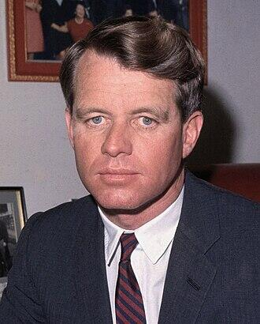

import Head from '@docusaurus/Head';

<Head>
  
</Head>

U.S. Senator and presidential candidate, assassinated in Los Angeles on June 5, 1968. Some fringe theorists claim he was killed to prevent continuation of his brother JFK's alleged UFO disclosure efforts. No direct evidence links RFK's assassination to UAPs.

| Field | Details |
|-------|---------|
| **Full Name** | Robert Francis Kennedy |
| **Born** | November 20, 1925 (Brookline, Massachusetts) |
| **Died** | June 6, 1968 |
| **Age at Death** | 42 |
| **Location of Death** | Good Samaritan Hospital, Los Angeles, California, USA |
| **Cause of Death** | Gunshot wounds (assassination) |
| **Official Ruling** | Homicide; Sirhan Sirhan convicted |
| **Category** | Political Figure |

## Assessment: UNCERTAIN (UFO Link)

Robert F. Kennedy's assassination is well-documented and has generated its own body of conspiracy theories — primarily involving a second gunman, CIA involvement, and the role of Sirhan Sirhan as a possible Manchurian candidate. The UFO disclosure theory is an extension of the fringe JFK-UFO theory: the claim is that RFK would have continued his brother's alleged pursuit of UFO transparency and was therefore silenced for the same reasons. **There is no direct evidence whatsoever linking RFK's assassination to UFOs or UAPs.** This is among the most speculative entries in the UAP deaths literature.

## Circumstances of Death

On June 5, 1968, moments after winning the California Democratic presidential primary, Robert Kennedy was shot in the kitchen pantry of the Ambassador Hotel in Los Angeles. He was struck by three bullets, with a fourth passing through his suit jacket. The fatal shot entered behind his right ear at close range. He was rushed to Good Samaritan Hospital, where he underwent surgery but never regained consciousness. He was pronounced dead at 1:44 a.m. on June 6, 1968.

Sirhan Bishara Sirhan, a 24-year-old Palestinian-Jordanian immigrant, was apprehended at the scene with a .22 caliber revolver. He was convicted of first-degree murder in 1969 and sentenced to death, later commuted to life imprisonment.

## Background

Robert F. Kennedy served as the 64th United States Attorney General (1961-1964) under his brother President John F. Kennedy and then as U.S. Senator from New York (1965-1968). As Attorney General, he led aggressive campaigns against organized crime and played a key role in the civil rights movement. After his brother's assassination in 1963, RFK entered the Senate and became increasingly outspoken against the Vietnam War.

In 1968, he entered the presidential race, winning several primaries and emerging as a strong contender for the Democratic nomination. His assassination occurred on the night of his California primary victory.

### The UFO Theory

The UFO connection to RFK's assassination is entirely derivative of the JFK-UFO theory. Proponents argue that if JFK was killed (in part) to prevent UFO disclosure, then RFK — who as president might have reopened his brother's inquiry — would have been targeted for the same reason. This theory has been promoted by some UFO disclosure advocates but rests on no independent evidence.

No documents, testimony, or credible sources link RFK to any interest in UFOs or classified aerospace programs. The theory is purely speculative extrapolation.

## Why This Death Possibly Raises Questions (UFO Context)

- The UFO theory is entirely speculative and derivative of the disputed JFK-UFO theory
- No documents or testimony link RFK to any UFO-related inquiry or interest
- Mainstream conspiracy theories focus on a possible second gunman, CIA involvement, and questions about Sirhan Sirhan's mental state
- The only connection is the assumption that RFK would have continued JFK's alleged UFO disclosure — an assumption built on an unverified premise
- This represents one of the weakest UAP-linked death claims in the literature

## See Also

- [John F. Kennedy](John_F_Kennedy.mdx) — Brother, whose assassination is the basis for the extended UFO theory
- [Dorothy Kilgallen](Dorothy_Kilgallen.mdx) — Journalist who investigated the JFK assassination

## Other Shocking Stories

- [Fred Bell](Fred_Bell.mdx): Nuclear physicist, claimed MKULTRA participant, and inventor who died on September 25, 2011 — reportedly within 48 hours...
- [Michael Baker](Michael_Baker.mdx): 22-year-old Plessey digital communications expert and part-time SAS member killed when his car crashed through a barrier near...
- [George Adamski](George_Adamski.mdx): The most famous 1950s UFO contactee who claimed meetings with extraterrestrial "Space Brothers."
- [John Burroughs](John_Burroughs.mdx): U.S. Air Force witness to the Rendlesham Forest incident of December 1980, who suffered permanent radiation injuries from...

## Sources

- [Wikipedia: Robert F. Kennedy assassination conspiracy theories](https://en.wikipedia.org/wiki/Robert_F._Kennedy_assassination_conspiracy_theories)
- [Wikipedia: UFO conspiracy theories](https://en.wikipedia.org/wiki/UFO_conspiracy_theories)
- [NBC News: Is that JFK memo to the CIA about UFOs real?](https://www.nbcnews.com/id/wbna42704241)
- [Live Science: CIA Cover-up Alleged in JFK's 'Secret UFO Inquiry'](https://www.livescience.com/33224-new-declassified-memos-jfk-kennedy-ufos-assassination.html)

*This information was built by Grok and Claude AI research.*

**Status:** Deceased (1968)
