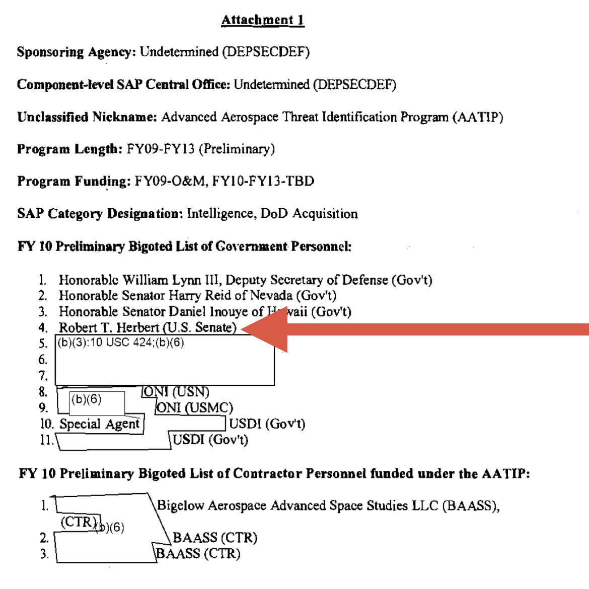
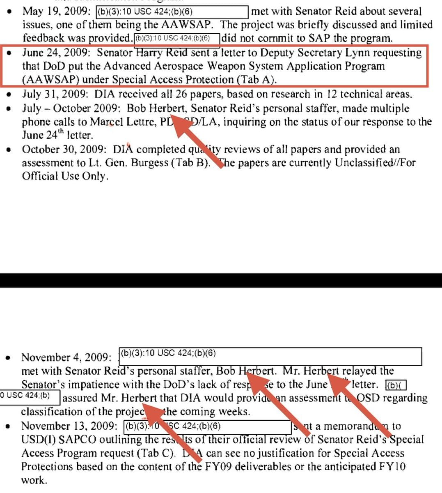

import Head from '@docusaurus/Head';

<Head>
  
</Head>

Retired two-star general and longtime senior aide to Senator Harry Reid who was listed on the classified AATIP/AAWSAP "Bigoted Access List" — the small group of people with direct access to the Pentagon's secret UAP program. Killed at age 64 in a single-vehicle Porsche crash on a remote desert road near the Nevada-California border on September 24, 2021.

| Field | Details |
|-------|---------|
| **Full Name** | Robert Thomas Herbert |
| **Born** | September 7, 1957 |
| **Died** | September 24, 2021 |
| **Age at Death** | 64 |
| **Location of Death** | Nipton Road near Ivanpah Road, unincorporated San Bernardino County, California (near Nevada border) |
| **Cause of Death** | Single-vehicle crash — Porsche traveling at high speed lost control, became airborne, overturned multiple times in open desert |
| **Official Ruling** | Accidental — CHP stated impairment was not suspected |
| **Category** | Military Officer / Government Official / AATIP-AAWSAP Insider |

## Key Documents

*Images from [@MvonRen on X](https://x.com/MvonRen/status/2039342213549920508), April 1, 2026.*

## Assessment: SUSPICIOUS

Major General Robert T. Herbert occupied a unique dual role: he was both a two-star general in the Nevada Army National Guard with over 42 years of military service and high-level security clearances, and Senator Harry Reid's senior defense policy advisor who managed all 12 federal spending bills including defense appropriations. He was listed as #4 on the proposed "Bigoted Access List" for the AATIP program — meaning he was designated as one of roughly 14 people who would have direct access to the classified UAP program's findings. He actively pressured the Pentagon on Reid's behalf to grant SAP protection to the UAP research program. His death in a solo desert crash at high speed — on a remote road near the Nevada Test Site corridor — came during a period of intense UAP disclosure activity (three months after the UAP Task Force delivered its preliminary assessment to Congress in June 2021). Senator Harry Reid himself died just three months later on December 28, 2021.

## Circumstances of Death

On September 24, 2021, at approximately 4:30 PM, Herbert was driving a Porsche westbound on Nipton Road, east of Ivanpah Road, in unincorporated San Bernardino County near the Nevada-California border. According to the California Highway Patrol, he was traveling at a high rate of speed when he lost control. The Porsche traveled off the road into the open desert to the north, became airborne, overturned multiple times, and came to rest in the open desert north of Nipton Road.

Herbert was alone in the vehicle. No other vehicles were involved. CHP stated that impairment was not suspected. No further explanation for the crash at high speed on a desert road was publicly provided.

The crash location on Nipton Road near Ivanpah is a remote stretch of desert highway near the Nevada-California border, relatively close to the Ivanpah Dry Lake area and within the broader Nevada Test Site corridor.

Herbert was buried at Arlington National Cemetery. Approximately 200 people attended his memorial at the Las Vegas Readiness Center, including a Chinook/Lakota flyover. President Biden sent a letter of condolence.

## Background

### Military Career (1975-2018)

Herbert enlisted in the U.S. Army immediately after high school in 1975 at age 18. Over 42 years of service, he held an extraordinary range of positions:

- **Cold War helicopter pilot** — flew patrol missions along the East-West German border
- **Nevada Army National Guard test pilot** (1982-1989)
- **Nevada's aviation officer** (commissioned 1989)
- **Director of Aviation for the Nevada Guard** (1995-2001) — managed operations and maintenance of 27 aircraft
- **Deputy Commander of the Nevada Army Guard** (2006-2013)
- **Assistant Adjutant General for the Army** (2013-2015)
- **National Security Policy Advisor to the Chief of the National Guard Bureau** (2015-2018)

He logged over 7,000 flight hours on both fixed-wing and rotary-wing aircraft and earned Army Master Aviator pilot wings. He held a Master's in Public Administration from George Washington University and a Master of Science in National Security Strategy from the National War College.

Herbert was the Nevada Army Guard's only major general. The City of Yerington named its new city hall the "Maj. Gen. Robert T. Herbert Administrative Building" in spring 2021, months before his death.

### Senate Career and Reid's Inner Circle (2001-2017)

Herbert served as Senior Policy Advisor and Director of Appropriations for Senator Harry Reid in Washington, D.C. He managed all 12 federal spending bills and advised Reid on transportation, defense, Veterans affairs, and homeland security matters. He helped secure over $200 million in funding for Nevada Guard infrastructure and equipment.

After leaving Reid's office in 2017, Herbert became Senior Vice President for the Porter Group, a lobbying firm headed by former U.S. Representative Jon Porter.

### AATIP/AAWSAP Involvement

Herbert was deeply embedded in the classified UAP program that Reid championed:

**The Reid Letter (June 24, 2009):** Senator Reid wrote to Deputy Secretary of Defense William Lynn III requesting that the Advanced Aerospace Weapon System Applications Program (AAWSAP) be designated as a Special Access Program (SAP). The letter explicitly named Herbert as the staff point of contact: *"If you or your staff have any questions, please contact Bob Herbert of my staff at (202) 437-3162."*

**Bigoted Access List:** Attachment 1 of Reid's letter contained the "FY 10 Preliminary Bigoted List of Government Personnel" — the small group of people who would have access to the classified program. Herbert was listed as #4, after William Lynn III (Deputy Secretary of Defense), Senator Harry Reid, and Senator Daniel Inouye. Most other names on the list were redacted in FOIA releases.

**Active Pentagon Pressure:** Between July and October 2009, Herbert made multiple phone calls to Marcel Lettre (PDASD/LA) at the Pentagon, inquiring about the status of DoD's response to Reid's June 24 letter. On November 4, 2009, Herbert met in person with Pentagon officials and relayed Senator Reid's impatience with the DoD's lack of response. On November 13, 2009, Herbert was informed that DIA would provide an assessment to DoD regarding classification of the program.

Herbert was not merely an administrative contact — his placement on the Bigoted Access List means he was designated as one of the small group with direct access to the classified UAP program's findings. His dual role as both a two-star general with high-level security clearances and Reid's senior defense appropriations advisor made him uniquely positioned to facilitate the program.

### The AAWSAP-Lockheed Connection

According to DOPSR-cleared statements by Lue Elizondo and David Grusch, the money allocated for AAWSAP was originally intended to facilitate a UAP material divestment plan proposed by Lockheed Martin Space Systems Vice President [Dr. James Ryder](James_Ryder.mdx). Ryder proposed transferring alleged crash retrieval material from a specific Lockheed facility to the DIA's AAWSAP program. This transfer was allegedly blocked by CIA Science and Technology Director Glenn Gaffney.

Herbert, as Reid's point man on AAWSAP and a member of the Bigoted Access List, would have been directly aware of — and likely involved in — the negotiations surrounding this proposed material transfer. His role as Director of Appropriations would have been critical to securing the funding needed for Bigelow Aerospace to build out facilities and material analysis equipment in Las Vegas.

## Why This Death Possibly Raises Questions

- Killed in a single-vehicle crash at high speed on a remote desert road near the Nevada Test Site corridor with no explanation for loss of control
- CHP stated impairment was not suspected, leaving the cause of the high-speed crash unexplained
- Was listed as #4 on the classified AATIP/AAWSAP Bigoted Access List — one of roughly 14 people with direct access to the Pentagon's secret UAP program
- Actively pressured the Pentagon on Reid's behalf to classify the UAP program as a SAP
- As Reid's Director of Appropriations, he controlled the funding mechanism for the UAP program
- His death on September 24, 2021 came three months after the UAP Task Force delivered its preliminary assessment to Congress (June 2021) — a period of intense disclosure momentum
- Senator Harry Reid died just three months later on December 28, 2021
- [Dr. James Ryder](James_Ryder.mdx), the Lockheed VP who proposed transferring UAP crash retrieval material to AAWSAP (the program Herbert helped fund and protect), also "died unexpectedly" in 2018 with no obituary ever located
- [Major General William McCasland](William_McCasland.mdx), the AFRL commander and SAPOC head who oversaw the SAP programs Herbert was trying to get AAWSAP classified under, disappeared on February 27, 2026
- Three of the key figures in the AAWSAP/AATIP material transfer chain — Herbert (funding/political cover), Ryder (proposed the transfer), McCasland (SAP oversight) — are now dead or missing
- His 42-year military career, 7,000+ flight hours, and National War College education suggest he was not an inexperienced or reckless driver
- The crash location near Ivanpah is in the remote desert corridor between Las Vegas and the Mojave — an area with minimal witnesses

## The Counterargument

- Single-vehicle crashes at high speed on desert roads, while tragic, are not uncommon — tire blowouts, wildlife, medical episodes, or momentary inattention can all cause loss of control
- Herbert was 64, an age where sudden cardiac events or medical episodes while driving can occur
- He was driving a Porsche, a high-performance vehicle that can be difficult to control at high speeds, especially on desert roads
- CHP investigated and classified it as accidental with no indication of impairment or foul play
- His role on the Bigoted Access List, while notable, was as a Senate staffer — he was a facilitator, not a direct witness to UAP materials or technology
- He had been out of Reid's office since 2017 and the AAWSAP program had ended years before his death
- No family members, colleagues, or associates have publicly stated they believe his death was suspicious
- The temporal proximity to the UAP Task Force report could be coincidental
- Reid's death three months later at age 82 from pancreatic cancer was consistent with his publicly known illness

## Key Quotes from Media Coverage

> "If you or your staff have any questions, please contact Bob Herbert of my staff at (202) 437-3162."
> — Senator Harry Reid, letter to Deputy Secretary of Defense William Lynn III, June 24, 2009

> "He didn't do it for the money. He did it because he was passionate about taking care of the military."
> — Former Congressman Jon Porter, Las Vegas Sun, October 2, 2021

> "He was a giant among the Nevada Guard. He was the patriarch."
> — Major General Ondra Berry, The Adjutant General of Nevada, at Herbert's memorial service

> "Bob Herbert, longtime aide to Harry Reid, killed in car crash."
> — Las Vegas Review-Journal headline, September 2021

## The AAWSAP Chain of Deaths

Three of the key figures in the AAWSAP/AATIP material transfer chain are now dead or missing:

| Name | Role in AAWSAP Chain | Status |
|------|---------------------|--------|
| **Robert Herbert** (this profile) | Reid's point man on AAWSAP; #4 on Bigoted Access List; Director of Appropriations controlling funding | Killed in solo desert crash, September 24, 2021 |
| **[James Ryder](James_Ryder.mdx)** | Lockheed VP who proposed transferring UAP crash retrieval material to AAWSAP | "Died unexpectedly" May 28, 2018; no obituary ever found |
| **[William McCasland](William_McCasland.mdx)** | AFRL commander; SAPOC executive secretary overseeing SAP programs | Missing since February 27, 2026; never seen leaving home |

## See Also

- [James Ryder](James_Ryder.mdx) — Lockheed Martin VP who proposed the UAP material transfer to AAWSAP; died unexpectedly in 2018
- [William McCasland](William_McCasland.mdx) — AFRL commander and SAPOC head; missing since February 2026
- [David Grusch](David_Grusch.mdx) — UAP whistleblower who provided DOPSR-cleared details about the AAWSAP material transfer
- [Lue Elizondo](Lue_Elizondo.mdx) — Former AATIP director who named Ryder and the AAWSAP funding in DOPSR-cleared statements
- [Harry Reid](Harry_Reid.mdx) — Senator who championed AAWSAP/AATIP; died December 28, 2021

## Other Shocking Stories

- [Phil Schneider](Phil_Schneider.mdx): Ex-government geologist who claimed involvement in underground bases found dead with catheter wrapped around his neck
- [Mark McCandlish](Mark_McCandlish.mdx): Disclosure Project witness and aerospace illustrator found dead from shotgun blast the day before testifying
- [James Ryder](James_Ryder.mdx): Lockheed VP who tried to transfer UAP crash materials died unexpectedly; no obituary ever found
- [William McCasland](William_McCasland.mdx): AFRL commander who oversaw SAP programs vanished from his home; FBI searching

## Sources

- [Las Vegas Review-Journal: Bob Herbert, longtime aide to Harry Reid, killed in car crash](https://www.reviewjournal.com/news/politics-and-government/nevada/bob-herbert-longtime-aide-to-harry-reid-killed-in-car-crash-2447570/)
- [Las Vegas Review-Journal: Bob Herbert, ex-Harry Reid aide, died in Porsche crash in California](https://www.reviewjournal.com/news/politics-and-government/nevada/bob-herbert-ex-harry-reid-aide-died-in-porsche-crash-in-california-2448971/)
- [Las Vegas Sun: One of a kind — Longtime Reid aide, Nevada Guard general memorialized](https://lasvegassun.com/news/2021/oct/02/one-of-a-kind-longtime-reid-aide-nevada-guard-gene/)
- [News3 Las Vegas: Former Harry Reid aid, retired Nevada Guard general Robert T. Herbert, dead at 64](https://news3lv.com/news/local/former-harry-reid-aid-retired-nevada-guard-general-robert-t-herbert-dead-at-64)
- [Congressman Steven Horsford: Mourns the Passing of Major General Bob Herbert](https://horsford.house.gov/media/press-releases/congressman-steven-horsford-mourns-the-passing-of-major-general-bob-herbert)
- [Nevada Appeal: Colleagues remember general's legacy to Nevada](https://www.nevadaappeal.com/news/2021/sep/28/colleagues-remember-generals-legacy-nevada/)
- [Las Vegas Review-Journal: Bob Herbert remembered as 'patriarch of the Guard' in Nevada](https://www.reviewjournal.com/local/local-nevada/bob-herbert-remembered-as-patriarch-of-the-guard-in-nevada-2452057/)
- [DVIDSHUB: Nevada Guard, state officials hold memorial service for general](https://www.dvidshub.net/news/406694/nevada-guard-state-officials-hold-memorial-service-general)
- [Senator Harry Reid letter to Deputy Secretary William Lynn III, June 24, 2009 (FOIA)](https://documents2.theblackvault.com/documents/dia/AAWSAP-DIRDs/AAWSAP-DIA-Letter.pdf)
- [@MvonRen on X: AAWSAP chain of deaths](https://x.com/MvonRen/status/2039342213549920508)

*This information was built by Grok and Claude AI research.*

**Status:** Deceased (2021)
