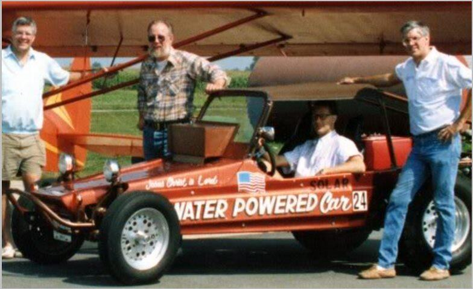

# Stanley Meyer
Inventor who claimed to have developed a water fuel cell capable of powering an automobile; died suddenly at a restaurant in 1998, reportedly exclaiming "They poisoned me" before collapsing.

| Field | Details |
|-------|---------|
| **Full Name** | Stanley Allen Meyer |
| **Born** | August 24, 1940 (Columbus, Ohio, USA) |
| **Died** | March 20, 1998 |
| **Age at Death** | 57 |
| **Location of Death** | Grove City, Ohio, USA |
| **Cause of Death** | Cerebral aneurysm |
| **Official Ruling** | Natural causes |
| **Category** | Inventor / Alternative Energy |

## Assessment: SUSPICIOUS

Stanley Meyer died suddenly on March 20, 1998, while dining at a restaurant during a meeting with two Belgian investors. According to his brother, Meyer ran outside and exclaimed "They poisoned me" before collapsing. The Franklin County coroner ruled his death was caused by a cerebral aneurysm, and police found no evidence of foul play. However, Meyer's supporters believe he was assassinated to suppress his water fuel cell technology, which he claimed could power a car using only water. It should be noted that an Ohio court had found Meyer's claims about the fuel cell to be fraudulent in 1996, two years before his death, which complicates the suppression narrative.

## Circumstances of Death

On March 20, 1998, Stanley Meyer was dining at a Cracker Barrel restaurant in Grove City, Ohio, with his brother Stephen and two Belgian investors, Philippe Vandemoortele and Marc. According to Stephen Meyer, during the meeting Stanley suddenly grabbed his neck, ran outside the restaurant, and exclaimed "They poisoned me" before collapsing in the parking lot. He was pronounced dead shortly thereafter.

An investigation by the Grove City police and the Franklin County coroner concluded that Meyer died of a cerebral aneurysm. Meyer had a documented history of high blood pressure. Toxicology tests found only lidocaine and phenytoin (seizure medication) in his system -- no poisons or unusual substances. No evidence of foul play was discovered.

Philippe Vandemoortele, one of the Belgian investors present at the dinner, later stated that he had been supporting Meyer financially for several years and considered him a personal friend. Vandemoortele said he had no idea where the rumors of his involvement in Meyer's death originated.

## Background

Stanley Allen Meyer was an American inventor from Columbus, Ohio, who claimed to have invented a "water fuel cell" -- a device he said could split water into hydrogen and oxygen using far less energy than conventional electrolysis, potentially allowing a car to run on water alone. Meyer received several patents for his designs and attracted significant attention from alternative energy enthusiasts.

Meyer's claims were controversial. In 1996, two years before his death, an Ohio court found Meyer guilty of "gross and egregious fraud" after investors filed a lawsuit. The court found that Meyer's water fuel cell did not perform as claimed and was based on conventional electrolysis rather than any breakthrough technology. Meyer was ordered to repay investors $25,000.

Despite the court ruling, Meyer continued promoting his technology and seeking investors. His supporters maintain that the fraud finding was itself part of a suppression campaign by interests threatened by his invention -- specifically the petroleum industry and related government agencies.

## Why This Death Possibly Raises Questions

- Reportedly exclaimed "They poisoned me" before collapsing, according to his brother
- Was promoting technology that, if legitimate, would have threatened the petroleum industry
- Died during a meeting with investors, which some interpret as suggesting he was close to a breakthrough or major deal
- Approximately one week after his death, his water fuel cell dune buggy — the demonstration vehicle — was reportedly stolen from his garage, along with other equipment and research materials
- His supporters claim a pattern of suppression of water-as-fuel and free energy technologies
- However: had documented high blood pressure, died of cerebral aneurysm (consistent with hypertension)
- Toxicology found no poisons -- only seizure medication
- Had been found guilty of fraud by an Ohio court in 1996, complicating the "suppressed genius" narrative
- The Belgian investor present denied any involvement and considered Meyer a friend

## The Counterargument

- The Franklin County coroner conducted a full autopsy and found the cause of death to be a cerebral aneurysm — a medically common cause of sudden death, particularly in persons with documented high blood pressure, as Meyer had
- Toxicology tests found no poison or unusual substances in Meyer's system — only lidocaine and phenytoin, a seizure medication consistent with his known medical history
- Meyer's brother Stephen was the sole source of the "They poisoned me" quote; Philippe Vandemoortele, one of the Belgian investors present at the dinner, gave a different account of events and denied any involvement or knowledge of threats
- An Ohio court found in 1996 — two years before his death — that Meyer's "water fuel cell" was based on conventional electrolysis and did not perform as claimed, and ordered him to repay investors $25,000 for "gross and egregious fraud"; this finding significantly complicates the narrative of a suppressed breakthrough inventor
- No independent scientific verification of Meyer's water fuel cell technology has ever been published in peer-reviewed literature; attempts to replicate his claims have consistently failed
- Sudden aneurysm deaths are not rare, and the presence of investors at the meal does not itself indicate a conspiracy — Meyer regularly met with investors
- The theory of suppression by petroleum interests or government agencies rests entirely on the assumption that his technology worked, which was directly contradicted by a court of law

## Key Quotes from Media Coverage

> "They poisoned me." — Stanley Meyer's last words, reported by his brother Stephen Meyer

> "I told people about this, what I had accomplished, and they'd say, 'Oh no, they'll kill you.'" — Stanley Meyer, in a 1995 interview

## Greer Testimony: The Engineering Team in Michigan (2026)

In a video posted on April 9, 2026, Dr. Steven Greer — founder of the Disclosure Project — gave a detailed public account of what allegedly happened to Meyer's technology after his death:

- After Meyer's death, his heirs invited Greer's team to bid for the equipment. Greer's team was outbid by a group funded by "someone in the House of Lords from the United Kingdom who was very wealthy."
- That group took all of Meyer's equipment — including a toroidal ("donut") shaped free energy device — to Michigan.
- The equipment had already been "slapped with a national security order."
- The engineering group in Michigan successfully got the devices to work.
- They were then threatened. A UK Lord called Greer urgently saying: "Dr. Greer, we need your help. That entire engineering team in Michigan have gotten these things to work, but they're being threatened. And we're concerned they're going to be killed."
- Greer gave a two-page strategy they didn't follow. They asked about fleeing to the Amazon; Greer said they'd "have to go to another star system to escape the reach of this organization."
- "The next thing you know, I think it was 18 or 19. All of them were killed except one."

**Source:** [@PlanetTyrusPod on X, April 9, 2026](https://x.com/PlanetTyrusPod/status/2042044832760344769?s=20)

<video controls style={{width: '100%', maxWidth: '720px', height: 'auto', display: 'block'}}>
  <source src="http://127.0.0.1:8080/ipfs/QmZ7GEkrpSAgCw3wr2k4p8SQR9NuKdmCPfM64o56uB6vhp" type="video/mp4" />
  <source src="https://ipfs.io/ipfs/QmZ7GEkrpSAgCw3wr2k4p8SQR9NuKdmCPfM64o56uB6vhp" type="video/mp4" />
  <source src="https://dweb.link/ipfs/QmZ7GEkrpSAgCw3wr2k4p8SQR9NuKdmCPfM64o56uB6vhp" type="video/mp4" />
  Your browser does not support the video tag.
</video>

*Dr. Steven Greer recounts the fate of Stan Meyer's technology and the engineering team allegedly killed after replicating his free energy devices. Source: [@PlanetTyrusPod on X](https://x.com/PlanetTyrusPod/status/2042044832760344769?s=20), April 9, 2026.*

## See Also

- [Stanley Meyer (Zero Point Energy)](https://uapmurders.com/uaps/Details/Stanley_Meyer/) — This case also appears in the Zero Point Energy project
- [Eugene Mallove](Eugene_Mallove.mdx) — Cold fusion advocate beaten to death in 2004
- [Arie DeGeus](Arie_DeGeus.mdx) — Free energy inventor found dead at airport
- [Paul Brown](Paul_Brown.mdx) — Nuclear battery inventor killed in car accident
- [Rory Johnson](Rory_Johnson.mdx) — Free energy inventor who died after DOE gag order
- [Amy Eskridge](Amy_Eskridge.mdx) — Antigravity researcher found dead from gunshot wound
- [Floyd Sweet](Floyd_Sweet.mdx) — Free energy inventor who received death threats

## Other Shocking Stories

- [John Brittan](John_Brittan.mdx): Royal College of Military Science IT specialist found dead from carbon monoxide poisoning in his garage — had...
- [Ivan T. Sanderson](Ivan_Sanderson.mdx): British-born biologist and founder of the Society for the Investigation of the Unexplained (SITU), died of fast-acting brain...
- [Robert F. Kennedy](Robert_F_Kennedy.mdx): U.S. Senator and presidential candidate, assassinated in Los Angeles on June 5, 1968. Some fringe theorists claim he...
- [Philip Haney](Philip_Haney.mdx): Department of Homeland Security founding member and counterterrorism whistleblower who was found dead from a single gunshot wound...

## Sources

- [Water fuel cell - Wikipedia](https://en.wikipedia.org/wiki/Water_fuel_cell)
- [The Classic Car Trust - The mysterious death of Stanley Meyer and his water powered car](https://tcct.com/news/2020/11/the-mysterious-death-of-stanley-meyer-and-his-water-powered-car/)
- [Historic Mysteries - Stanley Meyer's Murder and the Water-Powered Car](https://www.historicmysteries.com/science/stanley-meyer/31661/)
- [PolitiFact - Stanley Meyer was not killed by the Pentagon](https://www.politifact.com/factchecks/2021/jun/03/facebook-posts/no-stanley-meyer-was-not-assassinated-pentagon/)
- [Park City Prospector - The Mystery Of Stanley Meyer and his Water-Powered Car](https://parkcityprospector.us/3527/opinions/conspiracy-column-volume-two-the-mystery-of-stanley-meyer-and-his-water-powered-car/)
- [Dr. Steven Greer on Stan Meyer and the engineering team killed in Michigan — @PlanetTyrusPod on X, April 9, 2026](https://x.com/PlanetTyrusPod/status/2042044832760344769?s=20)

*This information was built by Grok and Claude AI research.*

**Status:** Deceased (1998)

---

## Additional context from the UAP Energy Systems Murders investigation

Inventor of a "water fuel cell" who claimed his car could run on water, died suddenly at a restaurant in Grove City, Ohio after telling companions "They poisoned me."

| Field | Details |
|-------|---------|
| **Full Name** | Stanley Allen Meyer |
| **Born** | August 24, 1940 |
| **Died** | March 20, 1998 |
| **Age at Death** | 57 |
| **Location of Death** | Grove City, Ohio |
| **Cause of Death** | Cerebral aneurysm |
| **Official Ruling** | Natural causes (cerebral aneurysm / high blood pressure) |
| **Category** | Energy Inventor |

## Assessment: HIGHLY SUSPICIOUS

Stanley Meyer spent over a decade developing and promoting a "water fuel cell" that he claimed could power an automobile using only water as fuel. The Pentagon took the technology seriously enough to fly a lieutenant colonel to Ohio to evaluate it, with reported discussion of using it for the Star Wars defense program and to power army tanks. Meyer died suddenly on March 20, 1998, while dining at a Cracker Barrel restaurant in Grove City, Ohio with his brother and two Belgian investors. According to his brother Stephen, Stanley ran outside after taking a drink of cranberry juice, shouting "They poisoned me" before collapsing in the parking lot. The Franklin County coroner ruled the cause of death as a cerebral aneurysm complicated by high blood pressure. No toxicology results pointing to poisoning were publicly released. His demonstration dune buggy was reportedly stolen from his garage within a week of his death. While an Ohio court had found Meyer's water fuel cell claims to be "gross and egregious fraud" in 1996, the combination of Pentagon interest, dying words alleging poisoning, stolen prototype, and death during an international investor meeting makes this one of the most suspicious energy inventor deaths on record.

## Circumstances of Death

On the evening of March 20, 1998, Stanley Meyer was dining at a Cracker Barrel restaurant in Grove City, Ohio — a suburb of Columbus. He was accompanied by his twin brother Stephen Meyer and two Belgian investors who had traveled to Ohio to discuss financing for Meyer's water fuel cell technology.

According to Stephen Meyer's account, during the meal Stanley took a sip of cranberry juice. He then suddenly clutched his throat, stood up, and ran outside into the parking lot. Stephen followed and found his brother on the ground. Stanley reportedly said "They poisoned me" before losing consciousness. He was pronounced dead shortly afterward.

The Franklin County coroner performed an autopsy and ruled the cause of death as a cerebral aneurysm, with contributing factors of high blood pressure. The coroner found no evidence of poisoning. Meyer's supporters have disputed this finding, arguing that certain poisons can induce symptoms mimicking a cerebral aneurysm and are difficult to detect without specifically targeted toxicology testing.

Approximately one week after Meyer's death, his water fuel cell dune buggy — the vehicle he had used in public demonstrations — was reportedly stolen from his garage. According to supporters and family accounts, other equipment and research materials also went missing in the aftermath of his death.

## Background

### The Water Fuel Cell

Stanley Meyer was a self-taught inventor from Columbus, Ohio — not a scientist or chemist, and he never graduated from college — who claimed to have developed a device that could split water into hydrogen and oxygen using far less energy than conventional electrolysis, effectively allowing a car to run on water. He called the device a "water fuel cell" and said it used a process involving voltage pulsing and resonance rather than brute-force electrolysis. According to Meyer, the fuel cell could operate on any water source: "rainwater, well water, city water, ocean water," snow, or salt water with "no adverse effect to the fuel cell."

Meyer received several U.S. patents for his water fuel cell technology, including:
- U.S. Patent 4,936,961 — "Method for the Production of a Fuel Gas"
- U.S. Patent 5,149,407 — "Process and Apparatus for the Production of Fuel Gas and the Enhanced Release of Thermal Energy from Such Gas"

Meyer demonstrated his device publicly on multiple occasions, including media demonstrations where a dune buggy allegedly ran on water. He claimed to have calculated that the dune buggy could travel from Los Angeles to New York on roughly 22 gallons of water. He attracted significant attention from investors, media, and the alternative energy community.

### Pentagon Interest

According to a contemporaneous television news report, **the Pentagon flew a lieutenant colonel to Ohio to evaluate Meyer's water fuel cell**. There was reportedly talk of using the technology in the **Strategic Defense Initiative ("Star Wars") program** and to **power U.S. Army tanks**. This military interest — documented in broadcast media before Meyer's death — indicates that the U.S. Department of Defense took the technology seriously enough to send a senior officer for an in-person evaluation. The Pentagon's interest significantly raises the stakes of Meyer's invention beyond a civilian curiosity: it placed his work squarely in the sights of defense and energy establishment interests.

### The Fraud Ruling

In 1996, two investors who had paid Meyer $25,000 each for dealership rights to sell his water fuel cell technology filed a lawsuit in Ohio. The court found Meyer guilty of "gross and egregious fraud." The judge ordered Meyer to repay the investors. Expert witnesses testified that the device was simply performing ordinary electrolysis — not the revolutionary process Meyer claimed.

Despite the court ruling, Meyer continued to promote his technology and seek new investors. The two Belgian investors present at his death dinner were reportedly interested in funding further development.

### The Meeting with Belgian Investors

The dinner at which Meyer died was reportedly a business meeting. The Belgian investors had come to Ohio specifically to discuss partnering with Meyer on his water fuel cell. The timing — dying during a meeting to secure international funding — is central to the suspicion surrounding his death.

## Why This Death Possibly Raises Questions

- **Last words:** Meyer's reported final words — "They poisoned me" — are striking. If he was experiencing a cerebral aneurysm, it would be an unusual self-diagnosis; aneurysm victims typically experience sudden headache, confusion, or loss of consciousness, not the sensation of poisoning
- **Timing with investors:** Meyer died during a dinner meeting with Belgian investors who had traveled internationally to fund his technology. If his device worked (or if powerful interests believed it might), this was the worst possible moment for those interests
- **Pentagon military interest:** According to a contemporaneous TV news report, the Pentagon flew a lieutenant colonel to Ohio to evaluate Meyer's invention, with discussion of using it for the Star Wars defense program and to run army tanks. This confirms the U.S. military took the technology seriously — and that Meyer's work had attracted the attention of defense and intelligence establishments before his death
- **Threat to petroleum industry:** A vehicle that runs on water would threaten the global petroleum industry — one of the largest and most powerful industries in the world. Multiple other inventors claiming alternative fuel breakthroughs have died under suspicious circumstances
- **No independent toxicology verification:** Meyer's supporters argue that standard autopsy toxicology panels do not test for all possible poisons, and that certain agents can induce symptoms resembling cerebral aneurysm
- **Pattern of inventor deaths:** Meyer's death fits a broader pattern of energy inventors dying suddenly before securing funding or going public — similar to [Arie DeGeus](Arie_DeGeus.mdx) (2007) and [Tom Ogle](Tom_Ogle.mdx) (1981)
- **Dune buggy stolen:** Approximately one week after Meyer's death, his water fuel cell dune buggy — the demonstration vehicle central to his technology claims — was reportedly stolen from his garage, along with other equipment and research materials
- **Brother's consistent account:** Stephen Meyer has maintained for decades that his brother was poisoned, never wavering from the account of Stanley's final words and behavior
- **Engineering team killed after successful replication:** According to Dr. Steven Greer (April 2026), a UK House of Lords-funded engineering group acquired Meyer's equipment, took it to Michigan, successfully replicated the free energy devices, and was then allegedly killed — with Greer claiming 18 or 19 members of the team died, with only one surviving. This would represent the broadest alleged suppression action in the Meyer case, extending beyond Meyer's death to the systematic elimination of anyone who could replicate his work
- **National security order on the Torroid:** Greer stated that among Meyer's equipment was a "Torroid" (toroidal/donut-shaped) device described as a free energy device that "would run your house or car or whatever," and that this device had already been placed under a national security order before it was acquired by the UK group

## The Counterargument

- The Franklin County coroner found no evidence of poisoning and attributed the death to cerebral aneurysm with high blood pressure
- An Ohio court had found Meyer's water fuel cell claims to be fraud in 1996, based on expert testimony that the device performed ordinary electrolysis
- Meyer's device would violate the laws of thermodynamics if it produced more energy than it consumed — mainstream physics says this is impossible
- Cerebral aneurysms can strike suddenly and without warning, particularly in individuals with undiagnosed high blood pressure
- Meyer was 57 and reportedly had high blood pressure, placing him in a demographic at elevated risk for cerebral events

## Key Quotes from Media Coverage

> "They poisoned me."
> — **Stanley Meyer**, his reported last words after taking a sip of cranberry juice at a Cracker Barrel restaurant, March 20, 1998, as recounted by his twin brother Stephen Meyer

> Stanley ran outside after taking a drink of cranberry juice, shouting "They poisoned me" before collapsing in the parking lot.
> — **Stephen Meyer**, Stanley's twin brother, describing the events at the Cracker Barrel restaurant in Grove City, Ohio

> The Pentagon flew a lieutenant colonel in last week to look at Meyer's invention. There's talk of possibly using it in the Star Wars defense program and to run army tanks.
> — **Television news report**, contemporaneous broadcast covering Meyer's water fuel cell demonstration

> I don't care if you use rainwater, well water, city water, ocean water. If you don't have any fresh water, go ahead and use snow. If you don't have any snow available to you, then use salt water because there's no adverse effect to the fuel cell.
> — **Stanley Meyer**, television interview

> The court found Meyer guilty of "gross and egregious fraud."
> — **Ohio Court Ruling**, 1996, after expert witnesses testified that Meyer's device performed ordinary electrolysis

## See Also

- [Eugene Mallove](Eugene_Mallove.mdx) — Cold fusion advocate beaten to death in 2004
- [Tom Ogle](Tom_Ogle.mdx) — Fuel vapor system inventor who died of overdose in 1981
- [Rudolf Diesel](Rudolf_Diesel.mdx) — Diesel engine inventor who vanished from a ship in 1913
- [Nikola Tesla](Nikola_Tesla.mdx) — Wireless energy pioneer whose papers were seized by the FBI
- [Aaron Salter Jr.](Aaron_Salter_Jr.mdx) — Buffalo officer who demonstrated water-powered car on TV; killed in 2022 mass shooting
- [Frank Roberts](Frank_Roberts.mdx) — Water car inventor whose van was burned and suffered chemically induced stroke
- [John Andrews](John_Andrews.mdx) — Water-to-gasoline additive inventor who disappeared; lab ransacked
- [Francisco Pacheco](Francisco_Pacheco.mdx) — Seawater hydrogen generator inventor. Demonstrated to VP Henry Wallace in 1942. Technology suppressed for 50 years
- [Bob Boyce](Bob_Boyce.mdx) — Hydrogen electrolysis inventor who discovered a VeriChip RFID implant surgically embedded in his shoulder without consent; another water/hydrogen energy inventor targeted for his work
- [Daniel Dingel](Daniel_Dingel.mdx) — Filipino inventor who demonstrated a water-powered car for decades before being convicted of fraud at age 82 and dying in custody; represents the legal suppression path for water fuel inventors
- [Stanley Meyer (UAP Deaths project)](/uaps/Details/Stanley_Meyer) — Parallel profile in UAP Deaths project

## Other Shocking Stories

- [Paul Brown](Paul_Brown.mdx): Home robbed three times, mother's car pipe-bombed. Then died in a car accident. Nuclear battery inventor.
- [Keith Bowden](Keith_Bowden.mdx): Marconi contractor's car veered across a dual carriageway and plunged off a bridge. No explanation.
- [Mark Tomion](Mark_Tomion.mdx): Patented "Star Drive" zero-point energy technology. Died shortly after developing a working prototype.
- [Paulo Correa](Paulo_Correa.mdx): Holds 12 patents for overunity energy device. Chief advocate Eugene Mallove was beaten to death.

## Greer Testimony: The Engineering Team in Michigan

In a video posted on April 9, 2026, Dr. Steven Greer — founder of the Disclosure Project and a prominent UAP/free energy whistleblower — gave one of the most detailed and disturbing public accounts of what allegedly happened to Stanley Meyer's technology after his death.

According to Greer's statement:

- Shortly after Meyer's death, his heirs invited Greer's team to bid for all of Meyer's equipment. Greer's team was unable to outbid a rival group.
- An engineering group funded by "someone in the House of Lords from the United Kingdom who was very wealthy" outbid Greer's team and took all of Meyer's equipment — including a device Greer described as resembling a donut or "Torroid" — to Michigan.
- Greer stated that this equipment had already "been slapped with a national security order" and that the Torroid was described as "a free energy device that would run your house or car or whatever."
- The engineering group in Michigan then successfully got the devices to work.
- The group was subsequently threatened. A "Lord" (whose identity Greer declined to reveal) called Greer in a "frantic" state, saying: "Dr. Greer, we need your help. That entire engineering team in Michigan have gotten these things to work, but they're being threatened. And we're concerned they're going to be killed."
- Greer provided a two-page written strategy of protective measures, which the team declined to follow. The team reportedly asked whether they could flee to the Amazon; Greer replied that "you'd have to go to another star system to escape the reach of this organization that wants you to stop."
- According to Greer: "The next thing you know, I think it was 18 or 19. All of them were killed except one."

Greer made these claims on the Planet Tyrus podcast, posted to X on April 9, 2026. This account — if accurate — would represent one of the most significant documented cases of energy suppression, implicating an international organized effort to prevent replication of Meyer's technology, with nearly an entire engineering team allegedly killed.

**Source:** [@PlanetTyrusPod on X, April 9, 2026](https://x.com/PlanetTyrusPod/status/2042044832760344769?s=20)

### Greer Video: Planet Tyrus Podcast (April 9, 2026)

<video controls style={{width: '100%', maxWidth: '720px', height: 'auto', display: 'block'}}>
  <source src="http://127.0.0.1:8080/ipfs/QmZ7GEkrpSAgCw3wr2k4p8SQR9NuKdmCPfM64o56uB6vhp" type="video/mp4" />
  <source src="https://ipfs.io/ipfs/QmZ7GEkrpSAgCw3wr2k4p8SQR9NuKdmCPfM64o56uB6vhp" type="video/mp4" />
  <source src="https://dweb.link/ipfs/QmZ7GEkrpSAgCw3wr2k4p8SQR9NuKdmCPfM64o56uB6vhp" type="video/mp4" />
  Your browser does not support the video tag.
</video>

*Dr. Steven Greer recounts the fate of Stan Meyer's technology: a UK House of Lords-funded engineering team took Meyer's equipment to Michigan, successfully replicated the free energy devices, then were allegedly killed — "18 or 19. All of them were killed except one." Source: [@PlanetTyrusPod on X](https://x.com/PlanetTyrusPod/status/2042044832760344769?s=20), April 9, 2026.*

## Social Media Coverage

Stanley Meyer remains the single most discussed energy suppression case on social media. Notable X.com posts include:

- @PlanetTyrusPod (April 9, 2026) — Dr. Steven Greer reveals that Meyer's technology was acquired by a UK House of Lords-funded group, successfully replicated by an engineering team in Michigan, and that team was then allegedly killed — "18 or 19. All of them were killed except one." (372 likes, 13,883 views)
- @ErinnFL (July 28, 2025) — "Stanley Meyer: Inventor of a water-powered car, died mysteriously in 1998, allegedly poisoned after a public demo, with his technology vanishing" (456 likes, 56,853 views)
- @k0k1eth (December 19, 2025) — "Stanley Meyer his crime was water fuel cars... Reportedly his last words were 'They poisoned me' but the official death case was ruled as aneurysm" (290 likes)
- @mistersplice (February 22, 2026) — Listed Meyer as "water fuel cell/water-powered car" among suppressed inventors (378 likes)
- @wwwguide (March 21, 2026) — "More than 30 years ago Stanley Meyer invented a fuel cell that could make all cars run on any kind of water for only $1500"
- @agent_mock (March 19, 2026) — "Stanley Meyer poisoned after water car demo '98"
- @RealAlexJones (December 22, 2025) — Featured Meyer's case in "FREE ENERGY SUPPRESSED BY THE NWO" special report video (648 likes, 74,300 views)

## Sources

- [Stanley Meyer's Water Fuel Cell — Wikipedia](https://en.wikipedia.org/wiki/Stanley_Meyer%27s_water_fuel_cell)
- [Stanley Meyer's Murder and the Water-Powered Car — Historic Mysteries](https://www.historicmysteries.com/science/stanley-meyer/31661/)
- [The Mysterious Death of Stanley Meyer — The Classic Car Trust](https://tcct.com/news/2020/11/the-mysterious-death-of-stanley-meyer-and-his-water-powered-car/)
- [Water Fuel Cell Inventor Stanley Meyer — Free Energy Conspiracy](https://en.wikipedia.org/wiki/Free_energy_suppression_conspiracy_theory)
- [U.S. Patent 4,936,961 — Method for the Production of a Fuel Gas](https://patents.google.com/patent/US4936961A/)
- [Dr. Steven Greer on Stan Meyer and the engineering team killed in Michigan — @PlanetTyrusPod on X, April 9, 2026](https://x.com/PlanetTyrusPod/status/2042044832760344769?s=20)

*This information was built by Grok and Claude AI research.*

**Status:** Deceased (1998)

---

## Additional context from the UAP Physics Murders investigation

Inventor who claimed to have developed a water fuel cell using high-voltage, low-current pulsed electrolysis at the resonant frequency of water molecules — producing hydrogen far more efficiently than conventional electrolysis — and who died suddenly in 1998 reportedly exclaiming "They poisoned me."

| Field | Details |
|-------|---------|
| **Full Name** | Stanley Allen Meyer |
| **Born** | August 24, 1940 (Columbus, Ohio) |
| **Died** | March 20, 1998 (Grove City, Ohio) |
| **Role** | Inventor / Alternative Energy Researcher |
| **Platform** | Patents, demonstrations, investor presentations, alternative energy conferences |
| **Notable Works** | US Patent 4,936,961 — "Method for the Production of a Fuel Gas"; US Patent 5,149,407 — "Process and Apparatus for the Production of Fuel Gas and the Enhanced Release of Thermal Energy from Such Gas"; Water-powered dune buggy demonstrations |
| **Evidence Rating** | **DEBATED** |

## Their Claims

Stanley Meyer claimed to have invented a "water fuel cell" (WFC) that could dissociate water into hydrogen and oxygen using far less energy than conventional electrolysis. If his claims were accurate, the device would have produced more combustible energy from the resulting hydrogen-oxygen mixture than the electrical energy required to split the water — effectively making water a net energy source for powering vehicles and generators.

Meyer termed his process "voltage intensive electrolysis" or "resonant electrolysis." He claimed that instead of forcing electrical current through water (conventional electrolysis, which requires significant amperage), his cell used high-voltage, low-current electrical pulses tuned to the resonant frequency of water molecules. This resonance approach, Meyer argued, exploited the molecular resonance of the hydrogen-oxygen bond to fracture water molecules with minimal energy input.

Meyer demonstrated a dune buggy he claimed was powered entirely by water, requiring no gasoline. He attracted investor interest, media attention, and a significant following in the alternative energy community. He received multiple US patents for his devices and processes.

Meyer's relevance to UAP physics lies in his claimed mechanism: resonant frequency manipulation of molecular bonds to extract energy with anomalous efficiency. If valid, this principle would connect to broader questions about resonance-based energy extraction, zero-point energy, and whether certain energy production methods have been suppressed because they threaten existing energy industries.

## Key Quotes

> "I told people about this, what I had accomplished, and they'd say, 'Oh no, they'll kill you.'"
> — **Stanley Meyer**, 1995 interview

> "They poisoned me."
> — **Stanley Meyer**, reported last words, according to his brother Stephen Meyer, March 20, 1998

## Key Arguments & Evidence They Cite

- **US Patent 4,936,961**: Granted August 14, 1990, describes a method for producing fuel gas from water using voltage rather than current, employing a pulsed electrical signal at specific frequencies
- **US Patent 5,149,407**: Granted September 22, 1992, describes a process for enhanced fuel gas production and thermal energy release, detailing the resonant electrolysis mechanism
- **Working demonstrations**: Meyer publicly demonstrated a dune buggy he claimed ran on water, attracting media coverage and investor interest
- **Resonant frequency principle**: Meyer argued that water molecules have a natural resonant frequency, and that applying electrical pulses at this frequency could fracture the hydrogen-oxygen bond with minimal energy — analogous to how a specific audio frequency can shatter glass
- **Voltage vs. current approach**: Conventional electrolysis pushes current (amps) through water; Meyer's cell used high voltage (thousands of volts) with minimal current (milliamps), treating the water cell as a capacitor rather than a resistive load
- **Multiple independent researchers**: Various experimenters have attempted to replicate Meyer's work, with some claiming partial success and others reporting failure
- **Connection to Tesla's resonance work**: Meyer's approach of using resonant frequencies to manipulate molecular bonds echoes [Nikola Tesla](Nikola_Tesla.mdx)'s work on resonance as a means of producing effects disproportionate to energy input

## The Physics

### Conventional Electrolysis

Standard water electrolysis passes direct current through water containing an electrolyte (such as sulfuric acid or sodium hydroxide). The electrical energy breaks water molecules into hydrogen and oxygen gas. The energy required follows fundamental thermodynamics: it takes at least 237 kJ/mol to dissociate water, and the hydrogen produced when burned releases approximately the same amount of energy. There is no net energy gain — the first law of thermodynamics prohibits it.

### Meyer's Claimed Mechanism: Resonant Electrolysis

Meyer proposed a fundamentally different approach:

1. **Pulsed high voltage**: Instead of steady DC current, Meyer applied voltage pulses at specific frequencies to the water cell
2. **Capacitive loading**: He treated the water cell as a capacitor, not a resistive conductor — the water gap between electrodes was the dielectric
3. **Step-charging**: Voltage was incrementally increased through a series of pulses, each pulse adding charge to the capacitor formed by the electrodes and water
4. **Resonant frequency**: When the pulse frequency matched the natural resonant frequency of the water molecule's hydrogen-oxygen bond, Meyer claimed the bond would fracture with minimal energy input
5. **Electron extraction**: Meyer described a process where the bonding electrons were progressively stripped from the water molecule through the electric field, destabilizing the covalent bond

### Thermodynamic Objections

The primary physics objection to Meyer's claims is thermodynamic: the energy content of hydrogen and oxygen recombined (burned) cannot exceed the energy required to separate them from water. If Meyer's cell produced more combustible energy than the electrical input, it would violate the first law of thermodynamics.

Meyer's supporters argue that the device may be tapping an additional energy source — possibly zero-point energy, ambient electromagnetic energy, or some aspect of the vacuum — through the resonance mechanism. Under this interpretation, the cell is not a perpetual motion machine but rather a device that accesses an energy source not accounted for in the conventional thermodynamic analysis.

### Connection to UAP Energy Physics

Meyer's work connects to UAP physics through the resonance principle. If resonant frequency manipulation can extract anomalous energy from molecular bonds or the vacuum, this same principle could scale to the energy requirements for advanced propulsion. Several UAP physics theses — including [Zero Point Energy](Zero_Point_Energy.mdx) extraction and vacuum engineering — propose that resonant electromagnetic fields can interact with the quantum vacuum to extract usable energy. Meyer's water fuel cell, if it worked as claimed, would represent a low-energy demonstration of this principle.

## Where They've Said It

- US Patent 4,936,961 — filed August 14, 1990
- US Patent 5,149,407 — filed September 22, 1992
- Multiple public demonstrations of water-powered dune buggy
- 1995 interview discussing his work and the threats he received
- Presentations to investors and alternative energy conferences throughout the 1990s

## Greer Testimony: The Torroid Device and the Michigan Engineering Team (2026)

In a video posted on April 9, 2026, Dr. Steven Greer — founder of the Disclosure Project — described what allegedly happened to Meyer's technology after his death, including details directly relevant to UAP physics:

- Among Meyer's equipment was a device Greer described as "something that looked like a donut, a Torroy" — a toroidal (donut-shaped) device described as "a free energy device that would run your house or car or whatever."
- This Torroid device had already been "slapped with a national security order" — indicating that classified authorities had formally identified the technology as sensitive before it was even acquired.
- A UK House of Lords-funded engineering group acquired all of Meyer's equipment and took it to Michigan.
- The engineering team in Michigan successfully replicated the devices — demonstrating that Meyer's technology was not simply fraudulent but reproducible.
- The team was then threatened, and according to Greer, approximately 18 or 19 members of the engineering team were subsequently killed, with only one surviving.

The toroidal geometry is significant in the physics context: toroidal field configurations appear repeatedly in classified propulsion and zero-point energy hypotheses, including in descriptions of UAP propulsion mechanisms. The fact that this device received a national security classification order suggests government awareness of its potential well beyond conventional electrolysis.

**Source:** [@PlanetTyrusPod on X, April 9, 2026](https://x.com/PlanetTyrusPod/status/2042044832760344769?s=20)

<video controls style={{width: '100%', maxWidth: '720px', height: 'auto', display: 'block'}}>
  <source src="http://127.0.0.1:8080/ipfs/QmZ7GEkrpSAgCw3wr2k4p8SQR9NuKdmCPfM64o56uB6vhp" type="video/mp4" />
  <source src="https://ipfs.io/ipfs/QmZ7GEkrpSAgCw3wr2k4p8SQR9NuKdmCPfM64o56uB6vhp" type="video/mp4" />
  <source src="https://dweb.link/ipfs/QmZ7GEkrpSAgCw3wr2k4p8SQR9NuKdmCPfM64o56uB6vhp" type="video/mp4" />
  Your browser does not support the video tag.
</video>

*Dr. Steven Greer describes a toroidal free energy device from Stan Meyer's collection — already under a national security order — and the engineering team that successfully replicated it before allegedly being killed. Source: [@PlanetTyrusPod on X](https://x.com/PlanetTyrusPod/status/2042044832760344769?s=20), April 9, 2026.*

## The Counterargument

- In 1996, an Ohio court found Meyer guilty of "gross and egregious fraud" after investors filed suit; the court determined the water fuel cell performed conventional electrolysis, not the breakthrough process Meyer described, and ordered him to repay $25,000
- Three expert witnesses examined Meyer's cell in court and found "nothing revolutionary about the cell at all"
- No independent scientific verification of Meyer's water fuel cell technology has been published in peer-reviewed literature
- Attempts by independent researchers to replicate his exact claims have consistently failed to demonstrate over-unity performance
- The claimed mechanism directly contradicts the first law of thermodynamics unless an unidentified external energy source is invoked
- Meyer's death, while sudden, was consistent with a cerebral aneurysm in a person with documented high blood pressure — toxicology found no poisons
- The "They poisoned me" quote comes from a single source (his brother) and was not corroborated by other witnesses at the dinner
- The Belgian investor present at the dinner gave a different account and denied any involvement or knowledge of threats

## Related Perspectives

- [Zero Point Energy](Zero_Point_Energy.mdx) — If Meyer's cell tapped an external energy source, ZPE is the most commonly proposed candidate
- [Nikola Tesla](Nikola_Tesla.mdx) — Pioneer of resonance-based energy concepts that Meyer's work echoes
- [Floyd Sweet](Floyd_Sweet.mdx) — Another inventor claiming to extract energy from the vacuum using conditioned materials and resonance
- [Bruce DePalma](Bruce_DePalma.mdx) — N-Machine over-unity claims operating on different principles but facing similar thermodynamic objections
- [Electromagnetic Propulsion](Electromagnetic_Propulsion.mdx) — Resonant electromagnetic effects as a basis for anomalous energy and propulsion

## See Also

- [Stanley Meyer (UAP Deaths)](/uaps/Details/Stanley_Meyer) — Profile emphasizing the suspicious circumstances of his death
- [Stanley Meyer (Zero Point Energy)](https://uapmurders.com/uaps/Details/Stanley_Meyer/) — Profile in the suppressed energy technology project
- [Royal Raymond Rife](Royal_Raymond_Rife.mdx) — Frequency device inventor whose career was systematically destroyed by the AMA after claiming to cure cancer with resonant frequencies; mirrors Meyer's suppression pattern with resonance-based technology

## Sources

- [Water Fuel Cell - Wikipedia](https://en.wikipedia.org/wiki/Water_fuel_cell)
- [US Patent 5,149,407 — Stanley Meyer — Google Patents](https://patents.google.com/patent/US5149407A/en)
- [Stanley MEYER Resonant Electrolysis Cell System — Academia.edu](https://www.academia.edu/32045299/Stanley_MEYER_Resonant_Electrolysis_Cell_System)
- [The Classic Car Trust — The Mysterious Death of Stanley Meyer and His Water Powered Car](https://tcct.com/news/2020/11/the-mysterious-death-of-stanley-meyer-and-his-water-powered-car/)
- [Historic Mysteries — Stanley Meyer's Murder and the Water-Powered Car](https://www.historicmysteries.com/science/stanley-meyer/31661/)
- [PolitiFact — Stanley Meyer Was Not Killed by the Pentagon](https://www.politifact.com/factchecks/2021/jun/03/facebook-posts/no-stanley-meyer-was-not-assassinated-pentagon/)
- [Stanley Meyer: Water Fuel Cell — Rex Research](http://rexresearch.com/meyerhy/meyerhy.htm)
- [Dr. Steven Greer on Stan Meyer's Torroid device and the engineering team killed in Michigan — @PlanetTyrusPod on X, April 9, 2026](https://x.com/PlanetTyrusPod/status/2042044832760344769?s=20)

*This information was compiled by Claude AI research.*

**Status:** Deceased (1998)

---

**Investigations:** UAPs Murders (General), UAP Energy Systems Murders, UAP Physics Murders
