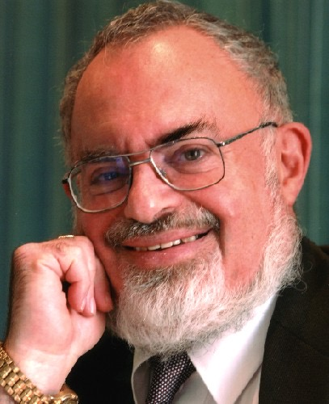

# Stanton Friedman
Nuclear physicist and pioneering UFO researcher who brought the Roswell Incident into mainstream awareness; died of a heart attack at Toronto airport in 2019 at age 84.

| Field | Details |
|-------|---------|
| **Full Name** | Stanton Terry Friedman |
| **Born** | July 29, 1934 (Elizabeth, New Jersey, USA) |
| **Died** | May 13, 2019 |
| **Age at Death** | 84 |
| **Location of Death** | Toronto Pearson International Airport, Ontario, Canada |
| **Cause of Death** | Heart attack |
| **Official Ruling** | Natural causes |
| **Category** | Nuclear Physicist / UFO Researcher |

## Assessment: NOT SUSPICIOUS

Stanton Friedman died at age 84 of a heart attack while traveling through Toronto Pearson Airport, returning home from a speaking engagement. Given his advanced age and the natural cause of death, there are no significant indicators of foul play. Friedman had been active in UFO research for nearly 50 years and had lived a long, productive life without apparent threats to his safety. His death appears to be a natural passing.

## Circumstances of Death

On May 13, 2019, Friedman suffered a heart attack at Toronto Pearson International Airport while traveling home to Fredericton, New Brunswick, Canada from a speaking engagement in Columbus, Ohio. He was 84 years old. His death was attributed to natural causes, and there were no suspicious circumstances reported.

## Background

Stanton Terry Friedman was an American-born Canadian nuclear physicist who became the world's most prominent professional ufologist. He earned his B.S. and M.S. in physics from the University of Chicago in 1955 and 1956 respectively. For 14 years he worked as a nuclear physicist for major corporations including General Electric, Aerojet General Nucleonics, General Motors, Westinghouse, TRW Systems, and McDonnell Douglas, where he was involved in advanced, classified programs on nuclear aircraft, fission and fusion rockets, and compact nuclear power plants for space applications.

In 1970, Friedman left full-time employment as a physicist to pursue the scientific investigation of UFOs. He is credited with bringing the 1947 Roswell Incident back into mainstream conversation after interviewing Jesse Marcel in 1978, the intelligence officer who had handled debris from the Roswell crash site. Friedman gave lectures at more than 600 colleges and to more than 100 professional groups in 50 US states, 10 Canadian provinces, and 19 countries.

He authored several books including *Crash at Corona* (1992), *TOP SECRET/MAJIC* (1996), and *Flying Saucers and Science* (2008). Friedman was known for his rigorous, evidence-based approach and his willingness to debate skeptics publicly.

## Why This Death Possibly Raises Questions

- Friedman's death does not raise significant questions regarding foul play
- He was 84 years old and died of a heart attack, a common cause of death at that age
- He had been a public UFO researcher for nearly 50 years without incident
- No warnings, threats, or premonitions were reported prior to his death
- The UFO research community broadly accepted his death as natural

## See Also

- [J. Allen Hynek](J_Allen_Hynek.md) — Astronomer and Project Blue Book consultant who died of a brain tumor
- [John Mack](John_Mack.md) — Harvard psychiatrist and alien abduction researcher killed in London
- [Leonard Stringfield](Leonard_Stringfield.md) — Pioneer crash-retrieval researcher who died of cancer
- [Frank Edwards](Frank_Edwards.md) — Radio broadcaster and UFO author who died of a heart attack in 1967
- [Coral Lorenzen](Coral_Lorenzen.md) — APRO co-founder who died in 1988, fellow pioneering civilian UFO researcher
- [Jim Lorenzen](Jim_Lorenzen.md) — APRO co-founder who died of cancer in 1986, two years before Coral

## Other Shocking Stories

- [Ryan Graves](Ryan_Graves.md): Former U.S. Navy F/A-18 pilot who became the first active-duty military pilot to publicly testify before Congress about...
- [Todd Sees](Todd_Sees.md): Pennsylvania deer hunter whose body was found emaciated and in his underwear near his home after a UFO...
- [Ashad Sharif](Ashad_Sharif.md): 26-year-old Marconi computer analyst who died after tying a rope between his neck and a tree and then...
- [Nikola Tesla](Nikola_Tesla.md): Legendary inventor of AC electricity and wireless power transmission who died alone in a New York hotel room...

## Sources

- [Stanton T. Friedman - Wikipedia](https://en.wikipedia.org/wiki/Stanton_T._Friedman)
- [CBC News - Stanton Friedman, famed UFO researcher, dead at 84](https://www.cbc.ca/news/canada/new-brunswick/stanton-friedman-ufologist-dead-1.5135588)
- [Newsmax - UFO Researcher Stanton Friedman Dead at 84](https://www.newsmax.com/newsfront/stanton-friedman-obituary-ufo-roswell/2019/05/14/id/916022/)
- [Mysterious Universe - Legendary Physicist and UFO Researcher Stanton Friedman Dies](https://mysteriousuniverse.org/2019/05/legendary-physicist-and-ufo-researcher-stanton-friedman-dies-at-85/)
- [ExoNews - UFO Researcher Stanton Friedman Dies After Half-Century Effort](https://exonews.org/ufo-researcher-stanton-friedman-dies-after-half-century-effort-to-prove-alien-life/)

*This information was built by Grok and Claude AI research.*
