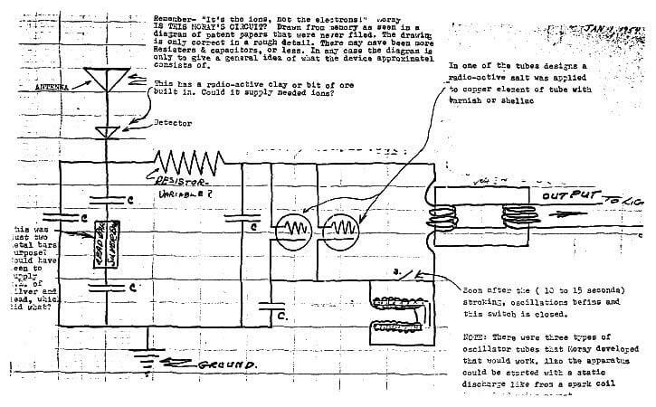

# Thomas Henry Moray
Inventor of the "Moray Valve" radiant energy device who was shot at multiple times, wounded in the leg, and whose device was destroyed by his own assistant with an ax.

| Field | Details |
|-------|---------|
| **Full Name** | Thomas Henry Moray |
| **Born** | August 28, 1892 |
| **Died** | May 1974 |
| **Age at Death** | 81 |
| **Location of Death** | Salt Lake City, Utah |
| **Cause of Death** | Natural causes |
| **Official Ruling** | Natural causes |
| **Category** | Energy Inventor |

## Assessment: ATTACKED AND SUPPRESSED

Thomas Henry Moray was not murdered — he died of natural causes at age 81. However, his case is one of the most dramatic examples of heavy suppression and threats directed at an energy inventor, and is considered a pre-Vesperman era case that set the template for the pattern of suppression seen with later alternative energy inventors. Moray claimed to have developed a device that could extract usable electrical energy from "radiant energy" — what he described as energy permeating the cosmos. He gave public demonstrations of the device throughout the 1930s, reportedly powering lights and appliances without any conventional power source. He was shot at on multiple occasions, sustaining a bullet wound to his leg in one attack. His laboratory was ransacked. In 1941, his research assistant Felix Frazer allegedly destroyed the Moray Valve device with an ax during a laboratory confrontation. Soviet agents reportedly approached Moray seeking to acquire the technology. Despite decades of effort, the device was never successfully reproduced, and the core component — a proprietary semiconductor-like material Moray called the "Swedish Stone" — was apparently destroyed along with the device.

## Circumstances of the Attacks

### Shootings

Thomas Henry Moray was the target of multiple shooting attempts during the 1930s and early 1940s while living and working in Salt Lake City, Utah. In one documented incident, shots were fired at his car, and Moray was struck in the leg by a bullet. The identity of the attackers was never definitively established. Moray attributed the attacks to agents working for entities that felt threatened by his radiant energy device.

### Laboratory Ransacking

Moray's home laboratory in Salt Lake City was broken into and ransacked on at least one occasion. Equipment was damaged and materials were taken.

### The Ax Destruction (1941)

The most devastating blow to Moray's work came in 1941 when his assistant, Felix Frazer, allegedly destroyed the Moray Valve — the core component of the radiant energy device — with an ax during a confrontation in the laboratory. Accounts differ as to Frazer's motivation:
- Moray and his supporters claimed Frazer was acting as an agent provocateur, possibly working for interests that wanted the technology destroyed
- Other accounts suggest Frazer was frustrated with Moray's secrecy about the device's internal workings and destroyed it in a rage
- Some researchers have speculated that Frazer was connected to Soviet intelligence, which had allegedly approached Moray about acquiring the technology

The destruction of the Moray Valve was catastrophic because the device's core component — a germanium-like semiconductor material that Moray called the "Swedish Stone" — was apparently irreplaceable. Moray claimed to have developed the material through a proprietary process and never published the recipe. With the Stone destroyed, the device could not be rebuilt.

## Background

### The Radiant Energy Device

Thomas Henry Moray was born in Salt Lake City and studied electrical engineering. Beginning in the 1920s, he developed what he called a "Radiant Energy Device" — an apparatus that he claimed could extract usable electrical energy from cosmic radiation or zero-point energy fields.

The device reportedly:
- Produced up to 50 kilowatts of power
- Required no conventional fuel or external power source
- Used a long antenna wire to collect energy
- Could power banks of light bulbs, irons, and other appliances
- Contained a proprietary semiconductor component (the "Swedish Stone" or "Moray Valve") that was essential to its operation

### Public Demonstrations

Moray gave numerous public demonstrations of the device throughout the 1930s, reportedly witnessed by scientists, engineers, and members of the public. In several demonstrations:
- The device was taken to remote locations far from power lines to rule out hidden connections
- Witnesses confirmed that lights and appliances operated from the device without any visible power source
- The antenna wire was cut during demonstrations, causing the device to stop, and reconnected, causing it to restart

Moray invited skeptics to examine the device but refused to allow anyone to open the sealed housing containing the Moray Valve, citing concerns about theft of his proprietary technology.

### Soviet Interest

According to Moray and his family, Soviet agents approached him multiple times seeking to acquire the radiant energy technology. The details of these approaches are not independently verified, but they align with known Soviet intelligence activities in the United States during the 1930s and 1940s, when the Soviets aggressively sought American technological secrets.

### Patent Difficulties

Moray applied for patents on his radiant energy device but was reportedly denied on the grounds that the Patent Office could not verify the device's operating principles. Without a patent, Moray had no legal protection for his invention and was dependent on keeping the device's internals secret — which made the 1941 destruction even more devastating.

### Later Years

After the destruction of the Moray Valve in 1941, Moray spent the remaining three decades of his life attempting to recreate the device. He was never successful, reportedly because he could not reproduce the Swedish Stone material. He continued to write and speak about radiant energy until his death in 1974.

His son, John Moray, continued advocating for his father's work after his death and authored materials about the radiant energy device.

### Historical Significance as a Suppression Template

Moray's case is notable as a pre-Vesperman era example that established the template for how alternative energy inventors would be suppressed in subsequent decades. The pattern he experienced — successful public demonstrations, followed by heavy suppression and threats, shooting attacks, laboratory break-ins, insider sabotage, patent denial, and the eventual destruction of irreproducible technology — became the recurring playbook seen in later cases such as [Stanley Meyer](Stanley_Meyer.mdx), [Tom Ogle](Tom_Ogle.mdx), and [Rory Johnson](Rory_Johnson.mdx). Moray endured decades of sustained heavy suppression and threats throughout his career, making his case one of the longest-running documented examples of this pattern.

## Why This Death Possibly Raises Questions

- **Multiple assassination attempts:** Being shot at multiple times and sustaining a gunshot wound demonstrates that someone considered Moray enough of a threat to attempt murder
- **Device destruction by insider:** The destruction of the Moray Valve by assistant Felix Frazer — whether acting on his own frustration or as an agent — eliminated the only working prototype
- **Soviet intelligence interest:** Foreign intelligence services allegedly tried to acquire the technology, indicating that at least some intelligence professionals believed it might be genuine
- **Patent denial:** The inability to secure patent protection left Moray vulnerable and ensured the technology could not be legally protected or independently developed
- **Irreproducible component:** The proprietary "Swedish Stone" material was never documented in enough detail to be reproduced, and its destruction ensured the device could not be rebuilt
- **Pattern consistency:** Moray's experience — public demonstrations followed by attacks, theft, and destruction — matches the pattern seen with other energy inventors including [Nikola Tesla](Nikola_Tesla.mdx) and [Stanley Meyer](Stanley_Meyer.mdx)

## The Counterargument

- Moray never allowed independent scientists to examine the internal workings of his device, making verification impossible
- The "Swedish Stone" has never been identified as a known material, and no independent researcher has been able to reproduce it
- Mainstream physics does not support the extraction of usable energy from "cosmic radiation" at the power levels Moray claimed
- The demonstrations, while witnessed, were not conducted under rigorous scientific protocols with independent controls
- Moray's refusal to publish his methods or allow examination of the device raises questions about whether it functioned as claimed

## Key Quotes from Media Coverage

> Moray attributed the attacks to agents working for entities that felt threatened by his radiant energy device.
> — Account of the multiple shooting incidents targeting Moray in Salt Lake City during the 1930s and 1940s

> Moray and his supporters claimed Frazer was acting as an agent provocateur, possibly working for interests that wanted the technology destroyed.
> — Account of the 1941 destruction of the Moray Valve by assistant Felix Frazer

> The device reportedly produced up to 50 kilowatts of power, required no conventional fuel or external power source, and used a long antenna wire to collect energy.
> — Description of the Moray Radiant Energy Device's claimed capabilities, from demonstrations throughout the 1930s

> Moray applied for patents on his radiant energy device but was reportedly denied on the grounds that the Patent Office could not verify the device's operating principles.
> — Account of the U.S. Patent Office's refusal to grant protection for Moray's invention

## See Also

- [Nikola Tesla](Nikola_Tesla.mdx) — Wireless energy pioneer whose papers were seized by the FBI
- [Stanley Meyer](Stanley_Meyer.mdx) — Water fuel cell inventor who died suddenly in 1998
- [Eugene Mallove](Eugene_Mallove.mdx) — Cold fusion advocate beaten to death in 2004
- [Tom Ogle](Tom_Ogle.mdx) — Fuel vapor system inventor who died of overdose in 1981

## Other Shocking Stories

- [Stanley Meyer](Stanley_Meyer.mdx): Last words: "They poisoned me." Died at dinner with investors. Water fuel cell inventor.
- [Paulo Correa](Paulo_Correa.mdx): Holds 12 patents for overunity energy device. Chief advocate Eugene Mallove was beaten to death.
- [Eugene Mallove](Eugene_Mallove.mdx): Cold fusion advocate beaten to death days before publishing breakthrough findings. Former MIT science writer.
- [Bruce DePalma](Bruce_DePalma.mdx): N-Machine inventor fled to New Zealand after threats. Died weeks before independent testing.

## Sources

- [Thomas Henry Moray — RationalWiki](https://rationalwiki.org/wiki/Thomas_Henry_Moray)
- [Thomas Henry Moray — Natural Philosophy Wiki](https://naturalphilosophy.org/people/thomas-henry-moray/)
- [Thomas Henry Moray — Scalar Light](https://www.scalarlight.com/thomas-henry-moray/)
- [Free Energy Suppression Conspiracy Theory — Wikipedia](https://en.wikipedia.org/wiki/Free_energy_suppression_conspiracy_theory)
- T.H. Moray, *The Sea of Energy in Which the Earth Floats* (Cosray Research Institute, 1960)

*This information was built by Grok and Claude AI research.*

**Status:** Deceased (1974)
