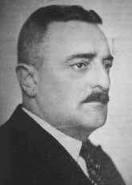

import Head from '@docusaurus/Head';

<Head>
  
</Head>

Austrian forester and inventor who developed "implosion" vortex energy technology, was forced to work on flying disc designs during WWII, then was brought to the United States in 1958 where he was coerced into signing over all rights to his work — and died five days after returning to Austria.

| Field | Details |
|-------|---------|
| **Full Name** | Viktor Schauberger |
| **Born** | June 30, 1885 |
| **Died** | September 25, 1958 |
| **Age at Death** | 73 |
| **Location of Death** | Linz, Austria |
| **Cause of Death** | Not publicly specified (described as dying "a broken man") |
| **Official Ruling** | Natural causes |
| **Category** | Energy Inventor |

## Assessment: SUPPRESSED — DIED DAYS AFTER SIGNING AWAY RIGHTS

Viktor Schauberger spent decades developing theories of "implosion" energy — based on vortex dynamics observed in natural water systems — which he believed could produce energy far more efficiently than conventional "explosion"-based technologies. His implosion technology was never independently verified by mainstream science. However, the documented circumstances of his final months are striking: he was brought to the United States, held for three months, coerced into signing an agreement that transferred all rights to his work and forbade him from continuing implosion research, had all his documents and models confiscated, and then died five days after returning home to Austria. His son Walter later described him as having returned "a very disillusioned man."

## Circumstances of Death

In June 1958, Viktor Schauberger — then 73 years old — traveled to the United States at the invitation of Karl Gerchsheimer, an Austrian-born American, and Robert Donner, reportedly a wealthy Texas financier. They had promised Schauberger funding and support to develop his implosion technology commercially.

Schauberger spent approximately three months in the United States, primarily in Texas. According to accounts from his son Walter and biographers, the trip quickly turned sour. Schauberger reportedly found himself isolated, unable to communicate effectively in English, and increasingly pressured to sign legal documents he did not fully understand.

Near the end of his stay, Schauberger was presented with a comprehensive agreement. Under duress — according to his family's account — he signed a document that transferred all rights to his inventions, patents, and research to a consortium. The agreement also reportedly prohibited him from conducting any further research into implosion technology. All of his documents, models, prototypes, and equipment were confiscated and remained in the United States.

Schauberger returned to Austria on September 20, 1958. He arrived home in Linz broken in spirit and health. Five days later, on September 25, 1958, he died. His son Walter later said his father had told him: "They took everything from me. Everything. I don't even own myself."

## Background

### The Forester and Water Observer

Viktor Schauberger came from a long line of Austrian foresters. His deep observation of natural water systems — mountain streams, river currents, and vortex patterns — led him to develop unconventional theories about energy and motion. He believed that nature operated primarily through "implosion" (inward-spiraling, centripetal motion) rather than "explosion" (outward-expanding, centrifugal motion), and that human technology had taken the wrong path by relying on explosion-based engines.

In the 1920s and 1930s, Schauberger designed innovative log flumes that could transport heavy logs through waterways that conventional engineering said were too shallow or turbulent. These flumes worked, earning him recognition and contracts from the Austrian government.

### Wartime Work Under Duress

During World War II, Schauberger was reportedly conscripted by the Nazi regime to work on advanced propulsion projects. According to multiple accounts, he was brought to the Mauthausen concentration camp complex, where he was forced to work on flying disc designs using implosion-based propulsion. Camp inmates were allegedly assigned as his laborers.

Schauberger later stated that he was coerced into this work under threat to his life and the lives of his family. The details and outcomes of his wartime research remain disputed — some biographers claim he successfully built a working prototype; others argue the claims are exaggerated or unverifiable.

After the war, Schauberger's work attracted attention from Allied intelligence services. Some of his equipment and documentation were reportedly seized by American forces.

### Implosion Technology Claims

Schauberger's central claim was that vortex-based implosion devices could produce energy with far greater efficiency than conventional engines. He designed several devices, including:

- **Repulsine** — A turbine-like device that used centripetal vortex motion, sometimes described as a potential flying disc propulsion system
- **Trout turbine** — Named for his observation that trout could remain stationary in fast-flowing streams, this device reportedly used vortex dynamics to generate power from water flow
- **Water purification systems** — Devices using vortex motion to restructure and energize water

None of these devices were ever validated through independent, controlled scientific testing.

### The American Trip

The 1958 trip to the United States was orchestrated by Karl Gerchsheimer and Robert Donner. Gerchsheimer, who spoke both German and English, served as intermediary. The stated purpose was to commercialize Schauberger's technology with American investment.

According to Schauberger's letters and his son's testimony, the reality was very different from what had been promised. Schauberger found himself increasingly isolated and pressured. The legal agreement he ultimately signed effectively stripped him of control over his entire body of work.

## Why This Death Possibly Raises Questions

- **Coerced signing:** Schauberger was reportedly pressured into signing away all rights to his life's work under conditions where he could not fully understand the English-language legal documents
- **Total confiscation:** All documents, models, prototypes, and equipment were taken from him and remained in the United States
- **Research ban:** The agreement reportedly prohibited Schauberger from conducting any further research into implosion technology — an extraordinary restriction on a scientist's freedom
- **Rapid death:** Schauberger died just five days after returning to Austria, suggesting either severe physical decline during his American stay or extreme psychological trauma
- **Pattern of suppression:** Schauberger's experience mirrors other cases where inventors with unconventional energy claims were brought to the United States, had their work confiscated, and were silenced — similar to what happened to [Nikola Tesla](Nikola_Tesla.mdx)'s papers after his death
- **Who benefited:** The consortium that obtained Schauberger's rights, documents, and devices has never publicly demonstrated or released any of his technology
- **Wartime intelligence interest:** The fact that both Nazi Germany and Allied intelligence services took interest in Schauberger's work suggests his ideas were taken more seriously by military and intelligence organizations than by mainstream science

## The Counterargument

- Schauberger was 73 years old at the time of his death — dying at that age, while sudden, is not medically extraordinary
- His implosion technology was never independently verified and may not have worked as claimed
- The stress of international travel, legal disputes, and business negotiations could explain his rapid decline without invoking foul play
- Schauberger may have willingly signed the agreement and later regretted it — coercion is alleged by family members but not independently documented
- No autopsy or forensic evidence suggests anything other than natural death

## Key Quotes from Media Coverage

> "They took everything from me. Everything. I don't even own myself."
> — **Viktor Schauberger**, to his son Walter, after returning to Austria from the United States, September 1958 — five days before his death

> His son Walter later described him as having returned "a very disillusioned man."
> — **Walter Schauberger**, describing his father's condition upon returning from the United States

> Schauberger later stated that he was coerced into this work under threat to his life and the lives of his family.
> — Account of Schauberger's wartime forced labor on flying disc designs at the Mauthausen concentration camp complex

## See Also

- [Nikola Tesla](Nikola_Tesla.mdx) — Inventor whose papers were seized by the FBI and Office of Alien Property after his death
- [Stanley Meyer](Stanley_Meyer.mdx) — Water fuel cell inventor who died suddenly in 1998
- [Thomas Henry Moray](Thomas_Henry_Moray.mdx) — Radiant energy inventor subjected to repeated suppression

## Other Shocking Stories

- [Robert Bass](Robert_Bass.mdx): Rhodes Scholar physicist. Three associates in his nuclear transmutation group allegedly assassinated.
- [Bill Yelon](Bill_Yelon.mdx): Died suddenly in 2018 shortly after announcing his over-unity device was ready for market.
- [Frederick Hochstetter](Frederick_Hochstetter.mdx): Debunked Hendershot's fuelless motor publicly. Died as the sole passenger fatality in a plane crash.
- [Paulo Correa](Paulo_Correa.mdx): Holds 12 patents for overunity energy device. Chief advocate Eugene Mallove was beaten to death.

## Sources

- [Viktor Schauberger — Wikipedia](https://en.wikipedia.org/wiki/Viktor_Schauberger)
- [Living Energies by Callum Coats — Comprehensive biography and technical overview of Schauberger's work](https://www.amazon.com/Living-Energies-Callum-Coats/dp/0717133079)
- [Viktor Schauberger — A Life of Learning from Nature — energyh3o2.com](https://energyh3o2.com/)
- [Schauberger and Living Water — alivewater.com](https://alivewater.com/)
- [The Schauberger Archives — PKS (Pythagoras Kepler System)](https://www.pks.or.at/)

*This information was built by Grok and Claude AI research.*

**Status:** Deceased (1958)

---

## Additional context from the UAP Energy Systems Murders investigation

Austrian forester and inventor who developed "implosion" vortex energy technology, was forced to work on flying disc designs during WWII, then was brought to the United States in 1958 where he was coerced into signing over all rights to his work — and died five days after returning to Austria.

| Field | Details |
|-------|---------|
| **Full Name** | Viktor Schauberger |
| **Born** | June 30, 1885 |
| **Died** | September 25, 1958 |
| **Age at Death** | 73 |
| **Location of Death** | Linz, Austria |
| **Cause of Death** | Not publicly specified (described as dying "a broken man") |
| **Official Ruling** | Natural causes |
| **Category** | Energy Inventor |

## Assessment: SUPPRESSED — DIED DAYS AFTER SIGNING AWAY RIGHTS

Viktor Schauberger spent decades developing theories of "implosion" energy — based on vortex dynamics observed in natural water systems — which he believed could produce energy far more efficiently than conventional "explosion"-based technologies. His implosion technology was never independently verified by mainstream science. However, the documented circumstances of his final months are striking: he was brought to the United States, held for three months, coerced into signing an agreement that transferred all rights to his work and forbade him from continuing implosion research, had all his documents and models confiscated, and then died five days after returning home to Austria. His son Walter later described him as having returned "a very disillusioned man."

## Circumstances of Death

In June 1958, Viktor Schauberger — then 73 years old — traveled to the United States at the invitation of Karl Gerchsheimer, an Austrian-born American, and Robert Donner, reportedly a wealthy Texas financier. They had promised Schauberger funding and support to develop his implosion technology commercially.

Schauberger spent approximately three months in the United States, primarily in Texas. According to accounts from his son Walter and biographers, the trip quickly turned sour. Schauberger reportedly found himself isolated, unable to communicate effectively in English, and increasingly pressured to sign legal documents he did not fully understand.

Near the end of his stay, Schauberger was presented with a comprehensive agreement. Under duress — according to his family's account — he signed a document that transferred all rights to his inventions, patents, and research to a consortium. The agreement also reportedly prohibited him from conducting any further research into implosion technology. All of his documents, models, prototypes, and equipment were confiscated and remained in the United States.

Schauberger returned to Austria on September 20, 1958. He arrived home in Linz broken in spirit and health. Five days later, on September 25, 1958, he died. His son Walter later said his father had told him: "They took everything from me. Everything. I don't even own myself."

## Background

### The Forester and Water Observer

Viktor Schauberger came from a long line of Austrian foresters. His deep observation of natural water systems — mountain streams, river currents, and vortex patterns — led him to develop unconventional theories about energy and motion. He believed that nature operated primarily through "implosion" (inward-spiraling, centripetal motion) rather than "explosion" (outward-expanding, centrifugal motion), and that human technology had taken the wrong path by relying on explosion-based engines.

In the 1920s and 1930s, Schauberger designed innovative log flumes that could transport heavy logs through waterways that conventional engineering said were too shallow or turbulent. These flumes worked, earning him recognition and contracts from the Austrian government.

### Wartime Work Under Duress

During World War II, Schauberger was reportedly conscripted by the Nazi regime to work on advanced propulsion projects. According to multiple accounts, he was brought to the Mauthausen concentration camp complex, where he was forced to work on flying disc designs using implosion-based propulsion. Camp inmates were allegedly assigned as his laborers.

Schauberger later stated that he was coerced into this work under threat to his life and the lives of his family. The details and outcomes of his wartime research remain disputed — some biographers claim he successfully built a working prototype; others argue the claims are exaggerated or unverifiable.

After the war, Schauberger's work attracted attention from Allied intelligence services. Some of his equipment and documentation were reportedly seized by American forces.

### Implosion Technology Claims

Schauberger's central claim was that vortex-based implosion devices could produce energy with far greater efficiency than conventional engines. He designed several devices, including:

- **Repulsine** — A turbine-like device that used centripetal vortex motion, sometimes described as a potential flying disc propulsion system
- **Trout turbine** — Named for his observation that trout could remain stationary in fast-flowing streams, this device reportedly used vortex dynamics to generate power from water flow
- **Water purification systems** — Devices using vortex motion to restructure and energize water

None of these devices were ever validated through independent, controlled scientific testing.

### The American Trip

The 1958 trip to the United States was orchestrated by Karl Gerchsheimer and Robert Donner. Gerchsheimer, who spoke both German and English, served as intermediary. The stated purpose was to commercialize Schauberger's technology with American investment.

According to Schauberger's letters and his son's testimony, the reality was very different from what had been promised. Schauberger found himself increasingly isolated and pressured. The legal agreement he ultimately signed effectively stripped him of control over his entire body of work.

## Why This Death Possibly Raises Questions

- **Coerced signing:** Schauberger was reportedly pressured into signing away all rights to his life's work under conditions where he could not fully understand the English-language legal documents
- **Total confiscation:** All documents, models, prototypes, and equipment were taken from him and remained in the United States
- **Research ban:** The agreement reportedly prohibited Schauberger from conducting any further research into implosion technology — an extraordinary restriction on a scientist's freedom
- **Rapid death:** Schauberger died just five days after returning to Austria, suggesting either severe physical decline during his American stay or extreme psychological trauma
- **Pattern of suppression:** Schauberger's experience mirrors other cases where inventors with unconventional energy claims were brought to the United States, had their work confiscated, and were silenced — similar to what happened to [Nikola Tesla](Nikola_Tesla.mdx)'s papers after his death
- **Who benefited:** The consortium that obtained Schauberger's rights, documents, and devices has never publicly demonstrated or released any of his technology
- **Wartime intelligence interest:** The fact that both Nazi Germany and Allied intelligence services took interest in Schauberger's work suggests his ideas were taken more seriously by military and intelligence organizations than by mainstream science

## The Counterargument

- Schauberger was 73 years old at the time of his death — dying at that age, while sudden, is not medically extraordinary
- His implosion technology was never independently verified and may not have worked as claimed
- The stress of international travel, legal disputes, and business negotiations could explain his rapid decline without invoking foul play
- Schauberger may have willingly signed the agreement and later regretted it — coercion is alleged by family members but not independently documented
- No autopsy or forensic evidence suggests anything other than natural death

## Key Quotes from Media Coverage

> "They took everything from me. Everything. I don't even own myself."
> — **Viktor Schauberger**, to his son Walter, after returning to Austria from the United States, September 1958 — five days before his death

> His son Walter later described him as having returned "a very disillusioned man."
> — **Walter Schauberger**, describing his father's condition upon returning from the United States

> Schauberger later stated that he was coerced into this work under threat to his life and the lives of his family.
> — Account of Schauberger's wartime forced labor on flying disc designs at the Mauthausen concentration camp complex

## See Also

- [Nikola Tesla](Nikola_Tesla.mdx) — Inventor whose papers were seized by the FBI and Office of Alien Property after his death
- [Stanley Meyer](Stanley_Meyer.mdx) — Water fuel cell inventor who died suddenly in 1998
- [Thomas Henry Moray](Thomas_Henry_Moray.mdx) — Radiant energy inventor subjected to repeated suppression
- [George Taylor Fulford](George_Taylor_Fulford.mdx) — Major GE shareholder killed in a car crash one week after announcing his intention to fund Tesla's wireless energy project; like Schauberger, his death ended financial support for revolutionary energy technology
- [Justin Christofleau](Justin_Christofleau.mdx) — French electroculture inventor whose technology harnessing atmospheric electromagnetic energy was suppressed by the fertilizer industry; like Schauberger, he worked with natural forces that the scientific establishment dismissed

## Other Shocking Stories

- [Robert Bass](Robert_Bass.mdx): Rhodes Scholar physicist. Three associates in his nuclear transmutation group allegedly assassinated.
- [Bill Yelon](Bill_Yelon.mdx): Died suddenly in 2018 shortly after announcing his over-unity device was ready for market.
- [Frederick Hochstetter](Frederick_Hochstetter.mdx): Debunked Hendershot's fuelless motor publicly. Died as the sole passenger fatality in a plane crash.
- [Paulo Correa](Paulo_Correa.mdx): Holds 12 patents for overunity energy device. Chief advocate Eugene Mallove was beaten to death.

## Sources

- [Viktor Schauberger — Wikipedia](https://en.wikipedia.org/wiki/Viktor_Schauberger)
- [Living Energies by Callum Coats — Comprehensive biography and technical overview of Schauberger's work](https://www.amazon.com/Living-Energies-Callum-Coats/dp/0717133079)
- [Viktor Schauberger — A Life of Learning from Nature — energyh3o2.com](https://energyh3o2.com/)
- [Schauberger and Living Water — alivewater.com](https://alivewater.com/)
- [The Schauberger Archives — PKS (Pythagoras Kepler System)](https://www.pks.or.at/)

*This information was built by Grok and Claude AI research.*

**Status:** Deceased (1958)

---

## Additional context from the UAP Physics Murders investigation

Austrian naturalist, forester, and inventor who developed implosion-based vortex energy technology — the theoretical inverse of explosion-based engines — and built prototype devices including the alleged "Repulsine" antigravity disc during WWII, before being brought to the United States in 1958, pressured into signing away all rights to his life's work, and dying five days after returning to Austria.

| Field | Details |
|-------|---------|
| **Full Name** | Viktor Schauberger |
| **Born** | June 30, 1885 (Holzschlag, Upper Austria, Austria-Hungary) |
| **Died** | September 25, 1958 (Linz, Austria) |
| **Age at Death** | 73 |
| **Role** | Naturalist / Inventor / Hydraulic Engineer / Implosion Technologist |
| **Platform** | Inventions, patents, private research, forestry engineering, lectures |
| **Notable Works** | Log flume transport systems (1920s); implosion vortex engine prototypes; the "Repulsine" device (1940s); water purification and vortex technologies; writings on "living water" and natural energy |
| **Evidence Rating** | **STRONG EVIDENCE** |

## Biography

### Early Life and Forestry Career

Viktor Schauberger was born into a long line of Austrian foresters — his family had served as forest wardens for generations in the Alpine regions of Upper Austria. Rather than pursue a university education, which he later described as producing a "nature-alienated science," Schauberger followed his father into forestry. This decision proved foundational: his decades of careful observation of water in mountain streams, rivers, and natural springs formed the basis of all his later theoretical and engineering work.

As a young forest warden, Schauberger spent years observing how water moved through pristine mountain environments. He studied the spiral vortex patterns in cold mountain streams, the way trout could remain stationary in fast-flowing currents and leap up waterfalls, and the temperature-dependent behavior of water at different times of day. These observations led him to conclusions that contradicted conventional hydraulic engineering: that water's most powerful and energized state occurred when it was cold, flowing in spiral vortex patterns, and shielded from direct sunlight.

### The Log Flume Innovation

Schauberger first gained public recognition in the 1920s when he was commissioned to design a log flume system for transporting timber from remote mountain forests to sawmills. Conventional log flumes used straight channels and relied on gravity and water volume. Schauberger designed a radically different system incorporating spiral guide vanes and temperature management, reportedly allowing the transport of logs heavier than water — including beechwood and stone — through flumes that used less water than conventional designs. The system's success brought him to the attention of Austrian authorities and industrialists, and he was subsequently commissioned to build several more flume systems across Austria and Bavaria.

### Conflict with Conventional Science

Throughout the 1920s and 1930s, Schauberger developed an increasingly comprehensive theoretical framework built around what he called the opposition between "implosion" and "explosion." He argued that modern technology was built entirely on explosion — combustion engines, hydraulic turbines, nuclear fission — which he viewed as destructive, centrifugal, and heat-generating. Nature, he contended, operated primarily through implosion: centripetal, cooling, concentrating vortex processes that were far more efficient and self-sustaining.

His motto was "Kapieren und kopieren" — comprehend and copy nature. He argued that conventional science had fundamentally misunderstood the most basic processes of energy and motion by focusing exclusively on explosion-based (centrifugal, expanding, heating) technologies while ignoring implosion-based (centripetal, contracting, cooling) processes that nature actually uses.

This put him at odds with the scientific establishment, which largely dismissed his ideas as the intuitions of an uneducated forester rather than rigorous science.

## His Physics and Engineering Work

### Implosion Theory

The core of Schauberger's physics was the distinction between two fundamental types of motion:

- **Explosion / Centrifugal motion**: Outward-moving, expanding, heating, pressure-increasing, disordering — the basis of all combustion engines, turbines, and nuclear technology
- **Implosion / Centripetal motion**: Inward-moving, contracting, cooling, vacuum-creating, ordering — the basis of natural vortex processes in water, air, and biological systems

Schauberger argued that implosion was vastly more powerful than explosion, and that a technology built on implosion principles could generate energy at a fraction of the cost and environmental impact of explosion-based systems. He described implosion as "a suctional process that causes matter to move inwards, not outwards as in the case of explosion. This inward motion does not follow a straight path to the centre, but follows a spiralling, whirling path called a vortex."

### Vortex Energy and the Double Cycloid Spiral

Schauberger's devices used what he described as a "double cycloid spiral curve" — a three-dimensional vortex path that simultaneously rotated and contracted. He claimed this geometry produced several effects:

- **Temperature reduction**: The contracting vortex cooled the medium (water or air), increasing its density and energy
- **Vacuum generation**: The cooling and contraction created an internal vacuum that augmented suction
- **Diamagnetic force**: Schauberger claimed the vortex process generated a force he described as "diamagnetic" — a levitating or antigravitational effect
- **Self-sustaining operation**: Once initiated, the vortex process allegedly required minimal external energy input to maintain

### Water Research

Schauberger's water research led him to conclusions that remain outside mainstream hydrology but have attracted renewed interest from some environmental researchers:

- Water is most energized and "alive" when cold (approximately 4 degrees Celsius, its point of maximum density)
- Spiral vortex motion purifies and energizes water, while straight-line forced flow degrades it
- Natural water systems maintain their health through spiral flow patterns, shading, and temperature regulation
- Modern water management — straightened rivers, pressurized pipes, chlorination — systematically destroys water's natural vitality

### The Repulsine Device

The most controversial aspect of Schauberger's work is the "Repulsine" — a disc-shaped device that allegedly used implosion vortex principles to generate lift or thrust without conventional propulsion.

The Repulsine reportedly worked by drawing air inward through the center of a rotating disc, accelerating it through spiral channels that created a powerful vortex, and expelling it at the edges. According to Schauberger and later accounts, the device generated anomalous upward thrust that could not be fully explained by conventional aerodynamic effects. During testing, one prototype allegedly broke free from its mounting bolts and struck the ceiling of the laboratory, shattering.

Whether the Repulsine constituted a true antigravity device, a highly efficient turbine, or something else entirely remains disputed. No surviving prototype is known to exist, and the available documentation consists primarily of Schauberger's own writings, later accounts by his family, and fragmentary wartime records.

## WWII and Nazi-Era Work

### Forced Collaboration

Schauberger's relationship with the Nazi regime is complex and contested. According to multiple accounts, Adolf Hitler met with Schauberger in 1934 to discuss his water and energy research. Schauberger reportedly resisted collaboration with the regime, but by March 1941, he was working in secret on projects for the Nazi government.

By 1943-1944, Schauberger was conducting research at a facility connected to the Mauthausen concentration camp system, specifically a sub-camp at Schonbrunn. Historical records from the Mauthausen Memorial confirm that concentration camp prisoners were assigned to work on what was described as an "alternative drive technology" called the Repulsine. The use of forced labor from concentration camps is documented, though the precise nature and success of the research conducted remains a matter of debate.

### Wartime Devices and Claims

Several claims surround Schauberger's wartime work:

- He allegedly built functional prototypes of implosion engines that demonstrated anomalous thrust or levitation effects
- The Repulsine disc prototypes were reportedly tested, with at least one device described as achieving uncontrolled flight
- At the end of the war, US forces reportedly located Schauberger, confiscated his equipment and research materials, and debriefed him over approximately nine months

The extent to which these wartime devices actually functioned as described cannot be independently confirmed. US debriefing records, if they exist, have not been publicly released.

## The Trip to America and Loss of His Work

### The 1958 US Visit

In 1957, Viktor Schauberger and his son Walter were invited to the United States by Karl Gerchsheimer, a German-born American, and a consortium represented by Robert Donner. The stated purpose was to put Schauberger's implosion technology into commercial production. The Schaubergers traveled to Texas, where they expected to work with American engineers and investors to develop functional implosion devices.

What followed has been described by multiple sources as a systematic extraction of Schauberger's knowledge and intellectual property:

- Viktor, who spoke little English, found himself increasingly isolated and unable to understand the legal and business proceedings around him
- Various "misunderstandings" developed between Schauberger and his American hosts regarding the terms and purpose of his work
- Viktor reportedly fell silent and refused to participate further in the project after becoming disillusioned with the arrangements
- After approximately three months of impasse, Viktor was presented with a contract — written in English, which he could not fully read — and pressured to sign

### The Contract

The agreement Schauberger signed was, by multiple accounts, extraordinarily broad. It reportedly transferred to Robert Donner and his associates all rights to Schauberger's inventions, patents, ideas, and research — including, according to some accounts, his "thoughts and knowledge in the past, present and future." All of Schauberger's documents, models, prototypes, and equipment that had been brought to the United States were retained by the American partners.

Viktor and Walter Schauberger were then permitted to return to Austria. Viktor arrived home in Linz on approximately September 20, 1958, almost penniless and in a state of profound despair.

## Death Circumstances

Viktor Schauberger died on September 25, 1958, in Linz, Austria — five days after returning from the United States. He was 73 years old.

In the days before his death, Schauberger reportedly repeated a single phrase over and over:

> "They took everything from me, everything. I don't even own myself."

The official cause of death is not widely documented in English-language sources. The combination of his advanced age, the physical toll of several months of stress in America, and the psychological devastation of losing control of his life's work are cited as contributing factors.

### Suspicious Circumstances

While Schauberger's death at age 73 can be attributed to natural causes compounded by extreme stress, several aspects of his final months raise questions within the context of suppressed technology research:

- **Timing**: His death occurred just five days after returning from the US, immediately after signing away his work — a pattern consistent with the removal of a key individual after their knowledge has been extracted
- **Comprehensive confiscation**: All documents, models, prototypes, and intellectual property were retained in the United States. The completeness of this extraction mirrors the pattern seen with [Nikola Tesla](Nikola_Tesla.mdx)'s papers being seized after his death
- **Isolation and language barrier**: Schauberger was brought to a foreign country where he could not speak the language and had no independent legal counsel, creating conditions ideal for coercive agreements
- **Destruction of the man**: Multiple accounts describe Schauberger as "a broken man" upon his return — not merely disappointed, but psychologically destroyed
- **Disappearance of the technology**: After Schauberger's death, his implosion technology did not enter commercial production or public development. Whatever was extracted in the United States vanished from the public record

## The Physics and UAP Relevance

### Implosion as Propulsion

Schauberger's implosion vortex technology, if functional as described, would represent a propulsion system with characteristics remarkably consistent with observed UAP behavior:

- **No combustion or visible exhaust**: Implosion-based propulsion would not produce the thermal signatures or exhaust plumes associated with conventional engines
- **Disc-shaped configuration**: The Repulsine was a disc — the most commonly reported UAP shape
- **Anomalous acceleration**: A device generating thrust through internal vortex dynamics rather than external reaction mass could theoretically achieve rapid acceleration without the g-force effects on a conventional airframe
- **Silent or near-silent operation**: Unlike explosion-based engines, an implosion device would generate minimal acoustic signature
- **Electromagnetic effects**: Schauberger's descriptions of diamagnetic forces generated by his devices parallel reported electromagnetic effects associated with UAP encounters

### Connection to Other Researchers

Schauberger's work intersects with several other lines of UAP-relevant physics research:

- **[Nikola Tesla](Nikola_Tesla.mdx)**: Both Tesla and Schauberger worked on energy systems that extracted power from natural environmental processes rather than consuming fuel. Tesla's vortex turbine (patented 1913) used spiral flow principles conceptually related to Schauberger's implosion devices
- **[Thomas Townsend Brown](Thomas_Townsend_Brown.mdx)**: Brown's electrogravitics research and Schauberger's implosion work represent two different approaches to the same goal — propulsion systems that interact with gravity rather than relying on Newtonian reaction mass. Both researchers saw their work marginalized or classified
- **Nazi aerospace research**: Schauberger's wartime work forms part of the broader body of alleged Nazi advanced propulsion research, which some researchers connect to post-war US classified aerospace programs

### Centripetal vs. Centrifugal: A Paradigm Challenge

Schauberger's most fundamental claim was that modern physics and engineering had built an entire technological civilization on the wrong type of motion. If centripetal implosion is indeed more powerful and efficient than centrifugal explosion — as Schauberger argued based on decades of natural observation — then the implications extend far beyond propulsion:

- Energy generation could be achieved through cooling and concentration rather than heating and combustion
- Water purification and management could work with natural vortex processes rather than against them
- The environmental destruction caused by explosion-based technology could be reversed

This paradigm-level challenge to established science and industry may explain the persistent marginalization of Schauberger's ideas — and the thoroughness with which his work was confiscated.

## Key Quotes

> "They took everything from me, everything. I don't even own myself."
> — **Viktor Schauberger**, reportedly repeated in the days before his death, September 1958

> "Kapieren und kopieren" (Comprehend and copy nature).
> — **Viktor Schauberger**, his guiding motto

> "Our technologists do not know the fundamentals of nature. They work with centrifugal forces which nature uses only for destruction and dissolution. Nature uses centripetal forces, which operate from the outside inwards."
> — **Viktor Schauberger**

> "You must learn to think one octave higher. Only then will you learn how implosion energy works."
> — **Viktor Schauberger**

## The Counterargument

- Schauberger had no formal scientific education; his ideas were based on intuitive observation of nature rather than rigorous mathematical frameworks or controlled experiments
- No independently verified, peer-reviewed replication of his implosion devices has been published
- The Repulsine device's alleged performance — including uncontrolled levitation during testing — relies primarily on accounts from Schauberger and his family, not independent observers
- Mainstream physics holds that the aerodynamic effects Schauberger described can be explained by conventional fluid dynamics without invoking novel forces
- His wartime work involved the use of concentration camp labor, complicating the narrative of Schauberger as a victimized genius
- A 2008 engineering thesis from the University of Queensland investigating Schauberger's vortex engine found that while the devices produced interesting fluid dynamic effects, they did not demonstrate anomalous energy production
- His death at age 73, while suspiciously timed, occurred at an age where natural causes are common, particularly after a period of extreme stress
- The "contract signed under duress" narrative, while supported by family accounts, has not been independently verified through legal records

## Legacy

Despite — or because of — the confiscation of his work, Schauberger's ideas have experienced a resurgence of interest in several fields:

- **Water research**: His concepts of "living water" and vortex-based water treatment have influenced alternative water purification approaches
- **Biomimicry**: His principle of observing and copying natural processes anticipated the modern biomimicry movement by decades
- **Alternative energy**: His implosion concepts continue to inspire researchers working outside mainstream physics
- **UAP research**: The Repulsine and his implosion propulsion concepts are frequently cited in discussions of possible UAP propulsion mechanisms

His son Walter Schauberger continued some aspects of his father's work, and grandson Jorg Schauberger has maintained the family archive. Callum Coats translated and compiled much of Schauberger's work into English through books including *Living Energies* (1996) and the *Eco-Technology* series, making his ideas accessible to an international audience.

The question of what happened to the documents and prototypes retained in the United States in 1958 remains unanswered.

## Related Perspectives

- [Nikola Tesla](Nikola_Tesla.mdx) — Like Schauberger, Tesla's work was confiscated after his death; both pursued energy systems that extracted power from natural processes
- [Thomas Townsend Brown](Thomas_Townsend_Brown.mdx) — Electrogravitics research representing a parallel approach to non-conventional propulsion; both saw their work absorbed into classified programs
- [Gravity Manipulation](Gravity_Manipulation.mdx) — Schauberger's implosion devices are cited as early examples of potential gravity modification technology
- [Electromagnetic Propulsion](Electromagnetic_Propulsion.mdx) — The diamagnetic effects Schauberger described connect to broader electromagnetic propulsion theses
- [Zero Point Energy](Zero_Point_Energy.mdx) — Schauberger's claims of self-sustaining vortex processes parallel concepts in zero-point energy extraction
- [Mark McCandlish](Mark_McCandlish.mdx) — The Alien Reproduction Vehicle's disc-shaped, field-propulsion design shares conceptual parallels with the Repulsine
- [Stanley Meyer](Stanley_Meyer.mdx) — Another inventor of alternative energy technology who died under suspicious circumstances after refusing to sell his work

## Modern Evidence: Crop Circle Encoding of Magnetic Spin-Counter-Spin Propulsion

In April 2026, Dr. Horace Drew (online: Red Collie), a molecular biologist with credentials from Caltech and the MRC Laboratory of Molecular Biology at Cambridge, posted video and image evidence claiming to document a small-scale reverse-engineered device based on the magnetic "spin and counter-spin" principle — the same centripetal/centrifugal opposition at the core of Schauberger's implosion thesis.

According to Dr. Drew, the propulsion geometry was first drawn into crop formations in May 1999. He states that the underlying mechanism is magnetic spin and counter-spin — two counter-rotating fields that generate lift or thrust without combustion. His posts describe an attempt to build a working small-scale device based on this geometry, using components including ceramic silicon-nitride ball bearings sourced from LILY in Shanghai.

The terminology — "spin and counter-spin" — directly parallels Schauberger's description of vortex implosion as a counter-rotating centripetal process opposed to the centrifugal expansion of conventional engines. Whether the crop circle diagrams encode an independent discovery of the same principle, a deliberate message referencing Schauberger's work, or something else entirely, the convergence is notable.

Source: [@RedCollie1 on X, April 13, 2026](https://x.com/RedCollie1/status/2043509434383732788)

## Image Evidence

*Slide 1: crop circle diagram drawn May 1999, claimed by Dr. Horace Drew to encode the magnetic spin/counter-spin UAP propulsion geometry. Slide 2: ceramic silicon-nitride ball bearing from LILY, Shanghai, used in the reverse-engineered small-scale device. Source: [@RedCollie1 on X](https://x.com/RedCollie1/status/2043509434383732788), April 13, 2026.*

## Video Evidence

<video controls style={{maxWidth: '50vw', maxHeight: '50vh', display: 'block', margin: '1rem auto'}}>
  <source src="https://ipfs.io/ipfs/QmeprsxqG4W4YexuHFHMwLcLEMgafNGzGvWueNZJxAskj7" type="video/mp4" />
  <source src="https://ipfs.io/ipfs/QmeprsxqG4W4YexuHFHMwLcLEMgafNGzGvWueNZJxAskj7" type="video/mp4" />
  <source src="https://dweb.link/ipfs/QmeprsxqG4W4YexuHFHMwLcLEMgafNGzGvWueNZJxAskj7" type="video/mp4" />
  Your browser does not support the video tag.
</video>

*Reverse-engineered small-scale device demonstrating the magnetic spin and counter-spin propulsion principle, as claimed by Dr. Horace Drew (Red Collie). The device is reportedly based on UAP propulsion geometry encoded in a May 1999 crop formation. Source: [@RedCollie1 on X](https://x.com/RedCollie1/status/2043509434383732788), April 13, 2026.*

## Sources

- [Viktor Schauberger - Wikipedia](https://en.wikipedia.org/wiki/Viktor_Schauberger)
- [Viktor Schauberger - BRMI History](https://www.brmi.online/viktor-schauberger)
- [Viktor Schauberger - Alive Water / Callum Coats](https://alivewater.com/viktor-schauberger)
- [Satellite Camp Schonbrunn - Mauthausen Memorial Guides](https://www.mauthausen-guides.at/en/subcamp/satellite-camp-schonbrunn)
- [Investigation of Viktor Schauberger's Vortex Engine - University of Queensland (2008)](https://espace.library.uq.edu.au/view/UQ:300139)
- [Viktor Schauberger's Repulsine - Frank Germano](https://frankgermano.wordpress.com/viktor-schauberger-the-repulsine/)
- [They Took Everything From Me - Maier Files](https://www.maier-files.com/schauberger/)
- Callum Coats, *Living Energies: An Exposition of Concepts Related to the Theories of Viktor Schauberger* (Gateway Books, 1996)
- Callum Coats (translator), *The Water Wizard: The Extraordinary Properties of Natural Water* (Gateway Books, 1998) — Volume 1 of the Eco-Technology series
- Nick Cook, *The Hunt for Zero Point: Inside the Classified World of Antigravity Technology* (Broadway Books, 2001)
- [@RedCollie1 (Dr. Horace Drew) — Magnetic spin and counter-spin device, April 13, 2026](https://x.com/RedCollie1/status/2043509434383732788)

*This information was compiled by Claude AI research.*

**Status:** Deceased (1958)

---

**Investigations:** UAPs Murders (General), UAP Energy Systems Murders, UAP Physics Murders
