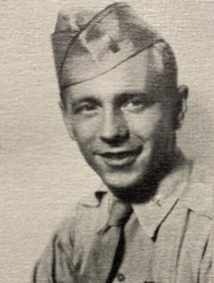

# Walter Haut
USAF public information officer at Roswell Army Air Field who authored the famous July 8, 1947, press release announcing the recovery of a "flying disc," and who left a sealed affidavit — opened after his death — claiming he personally saw alien bodies and a craft in a base hangar.

| Field | Details |
|-------|---------|
| **Full Name** | Walter G. Haut |
| **Born** | June 2, 1922 |
| **Died** | December 15, 2005 |
| **Age at Death** | 83 |
| **Location of Death** | Roswell, New Mexico |
| **Cause of Death** | Natural causes |
| **Official Ruling** | Natural death |
| **Category** | Military Witness / Disclosure Advocate |

## Assessment: NOT SUSPICIOUS (Death) — HIGHLY SIGNIFICANT (Testimony)

Walter Haut died of natural causes at age 83. His death itself raises no suspicion. However, Haut is included here because of his unique role in the Roswell incident: he was the military officer who wrote the original press release announcing the recovery of a "flying disc," and he left a sealed sworn affidavit — not to be opened until after his death — in which he stated he personally saw alien bodies and a craft at the base. His deathbed testimony represents one of the most significant first-person accounts in UAP history from a credentialed, identified military witness.

## Circumstances of Death

Walter Haut died on December 15, 2005, in Roswell, New Mexico, at the age of 83. His death was from natural causes and is not considered suspicious. He had lived in Roswell for decades following his military service and was a well-known community figure.

## Background

Walter Haut was born on June 2, 1922. He served in the United States Army Air Forces during World War II as a bombardier on B-29 Superfortresses in the Pacific Theater. After the war, he was assigned to the 509th Composite Group (later 509th Bomb Group) at Roswell Army Air Field — the same unit that had dropped the atomic bombs on Hiroshima and Nagasaki.

In 1947, Haut served as the public information officer (press officer) for the 509th Bomb Group at Roswell. On July 8, 1947, acting on orders from base commander Colonel William "Butch" Blanchard, Haut drafted and distributed a press release to local media that stated the Army Air Forces had recovered a "flying disc" from a ranch near Roswell.

The press release made headlines worldwide. Within hours, the story was retracted by higher-ranking officers at Fort Worth Army Air Field, who stated that the recovered object was a weather balloon. The retraction effectively buried the story for three decades.

### The Press Release and Its Retraction

The original press release read, in part, that the intelligence office of the 509th Bomb Group had come into possession of a "flying disc" through the cooperation of a local rancher and the sheriff's office. This release, distributed to radio stations and newspapers, created an international sensation before being quickly walked back.

The official explanation was changed to a weather balloon, and later (in 1994) to a Project Mogul balloon — a classified high-altitude acoustic monitoring device designed to detect Soviet nuclear tests.

### Later Life and the UFO Museum

In 1991, Haut co-founded the International UFO Museum and Research Center in Roswell, New Mexico, which became a major tourist attraction. For most of his public life, Haut was careful about what he said regarding the 1947 incident, generally sticking to the facts of the press release and its retraction without making dramatic personal claims.

## The Sealed Affidavit

In 2002, Haut composed a sworn affidavit that he instructed to be kept sealed until after his death. He signed the document at his International UFO Museum. The affidavit was held by UFO researchers Don Schmitt and Thomas Carey and by Haut's family, with the agreement that it would not be released during his lifetime.

Following Haut's death in 2005, the affidavit was first published in 2007 in the book "Witness to Roswell: Unmasking the Government's Biggest Cover-Up" by Schmitt and Carey.

### Key Claims in the Affidavit

In the affidavit, Haut stated:

- There were **two crash sites**, not one — a fact not widely discussed before the affidavit's release
- On July 8, 1947, following the distribution of his press release that afternoon, Colonel Blanchard took him to **Building 84** (Hangar 84/Hangar P-3) on the base
- Inside the hangar, he saw an object he described as an **egg-shaped craft approximately 12 to 15 feet long**, metallic in appearance
- He also saw **several small bodies, approximately four feet tall, with disproportionately large heads**
- He was convinced the bodies were **not human** and had come from the crashed craft
- He stated that the morning of July 8, Colonel Blanchard convened a meeting attended by senior officers including Colonel Thomas DuBose and that the meeting's purpose was to discuss the recovery of the craft and bodies
- He affirmed that his original press release — announcing the recovery of a "flying disc" — was accurate

### Significance of the Affidavit

The affidavit is significant for several reasons:

- Haut was a **named, identified military officer** with verified service at Roswell — not an anonymous source
- He chose to have the statement **sealed until after his death**, suggesting he feared professional or personal consequences during his lifetime
- The affidavit was **sworn** — a legal document with implications for perjury
- Haut had previously been cautious in his public statements, making the posthumous claims all the more striking
- However, critics have noted that the affidavit was composed late in Haut's life when his health was declining, and some have questioned whether the document was influenced by the UFO researchers who held it

## Why This Case Is Significant

- Haut is the author of the single most famous document in UFO history — the July 8, 1947, press release announcing recovery of a "flying disc"
- He was a verified military officer at the base in question, not an unidentified or anonymous source
- His sealed affidavit represents a deathbed confession from a first-person witness claiming to have seen alien bodies and craft
- The decision to seal the affidavit until after death suggests genuine fear of consequences — a pattern seen in other military witnesses
- The affidavit introduced the claim of two crash sites and provided specific details about the location (Building 84) and the nature of what was recovered
- Critics note the affidavit was composed decades after the event and was facilitated by UFO researchers with a stake in the Roswell narrative

## See Also

- [Frank Scully](Frank_Scully.md) — journalist who wrote one of the earliest books about crashed flying saucers
- [Stanton Friedman](Stanton_Friedman.md) — nuclear physicist and UFO researcher who helped revive the Roswell case in 1978

## Other Shocking Stories

- [Jim Sullivan](Jim_Sullivan.md): Singer-songwriter who recorded the prophetically titled album *U.F.O.* featuring lyrics about highway travel, leaving family behind, and alien...
- [Mark McCandlish](Mark_McCandlish.md): Aerospace illustrator and UFO disclosure advocate who died of a gunshot wound ruled as suicide in 2021, reportedly...
- [Thomas F. Mantell](Thomas_Mantell.md): Kentucky Air National Guard pilot who became the first person to die while pursuing an unidentified flying object
- [Luis "Lue" Elizondo](Lue_Elizondo.md): Former head of the Pentagon's Advanced Aerospace Threat Identification Program (AATIP), UAP whistleblower, author of *Imminent*, and the...

## Sources

- [Walter Haut — Wikipedia](https://en.wikipedia.org/wiki/Walter_Haut)
- [Walter Haut — Military Wiki](https://military-history.fandom.com/wiki/Walter_Haut)
- [Haut Affidavit — Roswell Proof](http://www.roswellproof.com/haut.html)
- [I saw aliens at Roswell, claims dead PR man — The Register](https://www.theregister.com/2007/07/02/dead_pr_alien_claim/)
- [60 Years Later, A Twist In Roswell Story — AVweb](https://avweb.com/news/60-years-later-a-twist-in-roswell-story/)
- ["My father saw the bodies": chasing the truth about Roswell — SBS](https://www.sbs.com.au/whats-on/article/my-father-saw-the-bodies-chasing-the-truth-about-roswell/thp111yiy)

*This information was built by Grok and Claude AI research.*

**Status:** Deceased (2005)
