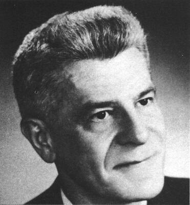

# Wilbert B. Smith
Canadian government engineer who ran Project Magnet, Canada's official UFO study, and concluded UFOs were extraterrestrial in origin.

| Field | Details |
|-------|---------|
| **Full Name** | Wilbert Brockhouse Smith |
| **Born** | February 17, 1910 |
| **Died** | December 27, 1962 |
| **Age at Death** | 52 |
| **Location of Death** | Ottawa, Ontario, Canada |
| **Cause of Death** | Cancer |
| **Official Ruling** | Natural causes |
| **Category** | Government Scientist / UFO Researcher |

## Assessment: MODERATE SUSPICION

Smith's death from cancer at 52 falls within the pattern of UFO researchers dying of fast-acting cancers noted by investigators. The most suspicious element is his deathbed instruction to his wife to hide all his research files, suggesting he feared seizure of his materials. Within days of his death, intelligence representatives from three nations reportedly approached his wife seeking the files.

## Circumstances of Death

Wilbert Smith died of cancer on December 27, 1962. Before his death, Smith instructed his wife to hide all his research files and sensitive documents, warning that the material could "get into the wrong hands."

According to multiple sources, shortly after Smith's death, representatives from the Russian, American, and Canadian governments approached his wife seeking access to his files and research materials.

## Background

Smith was a senior radio engineer for Transport Canada's Broadcast and Measurements Section, holding degrees in electrical engineering from the University of British Columbia. He was the chief engineer for radio station CJOR in Vancouver before joining the federal government.

In December 1950, Smith established Project Magnet, a Canadian government program to study UFO reports and investigate potential connections between UFOs and geomagnetism. The project was formally approved by the Canadian Department of Transport with the goal of determining whether Earth's magnetic field could be exploited as a propulsion source — possibly inspired by UFO propulsion systems.

In October 1952, Smith set up a UFO detection observatory at Shirley's Bay outside Ottawa, equipped with instruments to detect magnetic disturbances potentially associated with UFO activity.

Smith's research led him to conclude that UFOs were almost certainly extraterrestrial in origin and likely operated by manipulating magnetism. He reportedly made contact with American officials who confirmed, off the record, that the U.S. government was in possession of UFO wreckage. A classified Canadian government memo from Smith, dated November 21, 1950, stated that "flying saucers exist" and that "their modus operandi is unknown but concentrated effort is being made by a small group headed by Dr. Vannevar Bush" — a reference that has been connected to the alleged MJ-12 group.

Smith claimed to have received a fragment of a recovered UFO from the U.S. Navy, which he subjected to metallurgical analysis.

## Why This Death Possibly Raises Questions

- Death from cancer at 52, part of a pattern of premature cancer deaths among UFO researchers
- His deathbed instruction to hide research files suggests he anticipated attempts to seize his work
- Intelligence representatives from three countries reportedly approached his wife after his death
- He was one of the few government-connected researchers who publicly concluded UFOs were extraterrestrial
- His November 1950 memo confirmed the existence of a classified U.S. program studying UFOs under Vannevar Bush
- However, cancer at 52, while premature, is not exceptionally rare, and no evidence of deliberately induced illness has been presented

## Key Quotes from Media Coverage

> "Before his death from cancer, Mr. Smith asked his wife to hide all his research and sensitive files, as he was afraid that it would get into the wrong hands." — Mysteries of Canada

> Smith's 1950 memo stated: "Flying saucers exist. Their modus operandi is unknown but concentrated effort is being made by a small group headed by Dr. Vannevar Bush."

## See Also

- [Olavo Fontes](Olavo_Fontes.md) — Brazilian UFO researcher who also died of fast-acting cancer (1968)
- [Ivan Sanderson](Ivan_Sanderson.md) — UFO researcher who died of rapidly spreading cancer (1973)
- [J. Allen Hynek](J_Allen_Hynek.md) — Project Blue Book consultant who died of brain tumor (1986)
- [James Forrestal](James_Forrestal.md) — U.S. Defense Secretary, alleged MJ-12 member, died 1949

## Other Shocking Stories

- [Felix Moncla](Felix_Moncla.md): USAF pilot who vanished along with his radar operator while scrambled to intercept an unknown radar target over...
- [Shani Warren](Shani_Warren.md): GEC/Micro Scope employee found gagged, bound, and drowned in 18 inches of water at Taplow Lake — originally...
- [Jonathan Walsh](Jonathan_Walsh.md): GEC/British Telecom digital communications expert who fell from a hotel window in Abidjan, Ivory Coast, after reportedly expressing...
- [Alistair Beckham](Alistair_Beckham.md): 50-year-old Plessey Defence Systems software engineer working on SDI pilot programs, found electrocuted in his garden shed with...

## Sources

- [Wilbert Brockhouse Smith — Wikipedia](https://en.wikipedia.org/wiki/Wilbert_Brockhouse_Smith)
- [Project Magnet — Wilbert Smith — Canadian UFO Researcher — Mysteries of Canada](https://mysteriesofcanada.com/canada/wilbert-smith/)
- [Project Magnet (UFO) — Wikipedia](https://en.wikipedia.org/wiki/Project_Magnet_(UFO))
- [Canada's Project Magnet/Wilbert Smith — Enigma Labs](https://enigmalabs.io/library/495daab5-7372-4e04-90a1-483c964819f5)
- [Wilbert Smith and the Canadian UFO Research — Angelic Visions](https://comfortinaninstant.typepad.com/angelic_visions/2018/01/wilbert-smith-and-the-canadian-ufo-research.html)

*This information was built by Grok and Claude AI research.*

**Status:** Deceased (1962)
