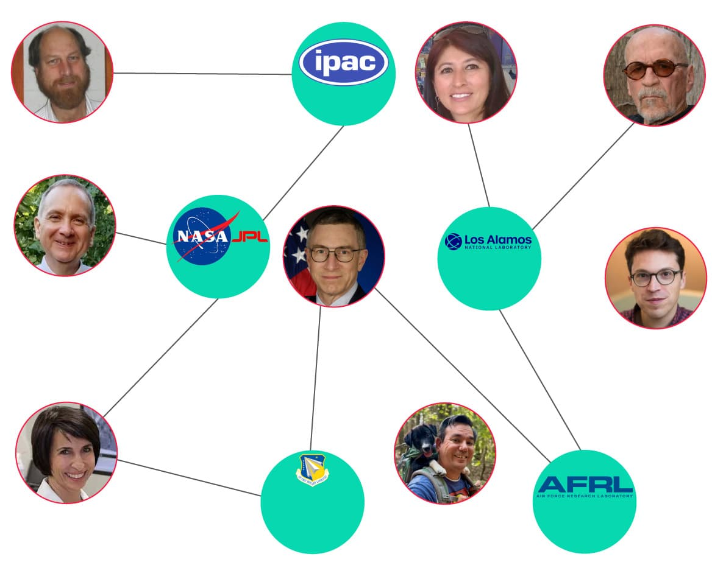

# William McCasland
Retired USAF Major General and former commander of the Air Force Research Laboratory at Wright-Patterson AFB. Missing since February 27, 2026 after leaving his Albuquerque home on foot without his phone or watch. FBI is assisting the search. Was reportedly a primary source for Tom DeLonge's To The Stars Academy and held some of the most sensitive positions in the U.S. military related to advanced aerospace technology.

| Field | Details |
|-------|---------|
| **Full Name** | William Neil McCasland |
| **Born** | c. 1957-1958 (age 68 at time of disappearance) |
| **Status** | MISSING since February 27, 2026 |
| **Current Location** | Unknown; last seen at his Albuquerque, New Mexico home |
| **Category** | Military Officer / Advanced Aerospace Research / UAP-Connected |

## Assessment: HIGHLY SUSPICIOUS

The disappearance of Major General McCasland is deeply concerning on multiple levels. He held some of the most sensitive positions in the U.S. military, including commander of the Air Force Research Laboratory (managing a $2.2 billion annual budget), chief engineer on the DoD's GPS program, system program director of the Space Based Laser Project Office, and director of special programs at the Pentagon. He left his home without his phone, prescription glasses, or wearable devices — items essential for a 68-year-old man with an unspecified medical condition. His hiking boots, wallet, and a .38-caliber revolver with holster are believed to be missing. An anonymous X account (@TMBSPACESHIPS) posting about plasma propulsion and advanced aerospace technology — whose technical profile overlapped significantly with McCasland's career — went silent approximately 30 minutes before he was last seen. Investigative journalist Ross Coulthart has called the disappearance a "grave national security crisis." President Trump had announced UFO file releases the week prior. As of March 13, 2026, no confirmed sightings or footage showing McCasland leaving the area have been identified.

## Current Situation

On February 27, 2026, William Neil McCasland left his home near Quail Run Court NE in Albuquerque, New Mexico, on foot and has not been in contact with family or friends since. A repairman saw him at approximately 10:00 a.m. His wife Susan left for an appointment at approximately 11:10 a.m.; when she returned at 12:04 p.m., he was gone. He was reported missing at approximately 3:07 p.m. The Bernalillo County Sheriff's Office issued a Silver Alert the following day, which remains in effect.

McCasland left behind his phone, prescription glasses, and wearable devices. He changed clothes before leaving — his indoor clothing was found in the residence — and vanished in under an hour while his wife was at an appointment. Investigators believe his hiking boots, wallet, and a .38-caliber revolver with a leather holster are missing from the residence. Authorities have noted he has an unspecified "medical issue" that has added urgency to the search. According to subsequent reporting, "mental fog" had been reported in the weeks prior to his disappearance.

Search efforts have included drones, helicopter support, ground searches with search-and-rescue teams, K-9 units, and volunteer horses. The Bernalillo County Sheriff's Office is coordinating with the FBI Albuquerque Field Office and Kirtland Air Force Base. Searches initially focused on the Sandia Mountains foothills near his Albuquerque home, but have since been extended to McCasland's Pagosa Springs, Colorado home, where clothing was found inside. Independent searchers have noted minimal law enforcement visibility in the desert search areas. A new photo was released showing the clothing McCasland was likely wearing when he disappeared. Despite extensive searching over approximately four weeks, investigators have not identified any confirmed sightings or footage showing McCasland leaving the area or indicating a direction of travel.

According to Ross Coulthart in a March 2026 update, McCasland was **never seen leaving his home** — no security camera footage, no witness sightings, no confirmed direction of travel. For a 68-year-old man walking on foot through a residential neighborhood, this absence of any visual trail is unusual.

An ex-colleague commented on an Instagram reel about the case: "I worked for General McCasland… this is all clickbait silliness."

McCasland's wife, Susan McCasland Wilkerson, has disputed characterizations that he was "confused and disoriented" when he went missing, according to reporting by the Albuquerque Journal. She stated in a Facebook post: "It is true that Neil had a brief association with the UFO community. This connection is not a reason for someone to abduct Neil. Neil does not have any special knowledge about the ET bodies and debris from the Roswell crash stored at Wright-Patt."

### Connection to Monica Jacinto Reza

As the search for McCasland continued, attention was drawn to the disappearance of aerospace engineer [Monica Jacinto Reza](Monica_Jacinto_Reza.mdx), who vanished while hiking in the Angeles National Forest on June 22, 2025 — approximately eight months before McCasland. Reza was the co-inventor of Mondaloy, a nickel-based superalloy critical to U.S. national security rocket engines, and her research was directly funded under the AFRL budget that McCasland oversaw as commander.

According to reporting by The Sentinel Network, Reza was declared legally dead and given a "green burial" just four days after vanishing — while search-and-rescue helicopters were still in the air. No remains were ever recovered. Ross Coulthart raised "grave new questions" about the connection between the two disappearances.

The Bernalillo County Sheriff's Department confirmed to Newsweek that detectives are "looking into this to see if there is any connection at all."

## Background

### Military Career

McCasland held an extraordinary series of sensitive positions during his military career:

- **Commander, Air Force Research Laboratory** at Wright-Patterson AFB, Ohio — overseeing a total $4.4 billion portfolio ($2.2 billion annual science and technology budget plus $2.2 billion in customer-funded R&D) and the Air Force's entire science and technology portfolio. When he took command in May 2011, [Dallis Hardwick](Dallis_Hardwick.mdx) was still one of his senior civilian scientists.
- **Commander, Phillips Research Site** at Kirtland AFB, New Mexico — home of AFRL's Directed Energy Directorate. According to The Sentinel Network's "THE LONG COUNT" investigation, Kirtland and Los Alamos National Laboratory, 100 miles apart, share joint programs in directed energy, weapons physics, and advanced materials. The New Mexico defense corridor is one continuous pipeline.
- **Chief Engineer** on the Department of Defense's Global Positioning System (GPS) program
- **System Program Director** of the Space Based Laser Project Office — particle-beam and space-weapons background
- **Director of Special Programs** at the Pentagon

He holds degrees from the U.S. Air Force Academy, the Massachusetts Institute of Technology, and the John F. Kennedy School of Government at Harvard University. He is an astronautical engineer by training. According to The Sentinel Network, at the time of his disappearance he had approximately $450 million in active defense contracts across institutions he built and advised.

His wife, Susan McCasland Wilkerson, was an astronaut semifinalist — a career detail that, according to The Sentinel Network, went unreported in every article covering his disappearance.

Wright-Patterson Air Force Base has long been associated with UFO lore — it housed Project Blue Book and has been the subject of persistent claims regarding crash-retrieval programs.

### Tom DeLonge and To The Stars Academy Connection

McCasland's name became publicly linked to UFO topics through the 2016 WikiLeaks release of emails from John Podesta, Hillary Clinton's campaign chairman. Calendar invites in Podesta's emails showed a virtual meeting involving Tom DeLonge (founder of To The Stars Academy), Rob Weiss (of Lockheed Martin Skunk Works), and retired Air Force General William N. McCasland.

DeLonge reportedly referenced McCasland multiple times in correspondence, claiming McCasland had advised him on disclosure matters and helped assemble an advisory team. According to available accounts, McCasland worked with DeLonge as an unpaid consultant on military and technical/scientific matters, though these claims come primarily from DeLonge and have not been independently confirmed by McCasland.

According to The Sentinel Network, his business partner — described publicly in every article as merely a community acquaintance — was in fact misidentified, a detail that went uncorrected across all major coverage.

### The Anonymous X Account

An anonymous X account called @TMBSPACESHIPS (display name "ELECTRIC PROPULSIVE SPACECRAFT") had been posting about exotic electric propulsion, plasma physics, and ionized gas flight mechanics since November 2022. The account shared more than 1,600 posts on these topics. Its bio described the author as a "38 year Active Duty USAF PhD Engineer" with experience connected to Air Force research institutions.

The account's last post was published on February 27, 2026 — the same day McCasland disappeared — approximately 30 minutes before he was last seen. Researchers noted significant overlap between the technical topics discussed by the account (ionized helium propulsion, directed energy research, pulsed power systems, fusion technology) and McCasland's documented career.

According to The Sentinel Network's "THE LONG COUNT" investigation, researchers recovered a 1998 schematic from the @TMBSPACESHIPS archive along with a reverse-engineered propulsion component list from the bleed-through on the back of the page. The Sentinel Network assessed the attribution to McCasland as "probable, not confirmed."

It has not been confirmed whether McCasland operated this account.

### Burchett on Intelligence Community Non-Cooperation

Congressman Tim Burchett told the Daily Mail (March 22, 2026) that he had been frustrated by the intelligence community's lack of cooperation, specifically calling out the "alphabet agencies" such as the FBI for being unhelpful in his attempts to find out the truth about what has happened to these scientists. Burchett said he had spoken with members of the intelligence community who claimed they had no knowledge about UFOs or the U.S. military's alleged work to reverse-engineer that technology, while others in different departments confirmed materials exist. "I honestly think that they both are telling the truth as far as they know it. It's a very compartmentalized issue," Burchett said. He also stated: "I think we ought to be paying attention to it" and warned that delays in taking the disappearances seriously had allowed "the trail to cool off."

### Context: Trump UFO File Release

President Trump had announced the release of UFO-related government files approximately one week before McCasland's disappearance, adding to speculation about the timing.

## Why This Person Matters

- Held some of the most sensitive advanced aerospace research positions in the U.S. military
- Commanded the Air Force Research Laboratory at Wright-Patterson AFB — a base central to UFO crash-retrieval narratives — and the Phillips Research Site at Kirtland AFB, home of the Directed Energy Directorate
- According to the Daily Mail, possessed nuclear secrets and worked with recovered UFO technology
- Was reportedly a primary source for Tom DeLonge's To The Stars Academy
- An anonymous X account with technical content matching his career went silent the same day he vanished
- Left without phone or wearable devices, making tracking impossible
- FBI involvement and Ross Coulthart's characterization as a "grave national security crisis" suggest this is not treated as a routine missing persons case
- His disappearance came one week after Trump announced UFO file releases
- No confirmed sightings or direction of travel have been established despite extensive search efforts
- According to Coulthart, he was **never seen leaving his home** — no security camera footage, no witness sightings
- A former colleague, aerospace engineer [Monica Jacinto Reza](Monica_Jacinto_Reza.mdx), whose research he oversaw at AFRL, vanished while hiking eight months earlier under similarly mysterious circumstances — declared dead four days later while search helicopters were still flying
- His $4.4 billion AFRL portfolio paid for the Mondaloy alloy work — he directed the Hydrocarbon Boost program and assessment of Mondaloy for preburners, thrust chambers, and hydrostatic bearings
- Approximately $450 million in active defense contracts across institutions he built and advised at the time of his disappearance

## The 2025-2026 Scientist Cluster

McCasland's disappearance is the latest in a cluster of five scientist deaths or disappearances between June 2025 and March 2026 that Congressman Tim Burchett has publicly linked as a pattern. The Daily Mail reported on March 22, 2026, that all five specialized in advanced technologies with a shared link to UAP-related research or defense contracts. The five are:

- **[Monica Jacinto Reza](Monica_Jacinto_Reza.mdx)** — Co-inventor of Mondaloy superalloy, funded under McCasland's AFRL budget. Missing since June 22, 2025.
- **[Jason Thomas](Jason_Thomas.mdx)** — Novartis chemical biology director. Vanished December 12, 2025. Body found March 17, 2026.
- **[Nuno Loureiro](Nuno_Loureiro.mdx)** — MIT Plasma Science and Fusion Center director. Shot December 15, 2025.
- **[Carl Grillmair](Carl_Grillmair.mdx)** — Caltech astrophysicist. Shot on his porch February 16, 2026.
- **William McCasland** (this profile) — Retired USAF Major General, AFRL commander. Missing since February 27, 2026.

### X Discourse and OSINT Coverage

The case has generated intense discussion on X (formerly Twitter). The Sentinel Network (@thesentinelnet) published an OSINT investigation titled "THE GHOST GENERAL" mapping the AFRL funding chain connecting McCasland to Reza. Viral threads list all five scientists together under the framing "5 Dead/Missing Scientists" tied to UFO/advanced technology. Additional names have surfaced in X discourse — including a reported Wright-Patterson triple death and Los Alamos National Laboratory scientist Melissa Casias — but these have not been verified in mainstream reporting. No evidence of a coordinated plot has emerged; most cases have partial official explanations except the two hikers (McCasland and Reza). Investigations remain active where unsolved. As of March 26, 2026, McCasland has been missing for approximately four weeks.

## Congressional Demands for Witness Protection

Former Congressman Matt Gaetz has publicly demanded witness protection for key UFO scientists, citing the pattern of deaths and disappearances in this cluster. Gaetz stated:

> "I would have witnesses protection for key witnesses right now. And Congress has the ability to get that done in concert with the Department of Justice."
> — **Matt Gaetz**, demanding witness protection for UFO scientists after researchers were found dead or missing

McCasland is one of five scientists whose deaths or disappearances between June 2025 and March 2026 prompted this unprecedented congressional call for protection:

- **[Monica Jacinto Reza](Monica_Jacinto_Reza.mdx)** — Co-inventor of Mondaloy superalloy, funded under McCasland's AFRL budget. Missing since June 22, 2025. No trace found.
- **[Jason Thomas](Jason_Thomas.mdx)** — Novartis chemical biology director. Vanished December 12, 2025. Body found March 17, 2026.
- **[Nuno Loureiro](Nuno_Loureiro.mdx)** — MIT Plasma Science and Fusion Center director. Shot and killed December 15, 2025.
- **[Carl Grillmair](Carl_Grillmair.mdx)** — Caltech astrophysicist. Shot on his porch February 16, 2026.
- **William McCasland** (this profile) — Retired USAF Major General, AFRL commander. Missing since February 27, 2026.

The fact that a former member of Congress is calling for DOJ witness protection for scientists connected to UAP research represents an extraordinary escalation — an acknowledgment at the federal level that these deaths and disappearances may not be coincidental and that surviving witnesses may be in danger.

## See Also

- [Robert Herbert](Robert_Herbert.mdx) — Major General and Reid's AAWSAP point man, #4 on Bigoted Access List; killed in solo desert crash 2021
- [James Ryder](James_Ryder.mdx) — Lockheed VP who proposed the UAP material transfer to AAWSAP; died unexpectedly in 2018
- [David Grusch](David_Grusch.mdx) — UAP whistleblower who testified about recovered craft programs
- [Lue Elizondo](Lue_Elizondo.mdx) — Former AATIP director and disclosure advocate
- [Bob Lazar](Bob_Lazar.mdx) — Physicist who claims to have worked on alien craft near Area 51
- [Robert Frost (Area 51)](Robert_Frost_Area51.mdx) — Area 51 contractor who died from toxic exposure
- [Walter Kasza (Area 51)](Walter_Kasza_Area51.mdx) — Area 51 contractor who died from toxic waste exposure
- [Monica Jacinto Reza](Monica_Jacinto_Reza.mdx) — Aerospace materials scientist missing since June 2025; research funded under McCasland's AFRL budget
- [Dallis Hardwick](Dallis_Hardwick.mdx) — Co-inventor of Mondaloy with Reza; led AFRL Materials Directorate gas turbine research; died of cancer 2014; completes the superalloy custody chain
- [Nuno Loureiro](Nuno_Loureiro.mdx) — MIT fusion physicist murdered December 2025; part of the same five-scientist cluster
- [Carl Grillmair](Carl_Grillmair.mdx) — Caltech astrophysicist killed February 2026; part of the same cluster
- [Jason Thomas](Jason_Thomas.mdx) — Novartis scientist found dead; part of the same cluster
- [JPL / LANL / AFRL Scientist Cluster 2023–2026](/uaps/JPL_LANL_AFRL_Scientist_Cluster) — Full overview of the nine scientists and defense insiders who died or vanished
- [AFRL Wright-Patterson AFB](AFRL_Wright_Patterson.mdx) — Organization: McCasland's command headquarters; oversee the research budgets that funded Reza's work
- [AFRL Kirtland AFB](AFRL_Kirtland.mdx) — Organization: McCasland's earlier command; 100 miles from LANL; vanished from this city
- [Steven Garcia](Steven_Garcia.mdx) — KCNSC contractor who vanished from Albuquerque in August 2025; fifth disappearance sharing the defense-corridor signature
- [Christopher Fallen](Christopher_Fallen.mdx) — Former HAARP chief scientist murdered in Albuquerque in 2024, same New Mexico defense corridor
- [John Rossi](John_Rossi.mdx) — Major General commanding Space and Missile Defense at Redstone Arsenal, found hanged two days before promotion

## Other Shocking Stories

- [Felix Moncla](Felix_Moncla.mdx): USAF pilot who vanished along with his radar operator while scrambled to intercept an unknown radar target over...
- [George Knapp](George_Knapp.mdx): Award-winning investigative journalist who broke the Bob Lazar / Area 51 story in 1989, has spent over 35...
- [Ashad Sharif](Ashad_Sharif.mdx): 26-year-old Marconi computer analyst who died after tying a rope between his neck and a tree and then...
- [Michael Baker](Michael_Baker.mdx): 22-year-old Plessey digital communications expert and part-time SAS member killed when his car crashed through a barrier near...

## Sources

- [CNN: FBI involved in search for retired Air Force major general missing for nearly 2 weeks](https://www.cnn.com/2026/03/11/us/retired-air-force-general-fbi-search)
- [ABC News: FBI assisting in search for retired Air Force major general missing for 2 weeks](https://abcnews.com/US/fbi-assisting-search-retired-air-force-major-general/story?id=130995432)
- [ABC7: William Neil McCasland missing](https://abc7.com/post/william-neil-mccasland-missing-retired-us-air-force-major-general-commanded-base-long-associated-ufo-lore/18707800/)
- [NewsNation: Disappearance of ex-general with UFO secrets a 'grave crisis': Ross Coulthart](https://www.newsnationnow.com/missing/mccasland-disappearance-national-security-concern-ufo-uap/)
- [NewsNation: UFO experts share theories on Gen. Neil McCasland's disappearance](https://www.newsnationnow.com/missing/ufo-experts-gen-neil-mccaslands-disappearance/)
- [IBTimes: Vanished Retired Air Force General Linked to Bizarre UFO-Themed X Account](https://www.ibtimes.com/vanished-retired-air-force-general-linked-bizarre-ufo-themed-x-account-that-fell-silent-day-he-3798976)
- [The Sentinel Network: THE DEAD DROP: An Anonymous X Account Went Silent the Day the General Vanished](https://thesentinelnetwork.substack.com/p/the-dead-drop-an-anonymous-x-account)
- [Albuquerque Journal: Wife of missing retired Gen. McCasland disputes dementia](https://www.abqjournal.com/news/retired-general-was-not-confused-and-disoriented-when-he-went-missing-wife-says/2999479)
- [Wikipedia: Neil McCasland](https://en.wikipedia.org/wiki/Neil_McCasland)
- [NewsNation: Search for missing Air Force officer at standstill, UFO journalist says](https://www.newsnationnow.com/missing/mccasland-never-seen-leaving-home-ross-coulthart/)
- [NewsNation: William McCasland search — Ex-colleague Monica Reza went missing months before him](https://www.newsnationnow.com/missing/william-mccasland-search-monica-reza/)
- [Newsweek: Monica Reza Case Gains Attention After Disappearance of US General](https://www.newsweek.com/monica-reza-case-gains-attention-after-disappearance-us-general-11698172)
- [CNN: A retired general vanished from his home](https://www.cnn.com/2026/03/17/us/fbi-search-william-mccasland-general-missing)
- [Military.com: Missing Air Force General Case Draws FBI and Online Conspiracy Theories](https://www.military.com/daily-news/air-force/2026/03/15/missing-air-force-general-case-draws-fbi-and-online-conspiracy-theories.html)
- [Ross Coulthart on X: grave new questions about McCasland's former colleague](https://x.com/rosscoulthart/status/2033634466724450743)
- [The Sentinel Network: THE GREEN BURIAL — She Was Declared Dead Four Days After She Vanished](https://thesentinelnetwork.substack.com/p/the-green-burial-she-was-declared)
- [Daily Mail: Mystery of five missing scientists sends chill across America](https://www.dailymail.co.uk/sciencetech/article-14607417/mystery-five-missing-scientists-three-dead-troubling-link-dc.html)
- [Daily Mail: Missing nuclear official becomes TENTH person tied to dark pattern surrounding US secrets (Apr 11, 2026)](https://www.dailymail.co.uk/sciencetech/article-14696025/missing-nuclear-official-tenth-person-dark-pattern-us-secrets.html)
- [THE LONG COUNT: We Started With Two Names. The List Didn't Stop. — The Sentinel Network](https://thesentinelnetwork.substack.com/p/the-long-count-we-started-with-two) (March 18, 2026)
- [THE BLIND SPOT: Rocks Are Falling Through Our Roofs — The Sentinel Network](https://thesentinelnetwork.substack.com/p/the-blind-spot-rocks-are-falling) (March 25, 2026)
- [@MvonRen on X: AAWSAP chain of deaths — Herbert, Ryder, McCasland](https://x.com/MvonRen/status/2039342213549920508)
- [@TruthXVector — US Scientist Cluster & BROWN-CAHILL METHOD Diagram — X](https://x.com/TruthXVector/status/2044216591840125300) — Documents the pattern of 8 dead/missing US scientists; McCasland's AFRL propulsion oversight maps directly onto the BROWN-CAHILL METHOD diagram's subsystems

## Sentinel Network Cluster (March 2026 compiled list)

McCasland's case is included in an 11-person cluster compiled by @thesentinelnet on X (March 25, 2026) spanning July 2024–February 2026 across CA, NM, MA, OH/Wright-Patterson, connecting JPL, Caltech/IPAC, LANL, AFRL, and MIT. Shared signatures across cases include factory-reset phones, items left behind, negative scent/cadaver-dog searches, and institutional silence. The cluster emphasizes overlaps with orbital surveillance, NEO/fireball detection, rocket propulsion/alloys, plasma/fusion, and UAP-adjacent research.

Specific to McCasland: Retired Air Force Major General and former AFRL commander; missing since Feb 27, 2026 (age 68) from Albuquerque, NM. He left after a repairman visit around 11am; his wife returned to an empty house — his phone and glasses were left behind, but his wallet, revolver, and hiking gear were taken. He was an avid hiker; clothing was later found in Colorado. He oversaw AFRL advanced aerospace/space-vehicle programs and budgeted Reza's Mondaloy work; Wright-Patterson ties have been referenced historically in UAP discussions.

See also: [JPL/LANL/AFRL Scientist Cluster](../JPL_LANL_AFRL_Scientist_Cluster)

*This information was built by Grok and Claude AI research.*

**Status:** Missing (2026)

---

## Additional context from the UAP Physics Murders investigation

Retired USAF Major General who commanded the Air Force Research Laboratory (AFRL) — overseeing a $4.4 billion research portfolio spanning plasma science, pulsed power, directed energy, and advanced propulsion — and who served as a primary source for Tom DeLonge's To The Stars Academy. Disappeared from his Albuquerque home on February 27, 2026. Changed clothes before leaving. Gone in under an hour. An anonymous X account posting about electric propulsive spacecraft, ionized helium propulsion, and fusion technology went silent the same day.

| Field | Details |
|-------|---------|
| **Full Name** | William Neil McCasland |
| **Role** | Military Officer / Advanced Aerospace Research Director |
| **Platform** | AFRL command, classified programs, Tom DeLonge advisory role, Riverside Research board |
| **Notable Works** | Commander of AFRL ($4.4B portfolio); Director of Special Programs at the Pentagon; System Program Director for Space Based Laser; Chief Engineer on DoD GPS program; Board of Trustees at Riverside Research |

## Their Claims

McCasland himself made few public claims about UAP physics — his significance lies in the positions he held and the research he oversaw. As commander of the Air Force Research Laboratory at Wright-Patterson AFB, he managed the Air Force's entire science and technology portfolio: a $2.2 billion annual budget plus an additional $2.2 billion in customer-funded research and development. This portfolio encompassed precisely the physics domains most relevant to UAP propulsion:

**Plasma Science and Pulsed Power:** AFRL's Directed Energy Directorate at Kirtland AFB conducts research in plasma physics, pulsed power systems, high-energy lasers, and particle acceleration — all areas directly relevant to proposed UAP propulsion mechanisms including electromagnetic propulsion and plasma-based flight.

**Space-Based Directed Energy:** As System Program Director of the Space Based Laser Project Office, McCasland oversaw development of orbital energy weapon systems requiring advanced power generation, beam propagation, and precision targeting — technologies that overlap with UAP energy source hypotheses.

**Advanced Materials and Propulsion:** AFRL's Materials and Manufacturing Directorate at Wright-Patterson researches exotic materials, metamaterials, and advanced propulsion concepts. The Mondaloy superalloy research by [Monica Jacinto Reza](Monica_Jacinto_Reza.mdx) was funded under the AFRL budget McCasland controlled.

**Classified Special Programs:** As Director of Special Programs at the Pentagon, McCasland had access to some of the most compartmented programs in the Department of Defense. The scope and nature of these programs remain classified.

### The @TMBSPACESHIPS Connection

An anonymous X account called @TMBSPACESHIPS (display name "ELECTRIC PROPULSIVE SPACECRAFT SYSTEMS"), active since November 2022, posted over 1,600 technical entries on exotic electric propulsion, plasma physics, ionized gas flight mechanics, and fusion technology. The account's bio described the author as a "38 year Active Duty USAF PhD Engineer" affiliated with "AFIT/AETC/AFMC - UT/OU." The technical topics discussed — ionized helium propulsion, directed energy, pulsed power systems, electric field propulsion, fusion tech — map directly to AFRL research domains.

The account's last post was published on February 27, 2026, approximately 30 minutes before McCasland was last seen. It has not been confirmed whether McCasland operated this account, but researchers have noted significant overlap between the account's technical profile and McCasland's documented career. He had changed clothes and disappeared in under an hour before the account went dark.

The @TMBSPACESHIPS account's content described propulsion concepts based on:
- **Ionized helium as a propulsive medium** — using electrically charged gas to generate thrust without combustion
- **Electric field propulsion** — creating thrust through electromagnetic field manipulation rather than mass ejection
- **Plasma dynamics for flight** — leveraging plasma behavior for aerodynamic and propulsive effects
- **Pulsed power systems** — high-energy electrical discharge systems for propulsion applications

On January 25, 2026 — thirty-three days before McCasland disappeared — the @TMBSPACESHIPS account posted a technical diagram in a low-visibility reply thread that has received minimal mainstream attention (23 likes, 1,825 views as of April 2026). The diagram is labeled **"BROWN-CAHILL METHOD for the REDUCTION of KINETIC PERMITTIVITY of FREE SPACE"** and the account described it as open-source technology that will get humanity to Mars in minutes, claiming the US has had operational "Spaceworthy" antigravity vehicles since the mid-1960s.

*"BROWN-CAHILL METHOD for the REDUCTION of KINETIC PERMITTIVITY of FREE SPACE" — technical diagram posted by [@TMBSPACESHIPS on X](https://x.com/TMBSPACESHIPS/status/2015561901430755404), January 25, 2026.*

The diagram integrates:
- **Incandescently heated thorium-zirconium coated antenna** for hot-electron production (thorium is a nuclear/radioactive element — connects to the Los Alamos domain)
- **Plasma with two velocity domains** (slow ions + fast electrons in self-contained laminar 2D sheets) — connects to MIT Plasma Science (the Loureiro domain)
- **Diaphragm drive coils and low-frequency ion modulation** for kinetic ion transport
- **Magnetoacoustic longitudinal waves** bouncing between fuselage skin and outer plasma envelope
- **Helium lubricant, ion seed gas, and high-K dielectric fuselage coating**

The account continued posting related schematics in February 2026: muon-catalyzed fusion, electro-acoustic waves, magnetic stochastics, 2DOF lattice fields, helium ionization to He+(+5/+6), and photographs of what it claimed were operational disc and triangle craft (manned, unmanned, and slave configurations). The account went silent on February 27, 2026 — approximately 30 minutes before McCasland was last seen.

The subsystems in the Brown-Cahill diagram map precisely onto the documented specialties of scientists in the 2023–2026 cluster:
- **Plasma control and fusion** → [Nuno Loureiro](Nuno_Loureiro.mdx) (MIT Plasma Science and Fusion Center director, shot December 2025)
- **High-temperature alloys for advanced propulsion** → [Monica Jacinto Reza](Monica_Jacinto_Reza.mdx) (Mondaloy nickel superalloy co-inventor, missing June 2025)
- **Thorium-adjacent nuclear/radioactive materials** → [Anthony Chavez](Anthony_Chavez.mdx) and [Melissa Casias](Melissa_Casias.mdx) (Los Alamos National Laboratory, both missing 2025)
- **Dual-use infrared sensor characterization** → [Carl Grillmair](Carl_Grillmair.mdx) (NEO Surveyor blind-spot analysis, shot February 2026) and [Frank Maiwald](Frank_Maiwald.mdx) (JPL advanced RF/microwave instruments, died July 2024)
- **Dual-use kinetic impactor and asteroid physics** → [Michael David Hicks](Michael_David_Hicks.mdx) (DART science team, died July 2023)
- **AFRL propulsion oversight and classified programs** → McCasland (this profile, missing February 2026)

The "Brown" in "Brown-Cahill Method" references [Thomas Townsend Brown](Thomas_Townsend_Brown.mdx), the electrogravitics pioneer whose work was publicly documented until 1956 and then abruptly classified. These concepts align with several UAP propulsion hypotheses documented in this project, particularly [Electromagnetic_Propulsion](Electromagnetic_Propulsion.mdx) and plasma-based flight theories.

### Tom DeLonge and To The Stars Academy

McCasland's name became publicly linked to UAP topics through the 2016 WikiLeaks release of John Podesta's emails. Calendar invites showed a virtual meeting involving Tom DeLonge, Rob Weiss of Lockheed Martin Skunk Works, and McCasland. DeLonge reportedly referenced McCasland multiple times as a key advisor on disclosure matters who helped assemble the advisory team behind To The Stars Academy. McCasland reportedly served as an unpaid consultant on military and technical/scientific matters.

### Riverside Research

Since June 2019, McCasland has served on the Board of Trustees at Riverside Research, a not-for-profit conducting classified and unclassified research for the U.S. government in optics, electromagnetics, and plasma physics — directly continuing his engagement with the physics domains relevant to UAP propulsion.

## Key Quotes

> "It's a very compartmentalized issue."
> — **Congressman Tim Burchett**, describing intelligence community knowledge of UAP programs, in the context of McCasland's disappearance, Daily Mail, March 22, 2026

> "This is a grave national security crisis."
> — **Ross Coulthart**, investigative journalist, describing McCasland's disappearance, NewsNation, March 2026

> "Neil does not have any special knowledge about the ET bodies and debris from the Roswell crash stored at Wright-Patt."
> — **Susan McCasland Wilkerson**, McCasland's wife, Facebook post, March 2026

## Key Arguments & Evidence They Cite

- McCasland's AFRL command gave him direct authority over the military's most advanced propulsion, energy, and materials research — the exact physics domains relevant to UAP technology
- Wright-Patterson AFB has been central to UAP crash-retrieval narratives since 1947, housing Project Blue Book and the Foreign Technology Division
- The @TMBSPACESHIPS account's technical content on ionized helium propulsion and plasma flight mechanics represents a specific theoretical framework for UAP propulsion, regardless of who authored it
- The Podesta emails confirm McCasland was connected to disclosure efforts involving Lockheed Martin Skunk Works personnel
- His Pentagon role as Director of Special Programs placed him in the compartmented programs where UAP reverse-engineering is alleged to occur
- His continued involvement with Riverside Research in plasma physics and electromagnetics after retirement suggests ongoing engagement with relevant physics

## Where They've Said It

- McCasland did not make public statements about UAP physics; his significance is positional and circumstantial
- The @TMBSPACESHIPS X account (unconfirmed attribution) posted over 1,600 technical entries on electric propulsion from November 2022 to February 27, 2026
- WikiLeaks Podesta emails (2016) — calendar entries confirming meetings with DeLonge and Lockheed Martin
- Tom DeLonge's public references to a "Major General" advisor (multiple interviews, 2016-2017)

## The Counterargument

- McCasland never publicly confirmed involvement with UAP research or confirmed DeLonge's characterizations
- His wife explicitly denied he held special knowledge about Roswell crash materials at Wright-Patterson
- The @TMBSPACESHIPS account attribution is circumstantial; the career overlap, while significant, does not constitute proof
- AFRL conducts thousands of research programs; commanding the lab does not mean personal involvement with every project
- The Director of Special Programs role covers many classified domains beyond UAP
- DeLonge's claims about his advisors have been questioned for potential embellishment
- McCasland's disappearance may have causes unrelated to his military career or UAP connections

## Related Perspectives

- [Hal Puthoff](Hal_Puthoff.mdx) — Physicist connected to AAWSAP/AATIP whose zero-point energy and advanced propulsion research overlaps with AFRL domains McCasland commanded
- [Eric Davis](Eric_Davis.mdx) — Physicist who worked on AAWSAP and briefed Congress on UAP crash retrievals; his research areas overlap with McCasland's command portfolio
- [Salvatore Pais](Salvatore_Pais.mdx) — Navy scientist whose exotic propulsion patents describe physics within AFRL's research domains
- [David Grusch](David_Grusch.mdx) — UAP whistleblower who testified about compartmented programs of the type McCasland would have had access to as Director of Special Programs
- [Monica Jacinto Reza](Monica_Jacinto_Reza.mdx) — Aerospace materials scientist whose Mondaloy research was funded under McCasland's AFRL budget; also missing

## Congressional Demands for Witness Protection

Former Congressman Matt Gaetz has publicly demanded witness protection for key UFO scientists, citing the pattern of deaths and disappearances in this cluster. Gaetz stated:

> "I would have witnesses protection for key witnesses right now. And Congress has the ability to get that done in concert with the Department of Justice."
> — **Matt Gaetz**, demanding witness protection for UFO scientists after researchers were found dead or missing

McCasland is one of five scientists whose deaths or disappearances between June 2025 and March 2026 prompted this unprecedented congressional call for protection:

- **[Monica Jacinto Reza](Monica_Jacinto_Reza.mdx)** — Co-inventor of Mondaloy superalloy, funded under McCasland's AFRL budget. Missing since June 22, 2025. No trace found.
- **[Jason Thomas](Jason_Thomas.mdx)** — Novartis chemical biology director. Vanished December 12, 2025. Body found March 17, 2026.
- **[Nuno Loureiro](Nuno_Loureiro.mdx)** — MIT Plasma Science and Fusion Center director. Shot and killed December 15, 2025.
- **[Carl Grillmair](Carl_Grillmair.mdx)** — Caltech astrophysicist and NEO Surveyor instrument characterization specialist. Shot on his porch February 16, 2026.
- **William McCasland** (this profile) — Retired USAF Major General, AFRL commander. Missing since February 27, 2026.

The fact that a former member of Congress is calling for DOJ witness protection for scientists connected to UAP research represents an extraordinary escalation — an acknowledgment at the federal level that these deaths and disappearances may not be coincidental and that surviving witnesses may be in danger.

## See Also

- [Electromagnetic_Propulsion](Electromagnetic_Propulsion.mdx) — The @TMBSPACESHIPS account's focus on electric propulsion and ionized helium propulsion maps to this thesis
- [Thomas Townsend Brown](Thomas_Townsend_Brown.mdx) — The "Brown" in "Brown-Cahill Method"; his electrogravitics work was publicly documented until ~1956 then abruptly classified
- [Gravity_Manipulation](Gravity_Manipulation.mdx) — AFRL's directed energy and pulsed power research has theoretical connections to gravity manipulation
- [Exotic_Metamaterials](Exotic_Metamaterials.mdx) — AFRL's Materials and Manufacturing Directorate at Wright-Patterson researches advanced materials relevant to UAP technology
- [Zero_Point_Energy](Zero_Point_Energy.mdx) — Advanced energy generation research within AFRL's portfolio
- [Carl Grillmair](Carl_Grillmair.mdx) — Caltech planetary defense scientist whose blind-spot analysis of NEO Surveyor has direct dual-use relevance; shot February 2026
- [Michael David Hicks](Michael_David_Hicks.mdx) — JPL DART scientist whose kinetic impactor work the Space Force Association documented as dual-use; died July 2023
- [Frank Maiwald](Frank_Maiwald.mdx) — JPL senior RF engineer with dual-use defense instruments; died July 2024, no cause ever released
- [William McCasland (UAP Deaths)](/uaps/Details/William_McCasland) — Profile focusing on the circumstances of McCasland's disappearance and the 2025-2026 scientist cluster

## Sources

- [CNN: FBI involved in search for retired Air Force major general](https://www.cnn.com/2026/03/11/us/retired-air-force-general-fbi-search)
- [THE DEAD DROP: An Anonymous X Account Went Silent the Day the General Vanished - The Sentinel Network](https://thesentinelnetwork.substack.com/p/the-dead-drop-an-anonymous-x-account)
- [Vanished Retired Air Force General Linked to Bizarre UFO-Themed X Account - IBTimes](https://www.ibtimes.com/vanished-retired-air-force-general-linked-bizarre-ufo-themed-x-account-that-fell-silent-day-he-3798976)
- [THE MISSING GENERAL AND HIS COLLEAGUES - Dick Russell / Substack](https://dickrussell.substack.com/p/the-missing-general-and-his-colleagues)
- [NewsNation: Disappearance of ex-general with UFO secrets a 'grave crisis'](https://www.newsnationnow.com/missing/mccasland-disappearance-national-security-concern-ufo-uap/)
- [Wikipedia: Neil McCasland](https://en.wikipedia.org/wiki/Neil_McCasland)
- [Daily Mail: Mystery of five missing scientists sends chill across America](https://www.dailymail.co.uk/sciencetech/article-14607417/mystery-five-missing-scientists-three-dead-troubling-link-dc.html)
- [@TMBSPACESHIPS — "BROWN-CAHILL METHOD for the REDUCTION of KINETIC PERMITTIVITY of FREE SPACE" diagram — X, January 25, 2026](https://x.com/TMBSPACESHIPS/status/2015561901430755404) — Low-visibility post (23 likes, 1,825 views) by a self-described 38-year retired USAF PhD engineer; describes DOD/DOE antigravity vehicles using fuselage high-K dielectric, plasma vacuum bubble, soliton magnetospheric field; the subsystems match the exact specialties of the 2023–2026 scientist cluster

*This information was compiled by Claude AI research.*

**Status:** Missing (2026)

---

**Investigations:** UAPs Murders (General), UAP Physics Murders
